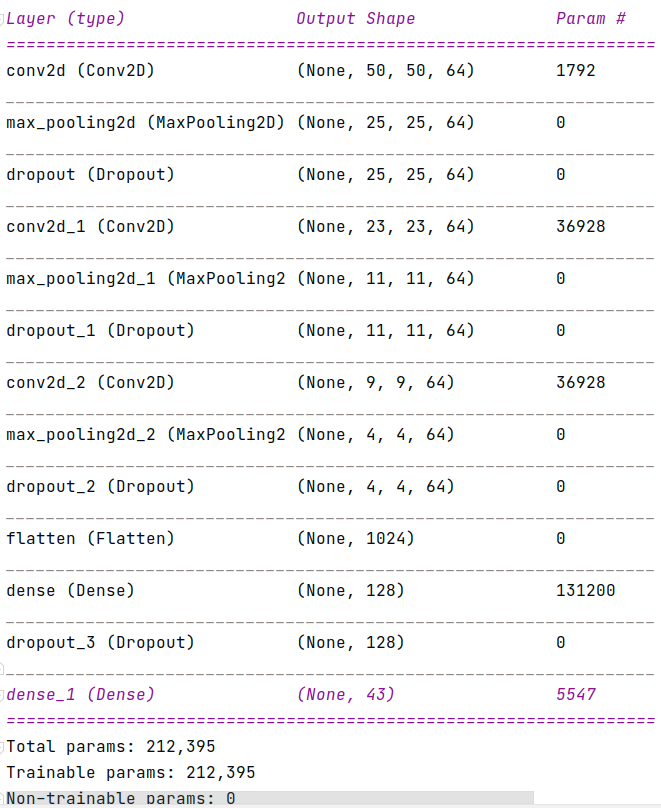

# ĐỒ ÁN CÀI ĐẶT MẠNG CNN TRAFFIC-SIGN DETECTION CỦA NHÓM 13

#### _Author: tdlam@gmail.com_

## Tài liệu trích dẫn, mã nguồn tham khảo:

+ https://www.kaggle.com/pritamaich/traffic-sign-classification-using-cnn
+ https://www.kaggle.com/valentynsichkar/traffic-signs-classification-with-cnn/notebook
+ https://www.kaggle.com/ashwanisahni/german-traffic-sign-recognition-with-99-accuracy
+ dataset: https://www.kaggle.com/meowmeowmeowmeowmeow/gtsrb-german-traffic-sign

____

## Tổng quan và setup môi trường

#### Các thư viện sử dụng trong project:

Các thư viện dễ/có sẵn:

+ os
+ pandas
+ numpy
+ matplotlib
+ seaborn
+ PIL
+ Sciki-learn sklearn

Các thư viện to hơn cần cài đặt kỹ:

+ Tensorflow 2.4.1
+ Keras 2.4.3

_https://giaphiep.com/blog/deep-learning-qua-kho-dung-lo-da-co-keras-9314_
____

## prepare dataset

+ download bộ dataset GTSRB và bỏ vào thư mục ./input
+ define các đường dẫn TRAIN_PATH, TEST_PATH
+ Visualize một bộ gồm 25 hình ngẫu nhiên để thấy được các tấm hình không đồng đều về kích thước
  
+ Tiến hành scan toàn bộ train để xem phân bố kích thước width_height của ảnh như thế nào
  
+ Với phân bổ trên, ta dùng numpy tính mean của width, mean của height sẽ ra xấp xỉ __50x50__, nên ta sẽ chuẩn hóa data
  về 50x50x3

____

## Chuẩn hóa data

+ Mỗi tấm ảnh từ nguyên gốc w x h x 3 sẽ được resize về 50x50x3. Giá trị của mỗi pixel lúc này là [0,255], ta cần đưa về
  [0,1]  (để làm gì thì chưa biết)
+ Sẵn tiện tính luôn phân bổ data của 43 loại biển báo trong tập train
  
+ Sau khi chuẩn hóa xong thì dùng numpy để lưu lại 2 file để không phải scan lại tập train
+ Lúc này ta có được tập train kích thước (39209, 50, 50, 3)

## Load dataset

+ Load lại 2 file đã có ở bước trên, sau đó chia ra thành 2 tập train và test với 4 biến:
    + x_train có x_val tương ứng
    + y_train có y_val tương ứng
+ _one-hot encoding là gì ? Vì sao có bước này ?_  
  "one-hot encoding" hay "one-hot vector" là quá trình biến đổi từng giá trị thành các đặc trưng nhị phân chỉ chứa giá
  trị 1 hoặc 0. Mỗi mẫu trong đặc trưng phân loại sẽ được biến đổi thành một vector có kích thước m chỉ với một trong
  các giá trị là 1 (biểu thị nó là active). Các này thường được sử dụng cho tập đặc trưng phân loại dạng rời rạc (không
  phải liên tục).

____

## Dựng CNN bằng Keras

### Giới thiệu lý thuyết về Keras và các Keras core modules:

+ Keras layers
+ Keras models
+ Keras loss
+ Keras optimizer: Đối với optimizers, tất cả các optimizer của Kera đều được xây dựng dựa trên thuật toán Gradient
  Descent.

### Mô tả cấu trúc mạng CNN mà nhóm đã tham khảo cài đặt

+ Các nguyên liệu sử dụng
+ Cơ sở lý thuyết
+ Bảng cấu trúc mạng
  

____

## Thực hiện huấn luyện
+ Mô tả các bước cần thực hiện

+ Mô tả môi trường thiết bị (vẽ ra bảng cho dễ hình dung)
  + CPU: 
  + GPU: 
+ So sánh thời gian chạy giữa các môi trường với nhau
+ So sánh kết quả khi thay đổi các tham số khác nhau
+ Lưu lại kết quả chạy

_Lưu ý: Bước __Model Evaluation__ cần thực hiện ngay sau khi train ra kết quả và lưu xuống file h5, vì phải xài đến history của model_
Mục đích của bước này là vẽ ra sự biến thiên của hàm loss và độ chính xác của mạng.
____

## Kiểm thử và đo kết quả
+ Load lại model đã lưu
+ lấy tập test trong TEST_PATH để kiểm tra, lưu ý ta phải dùng lại hàm chuẩn hóa data trước khi đưa vào cho model dự đoán. Chỗ này sẽ phải tách hàm
để tái sử dụng
  
_____
+ 15h ngày 20/03/2021 Lâm train và test lần 1 được các thông số sau (dùng sklearn.metrics.classification_report):

_____
____

## So sánh với baseline và state-of-the-art

