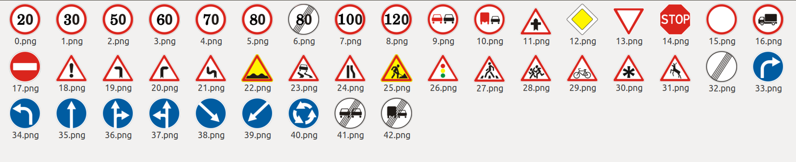
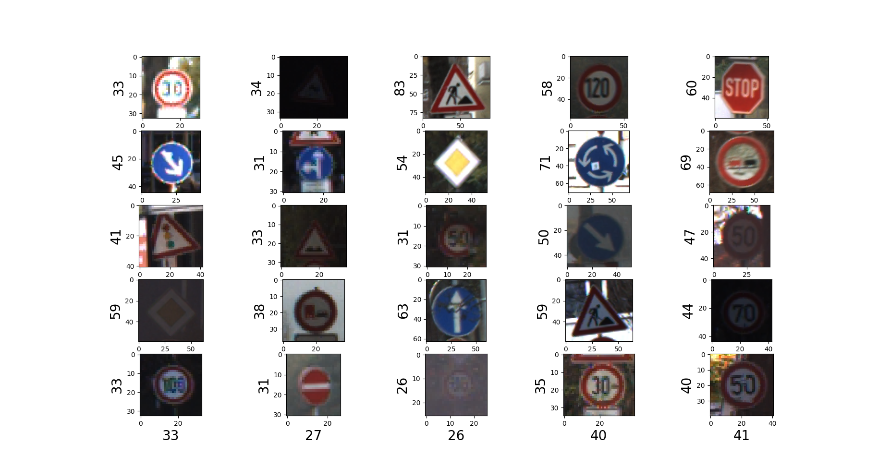
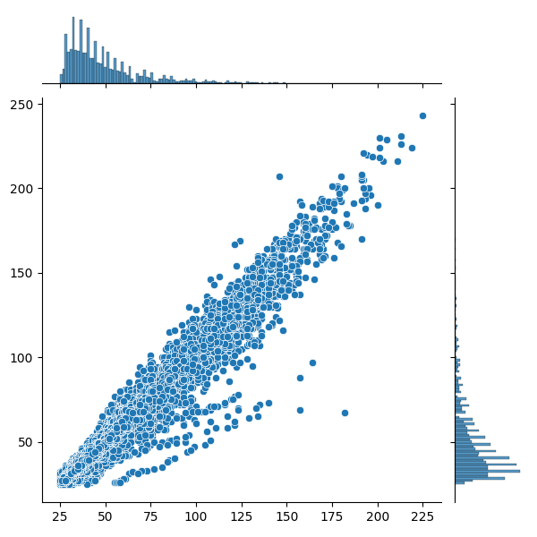
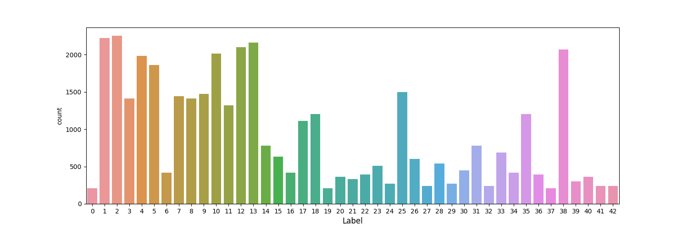
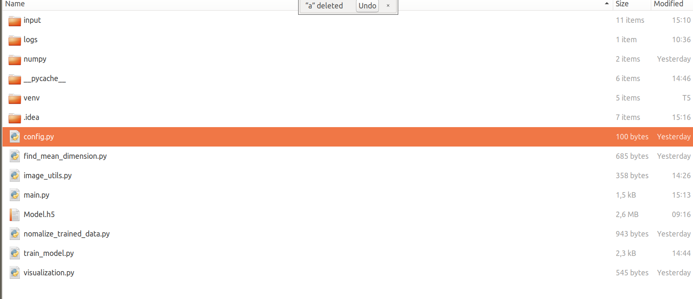
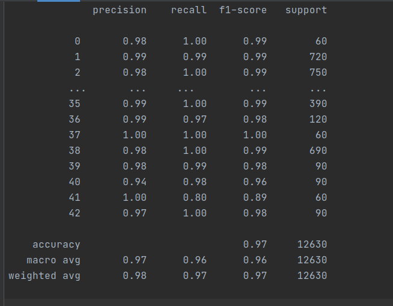
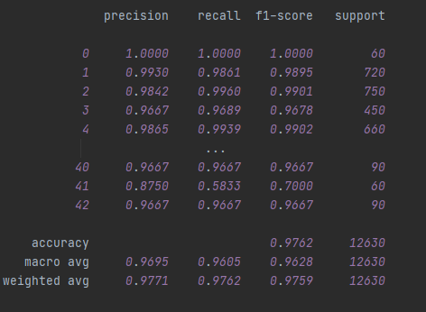

# ĐỒ ÁN CÀI ĐẶT MẠNG CNN TRAFFIC-SIGN DETECTION CỦA NHÓM 13
#Traffic-Sign Classification with GTSRB
#### _Author: tdlam123@gmail.com_

## Tài liệu trích dẫn, mã nguồn tham khảo:

+ https://www.kaggle.com/pritamaich/traffic-sign-classification-using-cnn
+ https://www.kaggle.com/valentynsichkar/traffic-signs-classification-with-cnn/notebook
+ https://www.kaggle.com/ashwanisahni/german-traffic-sign-recognition-with-99-accuracy
+ ataset: https://benchmark.ini.rub.de/gtsrb_dataset.html
+ kết quả đối sánh trong cuộc thi của IJCNN: https://benchmark.ini.rub.de/gtsrb_results.html
+ Tool vẽ CNN Architect: http://alexlenail.me/NN-SVG/LeNet.html
____

## I. Tổng quan và setup môi trường
### I.1 Mô tả bài toán:

### I.2 Các thư viện sử dụng trong project:

Các thư viện dễ/có sẵn:

+ os
+ pandas
+ numpy
+ matplotlib
+ seaborn
+ PIL
+ Sciki-learn sklearn

Các thư viện to hơn cần cài đặt kỹ:

+ Tensorflow 2.4.1
+ Keras 2.4.3

_https://giaphiep.com/blog/deep-learning-qua-kho-dung-lo-da-co-keras-9314_
____

## II. MÔ TẢ VỀ DATASET
### II.1. Cấu trúc Dataset:

+ Có tổng cộng 43 loại traffic sign
  
+ Download bộ dataset GTSRB và bỏ vào thư mục ./input
+ Define các đường dẫn TRAIN_PATH, TEST_PATH trong file config
+ Visualize một bộ gồm 25 hình ngẫu nhiên để thấy được các tấm hình không đồng đều về kích thước
  
+ Tiến hành scan toàn bộ train để xem phân bố kích thước width_height của ảnh như thế nào
  
+ Với phân bổ trên, ta dùng numpy tính mean của width, mean của height sẽ ra xấp xỉ __50x50__, nên ta sẽ chuẩn hóa data
  về 50x50x3

### II.2. Chuẩn hóa data

+ Mỗi tấm ảnh từ nguyên gốc w x h x 3 sẽ được resize về 50x50x3. Giá trị của mỗi pixel lúc này là [0,255], ta cần đưa về
  [0,1]  (để làm gì thì chưa biết)
+ Sẵn tiện tính luôn phân bổ data của 43 loại biển báo trong tập train
  
+ Sau khi chuẩn hóa xong thì dùng numpy để lưu lại 2 file vào folder "numpy", để không phải scan lại tập train
+ Lúc này ta có được tập train kích thước (39209, 50, 50, 3)

### II.3. Load dataset

+ Load lại 2 file đã có ở bước trên, sau đó chia ra thành 2 tập train và test với 4 biến:
    + x_train có x_val tương ứng
    + y_train có y_val tương ứng
+ _one-hot encoding là gì ? Vì sao có bước này ?_ <br>
  "one-hot encoding" hay "one-hot vector" là quá trình biến đổi từng giá trị thành các đặc trưng nhị phân chỉ chứa giá
  trị 1 hoặc 0. Mỗi mẫu trong đặc trưng phân loại sẽ được biến đổi thành một vector có kích thước m chỉ với một trong
  các giá trị là 1 (biểu thị nó là active). Các này thường được sử dụng cho tập đặc trưng phân loại dạng rời rạc (không
  phải liên tục).

____

## III. Dựng CNN bằng Keras
+ Cấu trúc project phân loại traffic sign như sau:
  
  
### III.1. Giới thiệu lý thuyết về Keras và các Keras core modules:

+ Keras layers
+ Keras models
+ Keras loss
+ Keras optimizer: Đối với optimizers, tất cả các optimizer của Kera đều được xây dựng dựa trên thuật toán Gradient
  Descent.
  
+ Keras dropout: https://viblo.asia/p/deep-learning-ky-thuat-dropout-bo-hoc-trong-deep-learning-OeVKBn80KkW
+ padding và stride

### III.2. Mô tả cấu trúc mạng CNN mà nhóm đã tham khảo cài đặt
+ Cơ sở lý thuyết:
  + Vì sao phải dùng Dropout? Bỏ qua bước dropout được không?
  + Cách tính số lượng tham số ở mỗi layer: https://forum.machinelearningcoban.com/t/tutorial-tinh-so-luong-parameters-trong-convolutional-neural-network/3638
+ Bảng cấu trúc mạng
  
  

+ Số lượng tham số trong bảng sau:
  
  
  
+ Ta Trực quan hóa kiến trúc mạng như sau:  

  

____

## IV. Thực hiện huấn luyện
### IV.1. Mô tả các bước cần thực hiện:
 + Cài đặt tham số và đường dẫn
```python
INPUT = os.getcwd() + '/input' 
TRAIN_PATH = INPUT + '/Train' #Đường dẫn thư mục đầu vào cho tập Train
TEST_PATH = INPUT + '/Test' #Đường dẫn thư mục đầu vào cho tập Test

STANDARD_SIZE = (50, 50) #Kích thước hình ảnh

MODEL_PATH = 'model/output_model.h5' #Đường dẫn đầu ra của model
 ```
 + Trực quan hóa dữ liệu
```python
import visualization
visualization.visualize()
 ```
 + Tìm giá trị trung bình
```python
import find_mean_dimension
find_mean_dimension.find_mean()
 ```
 + Chuẩn hóa dữ liệu
```python
import normalize_trained_data
normalize_trained_data.normalize_data()
 ```
 + Bắt đầu thực hiện quá trình huấn luyện
```python
import train_model
train_model.start_train()
 ```
 Sau khi quá trình huấn luyện hoàn tất, ta nhận được tập tin model h5 được lưu trong thư mục model. Đây là quá trình đánh giá mô hình (Model Evaluation), tập tin này lưu lại kết quả history của model. Mục đích của bước này là vẽ ra sự biến thiên của hàm loss và đo độ chính xác của mạng.
  + Tiến hành load model đã lưu và chạy test
 ```python
model = keras.models.load_model(MODEL_PATH)
...
import tester
tester.test()
 ``` 
____

+ Mô tả môi trường thiết bị (vẽ ra bảng cho dễ hình dung)
  + CPU: 
    + máy của Lâm: CPU 4-core Model Intel(R) Core(TM) i5-7200U CPU @ 2.50GHz
      + Thời gian thực thi lần 1 (0.8 train,0.2 test): 2796 giây cho 25 lần lặp (mỗi lần batch_size=64)
      + Thời gian thực thi lần 2 (0.7 train,0.3 test): 3148 giây cho 25 lần lặp (mỗi lần batch_size=64)
      + Thời gian thực thi lần 2 (0.9 train,0.1 test):  giây cho 25 lần lặp (mỗi lần batch_size=64)
    + Máy Kiên: CPU i5 8400 @ 2.800GHz (6 CPUs)
      + Thời gian thực thi (kiennt_model_01) (0.9 train, 0.1 test, 60x60 size): 1479 giây cho 25 lần lặp (mỗi lần batch_size=64)
    
  + GPU: 
    + Google Colab GPU Tesla K30
      + Thời gian thực thi lần 1: (0.9 train, 0.1 test): 134 giây cho 25 lần lặp
    + Máy Kiên: NVIDIA GTX 1070
      + Thời gian thực thi (kiennt_model_02): (0.8 train, 0.2 test, 50x50 size, increasing filters): 130 giây cho 25 lần lặp (mỗi lần batch_size=64)
      + Thời gian thực thi (kiennt_model_03) (0.9 train, 0.1 test, 60x60 size, increasing filters): 80 giây cho 25 lần lặp (mỗi lần batch_size=64)

+ So sánh kết quả khi thay đổi các tham số khác nhau
+ Lưu lại kết quả chạy

_Lưu ý: Bước __Model Evaluation__ cần thực hiện ngay sau khi train ra kết quả và lưu xuống file h5, vì phải xài đến history của model_
Mục đích của bước này là vẽ ra sự biến thiên của hàm loss và độ chính xác của mạng.
____

### IV.2. Kiểm thử và đo kết quả
+ Load lại model đã lưu
+ Lấy tập test trong TEST_PATH để kiểm tra, lưu ý ta phải dùng lại hàm chuẩn hóa data trước khi đưa vào cho model dự đoán. Chỗ này sẽ phải tách hàm
để tái sử dụng
  
_____
+ 15h ngày 20/03/2021 Lâm train và test lần 1 (Model_1) được các thông số sau (dùng sklearn.metrics.classification_report):

+ Ngày 09/04/2021 Kiên train và test (kiennt_model_02) đạt được kết quả tốt nhất với (Train: 0.8 | Test: 0.2 | StandardSize=50x50 | Filters_layer_1: 64 | Filters_layer_2: 96 | Filters_layer_3: 128)


+ Đưa các input bên ngoài vào để đánh giá độ chính xác của model. Các input được để trong ./input/online

_____
____

## V. So sánh với baseline và state-of-the-art
+ Ở bước baseline ta sẽ so sánh với chính bài tham khảo xem cái nào hiệu quả hơn
  + Lấy kết quả từ cuộc thi GTSRB luôn, link https://www.ini.rub.de/upload/file/1470692848_f03494010c16c36bab9e/StallkampEtAl_GTSRB_IJCNN2011.pdf
    https://benchmark.ini.rub.de/gtsrb_results.html
### V.1. Tiêu chí so sánh
+ Tham khảo: https://www.researchgate.net/publication/327389916_An_Efficient_Traffic_Sign_Recognition_Approach_Using_a_Novel_Deep_Neural_Network_Selection_Architecture_Proceedings_of_IEMIS_2018_Volume_3
+ Tiêu chí 1: Tổng Accuracy
  
+ Tiêu chí 2: Từng loại Traffic-sign nhỏ:
  Trong tài liệu tham khảo, các tác giả chia 43 loại Traffic-sign thành 6 loại con bao gồm:
  + "Blue": 8 loại 33,..,40
  + “Danger”: 15 loại : 11,18,...,  31 
  + “End-of”: 4 loại 6,32,41,42
  + “Speed”: 8 loại 0,1,2,3,4,5,7,8
  + "Red-other”: 4 loại 9, 10, 15, 16
  + “Spezial”: 4 loại 12, 13, 14,17
  
### V.2. Kết quả so sánh
Nhóm sẽ chọn ra model tốt nhất trong các model đã huấn luyện được để so sánh với các model khác trong cuộc thi
#### Tiêu chí 1: Tổng Accuracy
|Method|Accuracy|
|:-----|:------:|
|Novel DNN Selection[]|99.92%  
|Haloi []|99.81%
|Committee of CNNs | 99.46%
|Human Performance []|98.84%
|Multi-Scale CNNs []|98.31%
|__Của nhóm__|__98.00%__ (tốt nhất hiện tại, đang chờ thu thập thêm)|
|Random Forests []| 96.14%
#### Tiêu chí 2: Accuracy trên mỗi loại 

_____________

## Mở rộng: Thử nghiệm cài đặt mạng hiện có bằng mạng AlexNet
