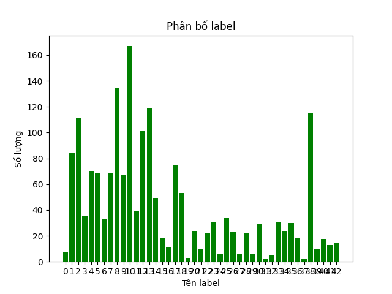

# ĐỒ ÁN CÀI ĐẶT MẠNG CNN TRAFFIC-SIGN DETECTION CỦA NHÓM 13

_____________

# PHẦN 2: TRAFFIC-SIGN DETECTION

___

## Tài liệu trích dẫn, mã nguồn tham khảo:

#### Sử dụng Faster R-CNN

https://www.kaggle.com/safabouguezzi/german-traffic-sign-detection-benchmark-gtsdb/code
https://www.kaggle.com/valentynsichkar/traffic-signs-detection-by-yolo-v3-opencv-keras
https://benchmark.ini.rub.de/gtsdb_results_prohibitory.html
___

## Tổng quan và setup môi trường

Các thư viện dễ/có sẵn:

+ os
+ pandas
+ numpy
+ matplotlib
+ seaborn
+ PIL
+ cv2
+ torch: là thư viện thay thế cho numpy, một platform deeplearning linh hoạt và tốc độ
+ torchvision

## Prepare dataset: GTSDB

+ Tập Train: Bao gồm 600 tấm hình ppm (từ 000 -> 599) đã có annotate bounding box cho biển báo giao thông
+ Thông tin gán nhãn trong file gt.txt, định dạng file như sau:
    + 00000.ppm;774;411;815;446;11 -> Hình 0 có bounding box top-left-bot-right-label tương ứng
    + 00001.ppm;983;388;1024;432;40
    + 00001.ppm;386;494;442;552;38
    + 00001.ppm;973;335;1031;390;13
+ Phân bố label như sau:
  

## Chuẩn hóa data, data Augmentation

+ Giải thích ý nghĩa của bước tranform data bằng các hàm bổ trợ của pytorch

+ 

## Load CNN bằng Keras

## Thực hiện huấn luyện

## Kiểm thử và đo kết quả

## So sánh với baseline và state-of-the-art

