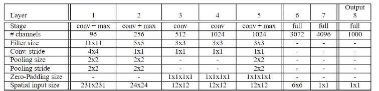
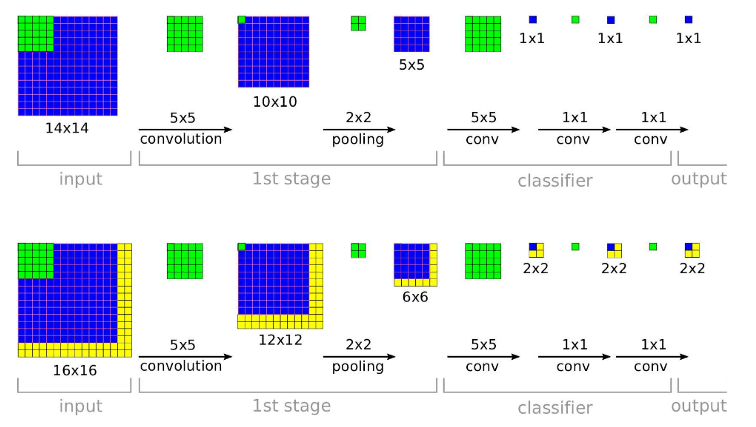
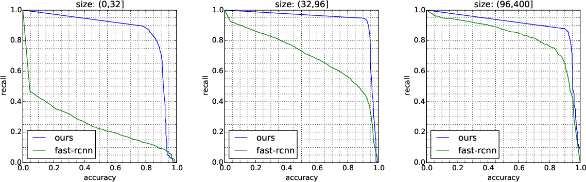
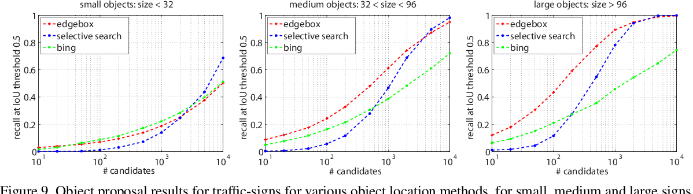

# FILE TỔNG HỢP CÁC NỘI DUNG SERMINAR CỦA NHÓM

## Mục tiêu cuối cùng của bài Serminar:

## **"LÀM THẾ NÀO ĐỂ LỚP HIỂU TARGET   CỦA BÀI TOÁN TRAFFIC SIGN RECOGNITION"**

Link bài dịch: https://docs.google.com/document/d/1x7gl_FlZ10jm8LBw55JzHnBl5I0pCHu6En4ttOaJvRw/edit

Tổng hợp task: https://trello.com/c/ZY6oKScO/10-ti%E1%BA%BFn-h%C3%A0nh-%C4%91%E1%BB%93-%C3%A1n-serminar

_______________________________________

## 1. Overview
_______________________________________
+ ### Bài báo đến từ đâu? Ra mắt năm nào?
  Bài báo đến từ đội ngũ Nhóm nghiên cứu của Phòng Nghiên cứu Khoa Học Máy Tính và Công Nghệ, Đại học Thanh Hoa Bắc Kinh (Tsinghua University) 
  Được công bố ở hội nghị CVPR năm 2016  
  Số lượng Citation:  
  Các tác giả bao gồm: Zhe Zhu, Dun Liang, Song-Hai Zhang, Xiaolei Huang, Baoli Li and Shi-Min Hu 
  Link bài báo: https://cg.cs.tsinghua.edu.cn/traffic-sign/
___
+ ### Bài báo thuộc chủ đề/Thể loại gì?
  _https://www.semanticscholar.org/paper/Traffic-Sign-Detection-and-Classification-in-the-Zhu-Liang/cdd8bad29b5e90a1f92080eaca51ba123f34ada5_
  + Object Detection: là 1 bài toán không mới và cũng đã đạt được rất nhiều các thành tựu trong những năm gần đây, cả phần ứng dụng và mô hình thuật toán. Điển hình là các phương pháp Object Detection sử dụng Deep Learning đã đạt được các bước cải thiện vượt trội so với các phương pháp xử lý ảnh thông thường khác.
  + Benchmark
  + Recognition
  + CNN
  + Image Processing
  
_______________________________________   

+ ###Mục tiêu cốt lõi của nhóm tác giả là gì?
  Trong phần introduction, tác giả giới thiệu 2 mục tiêu và kết quả cốt lõi chính của bài báo:
    + Xây dựng một tập data Tsinghua-Tencent 100K thực tế hơn các tập data về Traffic-Sign trước đó.
    + Xây dựng được mạng CNN cải tiến để vừa xác định biển báo, vừa phân loại biển báo luôn.

_(Ý này có nghĩa là các mạng CNN trước đó thường thực hiện xác định biển báo trước, sau đó tuần tự mới phân loại biển báo
sau)_
_______________________________________
+ ### Tác giả cung cấp những gì? Tài liệu phụ lục kèm theo?
+ https://cg.cs.tsinghua.edu.cn/traffic-sign/
+ Tác giả cung cấp bộ data set 100K tấm ảnh góc rộng từ Tencent Street View 
+ Hướng dẫn chạy model của họ  với TT100K dataset
+ Có Phụ lục kèm theo bao gồm kết quả detect một số case, và kết quả classification một số case
+ Có cung cấp 1 file caffemodel và 3 file .prototxt để train và test cho mô hình Fast-RNN
+ Cung cấp dataset 17GB
+ Cung cấp code 764MB
_______________________________________
+ ### Tác giả không cung cấp những gì? 
_(thuật toán có chi tiết? cách cài đặt có rõ ràng ko?...)_

_______________________________________

## 2. Lookback - Đặt vấn đề
____
+ ###Các bài báo tiền nhiệm là bài báo nào?
Tác giả có trích dẫn nhiều bài báo trước đó cùng chủ đề
  + [1] Man vs. computer: Benchmarking machine learning algorithms for traffic sign recognition: 2012, link https://www.ini.rub.de/upload/file/1470692859_c57fac98ca9d02ac701c/stallkampetal_gtsrb_nn_si2012.pdf
  + [2] The German Traffic Sign Recognition Benchmark: A multi-class classification competition, https://www.ini.rub.de/upload/file/1470692848_f03494010c16c36bab9e/StallkampEtAl_GTSRB_IJCNN2011.pdf
  + [3] Traffic Sign Recognition with Multi-Scale Convolutional Networks http://yann.lecun.com/exdb/publis/pdf/sermanet-ijcnn-11.pdf
  + [4] https://cs.nyu.edu/~fergus/teaching/vision/5_detection.pdf
  + [5] An Empirical Evaluation of Deep Learning on Highway Driving https://arxiv.org/pdf/1504.01716.pdf
____

+ ###Họ đã làm được gì?
  + Kể từ khi có tập data về biển báo đầu tiên của Đức GTSDB và GTSRB [24,25] đến nay, có nhiều nhóm nghiên cứu đã làm về
    2 pha này (detection & classification), và đạt đến gần 100% độ chính xác (recall & precision for detection) và 99.67% (classification)
  + Nói sơ qua về tập Data GTSRB sử dụng trong cuộc thi tại thời điểm ra mắt bài báo: 
    + Tập data bao gồm hơn  50,000 ảnh được chụp trên đường phố nước Đức
    + Chia thành 43 lớp loại khác nhau của Traffic-sign
    + Được trích xuất từ hơn 10 giờ video với độ phân giải 1360×1024 pixels, sau đó được convert từ dạng Raw sang RGB format
    + Dữ liệu sau đó sử dụng NISYS Advanced Development and Analysis Framework để đánh dấu và gán nhãn thủ công
    + Kích thước của traffic signs trong tập này dao động từ 15×15 đến 222×193 pixel
  + Các phương pháp đưa ra đã đạt kết quả rất tốt trên tập GTSRB, lên đến 99.6% tốt hơn cả con người
  + Họ đã Ứng dụng và cải tiến được đáng kể các thuật toán phổ biến trong object detection như:
    + R-CNN -> SPPNet -> Fast R-CNN -> Faster R-CNN
    + OverFeat
    + 
____  
+ ###Bối cảnh và bài toán nào đã được các bài báo, các cuộc thi trước đó giải quyết?
  + 
____
+ ###Vấn đề còn tồn đọng hoặc phát sinh từ các bài báo này?
    + **Các bộ dữ liệu trước đó bị nhược điểm gì mà tác giả lại chê?**
      + Tác giả nhận định các dataset trước đó không đại diện cho hầu hết các trường hợp thực tiễn, ví dụ như trong GTSRB, 
        biển báo lại xuất hiện trong hầu hết các bức ảnh, và thuật toán chỉ việc phân loại biển báo trong ảnh mà thôi.
      + Bộ dataset chưa có các trường hợp gây nhiễu làm lệch kết quả tính toán
      + Trong thực tế biển báo chỉ chiếm một phần rất nhỏ trong ảnh, thường nhỏ hơn 1%. Trong khi đó dataset hiện tại thì 
        hình biển báo chiếm tỉ lệ tương đối trong bức ảnh. Như vậy là không thực tiễn
      + Trong ImageNet và COCO, hình được lấy từ Internet search engine,  mà ở đó khá ít user tải ảnh từ thực tế cuộc sống mà có biển báo giao thông như khi ta đi trên đường, hoặc nếu có thì cũng chỉ là vô tình và ngẫu nhiên.
        Cách thu thập data này thiếu tính thực tế.
      + Trong GTSRB, các biển báo được trích xuất từ một phân đoạn video, tức hình biển báo sẽ rất giống nhau ở mọi hình.
        Điều này dẫn đến độ đa dạng trong tập data sẽ không được như mong đợi.

    + **Các giải pháp cũ có ứng dụng thực tiễn được không?**
      + Theo tác giả thì chưa đủ :)) 
____
_______________________________________

## 3. Cách họ xây dựng data như thế nào? ( Nhóm thực hành)
____
+ ####Các bộ dataset của các paper trước đó là gì ?
  + PASCAL VOC
  + ImageNet ILSVR-C
  + Thu thập các hình ảnh do người dùng chụp trên Internet bởi các search engine, nên sẽ không gần giống với các tình huống thực tế: ImageNet, Microsoft COCO
  + Cắt các hình liên tiếp từ video dẫn đến các biển báo sẽ xuất hiện rất giống nhau trong các ảnh: GTSRB
____
+ ####Data lấy từ đâu?
  Tencent Street View (từ 300 thành phố ở Trung Quóc và các tuyến đường kết nối chúng). Được chụp với camera 6 SLR và sau đó ghép nối lại với nhau. Các kỹ thuật xử lý ảnh như điều chỉnh độ phơi sáng cũng được dùng. Các ảnh này được chụp từ phương tiện giao thông và các thiết bị gắn trên vai với tần suất 10 phút
____
+ ####Có lấy data từ các bài báo trước đó không? 
  Không
____
+ ####Tính chất của data có gì khác biệt so với bộ data của các bài báo trước?
  + Trong các tập data trước đây, đối tượng cần detect thường chiếm kích thước lớn (khoảng hơn 20%) trong ảnh, các loại biển báo ít đa dạng. Trong thực tế biển báo có thể là một phần nhỏ trong ảnh với kích cỡ thông thường khoảng 80x80p, và thường chiếm chỉ 0.2% bức ảnh
  
  + Thu thập các hình ảnh do người dùng chụp trên Internet bởi các search engine, nên sẽ không gần giống với các tình huống thực tế: ImageNet, Microsoft COCO
  + Cắt các hình liên tiếp từ video dẫn đến các biển báo sẽ xuất hiện rất giống nhau trong các ảnh: GTSRB
  
 
  + Với bộ data mới này (Tsinghua-Tencent 100K), các tấm ảnh được chụp từ các camera trong những điều kiện ánh sáng và thời tiết khác nhau, chỉ chiếm một phần nhỏ và có thể ở bất cứ vị trí nào trong ảnh nên sẽ mô phỏng các tình huống thực tế tốt hơn.  
  + Nhiều loại biển báo (100K ảnh với 30K biển báo), góc chụp đa dạng hơn (chính diện, nghiêng), có các biển nhìn rõ và cả những biển bị che khuất một phần 
  + Ảnh chụp trong nhiều điều kiện thời tiết (trời nắng, có mây) 
  + Một số ảnh chụp có background phức tạp làm tăng độ khó khi detect biển báo 
  
____
+ ####Họ chuẩn hóa data như thế nào? Dùng tay để lọc hay dùng máy?
  Các tấm ảnh được chọn lọc và đánh nhãn bằng tay. Ghi dấu lại khung bao, các đỉnh của khung và gán nhãn cho biển báo trong từng tấm ảnh
  
  
____
+ ####Data có nhiễu nhiều hay không? Được chụp/quay bằng gì?
  Data nhiễu -> Có sử dụng khá nhiều hình ảnh không có biển báo, có add thêm độ nhiễu ngẫu nhiên trong quá trình train
   
  gây nhiễu: xoay hình ngãu nhiên trong khoảng -20 độ -> +20 độ, scale hình, làm méo hình
   
  Các ảnh này được chụp từ phương tiện giao thông và các thiết bị gắn trên vai
____
+ ####Họ có trích xuất Feature ra trước khi đưa vào mạng không? Có gán nhãn trước cho biển báo giao thông?
  + Họ có trích xuất Feature ra trước khi đưa vào mạng không -> chưa hiểu
  + Có gán nhãn bằng tay 
____
+ ####Tác giả có chú trọng rất nhiều, có đặt trọng tâm bài báo vào bộ data này không? Vì sao?
  Ngoài việc cải tiến CNN để phân loại và nhận dạng, bài báo còn chú trọng vào việc tạo ra một bộ data thực tế và đa dạng hơn so với các bộ data hiện có cho việc training và benchmarking.
_______________________________________
+ ####Pixel mask khi gán nhãn dữ liệu là gì? 
  Là đánh dấu vùng thực sự có biển báo (hình tròn, chũ nhật, tam giác) trong bounding box
+ ####Có hình minh họa, biểu đồ, lược đồ, ví dụ thể hiện data của họ không?
  Chỉ có mấy biểu đồ so sánh độ chính xác với từng kích cỡ biển báo (60px, 80px, ...)
_______________________________________

## 4. Mô hình Mạng CNN có gì đặc biệt?
____
### 4.1. Mô hình cũ trước đó
____
+ ####Nêu ra các mô hình trước đó?
  + **AlexNet** là một trong những Mô hình đầu tiên giải quyết bài toán phân lớp (classification)một bức ảnh vào 1 lớp trong 1000 lớp khác nhau (vd gà, chó, mèo … ). Đầu ra của mô hình là một vector có 1000 phần tử.
    Mạng CNN này đã thắng hạng nhất trong cuộc thi ILSVRC năm 2012.
    Kiến trúc mạng như sau: 
    
    
  + Đầu vào của AlexNet là một bức ảnh RGB 3x256x256 ở cả tập train và tập test. Đây là kích thước chuẩn bắt buộc sử dụng trong mạng.
  + Sau khi chuẩn hóa, kích thước đầu vào được sử dụng là 227x227 và cắt ngẫu nhiên trên hình gốc 256x256.
  + Kiến trúc AlexNet bao gồm 5 convolutional Layer và 3 fully connected layer. Nó có tổng cộng 60 triệu tham số và 650 nghìn neural.
  + Các convolutional Layer (filter) đầu tiên có chức năng trích xuất các đặc trưng cơ bản của tấm ảnh:
    + Filter đầu tiên chứa 96 kernel có kích thước 3x11x11, stride=4
    + Các layer sau kết nối với layer trước đó qua một Overlapping Max Pooling ở layer thứ 1,2 và 5. Max Pooling layer thường được sử dụng để giảm chiều rộng và chiều dài của một tensor nhưng vẫn giữ nguyên chiều sâu
    + ReLU nonlinerity được sử dụng sau tất các các convolution và fully connected layer. Theo tác giả, ReLU giúp cho mạng
      huấn luyện nhanh hơn và cải thiện độ lỗi gấp nhiều lần so với khi dùng hàm Tanh hay Sigmoid. 
    + Cho đến cuối cùng, layer thứ 7 là fully connected kết nối với layer 8 là một bộ phân lớp softmax với 1000 vector đầu ra, với tổng giá trị bằng 1.

Read more: https://www.phamduytung.com/blog/2018-06-15-understanding-alexnet/#ixzz6op5N5Kb8
____
  + **OverFeat** là một mạng CNN dùng để detect (classification, localization and detection) đối tượng cực kỳ hiệu quả, được cải tiến dựa trên mạng CNN AlexNet của Alex Krizhevsky (2012).

+ Dưới đây là bảng mô tả kiến trúc cơ bản của mạng OverFeat

+ Các cải tiến của OverFeat so với AlexNet bao gồm:
  + Pooling region không xài Overlapping, tức stride của lớp max pooling  đúng bằng kích thước của kernel, các tấm kernel khi trượt sẽ không chồng lắp lên nhau (mạng AlexNet có chồng lên 1 pixel).
  + Feature map sẽ to hơn một chút do dùng slide nhỏ hơn so với AlexNet.    
  + Sử dụng cửa số trượt sliding window hiệu quả hơn nhờ vào việc share kết quả tính toán của một vùng từ lần trước cho lần tính toán sau (thường sẽ overlap nhau rất nhiều).
  
  + Sử dụng cơ chế multi-view voting: scale tấm ảnh ra thành nhiều tấm ảnh, sau đó dự đoán tất cả chúng, rồi lấy trung bình kết quả.
  + Để localization, tìm ra bouding box của đối tượng, mạng này thay classifier layer (layer thứ 6,7,8) bằng một mạng hồi quy, sử dụng kết quả từ layer thứ 5 làm input.
  Ở đó, output cuối cùng của mạng hồi quy này là các vector 4 chiều mô tả bounding box của input tương ứng.
    Như vậy bằng việc tách nhánh ở cuối layer 5, tác giả đã xử lý được song song việc classification và tìm ra bounding box luôn.
    

Read more: https://towardsdatascience.com/overfeat-review-1312-6229-4fd925f3739f
____
+ Tác giả dựa trên giải pháp Vehicle Detection của bài báo trước đó [5], sử dụng kết hợp OverFeat và một mạng Hồi quy ở cuối. Cụ thể:
  + Hình input của mạng này được nâng lên 640 × 480, để đáp ứng bài toán detect phương tiện và lane đường xa hơn 100m so với camera.
  + Kết hợp thêm một mask detector, để xác định được bonding box nhanh hơn so với OverFeat nguyên thủy.
  + Các tầng layer fully connected (dense) được chuyển đổi thành các mạng convolution.
  + Khi sử dụng hình input lớn hơn, dẫn đến output ở layer thứ 6 cũng nở ra từ 1x1x4096 thành 20x15x4096 
____

### 4.2. Mô hình mới

____
+ ####Mô hình mạng mới của bài này có gì khác biệt? đặc biệt hơn cái cũ chỗ nào?
  Mô hình mới lấy ý tưởng từ cả mô hình OverFeat và Vehicle Detection như đã trình bày ở phần trên cho bài toán Traffic Sign Detection
____
+ ####Làm sao để giải thích rõ ràng mô hình mạng này cho mọi người hiểu?
  Bảng sau đây mô tả tổng thể kiến trúc các layer của mô hình mạng mà tác giả đề xuất 

  Các thay đổi, điều chỉnh so với mô hình gốc như sau:
  + Các tác giả đã thử nghiệm việc chạy song song truoc khi xong layer thu 7, và nhận thấy tách nhánh để chạy song song từ sau layer 6 là giải pháp cân bằng giữa
  thời gian tính toán và độ chính xác cần thiết (tách càng sớm thì performance càng nhanh nhưng tốn nhiều tài nguyên, tách quá trễ sẽ tính toán lâu hơn)
  + So với bài toán Vehicle Detection, thì layer cuối cùng có thêm 1 nhánh chạy song song giúp phân loại luôn loại biển báo.
  
_______________________________________

## 5. Kết quả và đối sánh hiệu quả ra sao?
____

+ Thời gian thực thi như thế nào? Chạy trên device gì? Card gì, chạy trong bao lâu thì ra kết quả? Model hội tụ được kết
  quả sau bao nhiều lần lặp?
____
+ Mỗi biểu đồ trong bài báo thể hiện điều gì? Thông số nào là quan trọng?

   + Kết quả so sánh với mô hình Fast R-CNN trong việc classify loại biển báo, với các kích thước khác nhau
     
   + Kết quả so sánh với các phương thức object detection khác như Selective Search, EdgeBoxes
     
____
+ Kết quả cho thấy tốt hơn như thế nào? Nhanh hơn hay chính xác hơn? Nhanh hơn bao nhiêu? Chính xác hơn bao nhiêu?
____
+ Những đóng góp mới của nhóm tác giả có giá trị như thế nào? Tạo tiền đề gì cho hậu thế? Cụ thể thì sẽ được mở rộng
  trong khía cạnh nào của lĩnh vực nhận diện biển báo giao thông?
____
+ Có điểm nào trong phần này bạn thấy chưa thỏa đáng hay không?
____
+ Từ đó đến hiện tại nhóm tác giả có đề xuất hay cải tiến thêm độ hiệu quả của mô hình này không? Bài báo nào? Mô tả hiệu quả?
____

_______________________________________

## 6. Demo như thế nào? (Nhóm thực hành)

+ Quay video demo lại __cách sử dụng model__ đã được train. Cần check lại có model sẵn chưa?
  + Đã có sẵn model. Đã có thể xuất ra được kết quả dựa trên model đã train của tác giả.
+ Có option chạy CPU không ? Nếu chạy trên GPU thì chạy cloud được ko? GoogleColab?
  + Project sử dụng CUDA toolkits để train một bộ dataset khá lớn. Nếu không có GPU hỗ trợ thì sẽ rất khó để chạy được. -> Có thể tìm model nhỏ hơn
+ Có chạy được với dataset ít hơn ko? 14GB?
+ Nhận xét chủ quan của nhóm mình?
  (bước tiến có lớn hay ko hay chỉ chém gió? so với cái cũ thì có vượt trội?)
  + Có vượt hơn fast-rcc một chút về độ chính xác (Theo bản report)

_______
## 7. Tài liệu tham khảo
+ The Graphics and Geometric Computing Group,  Tsinghua University
+ Towards Data Science, https://towardsdatascience.com/r-cnn-fast-r-cnn-faster-r-cnn-yolo-object-detection-algorithms-36d53571365e
+ Semantic Scholar https://www.semanticscholar.org/
+ 