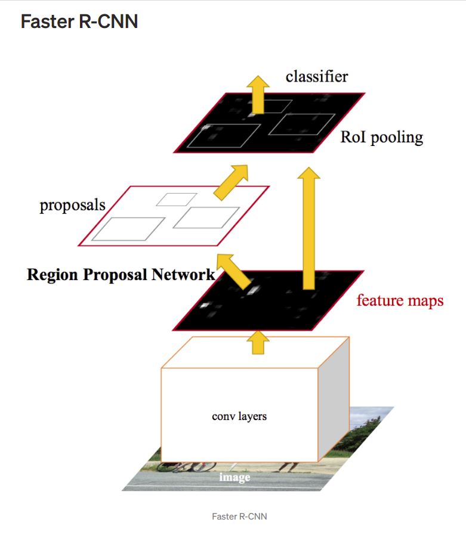
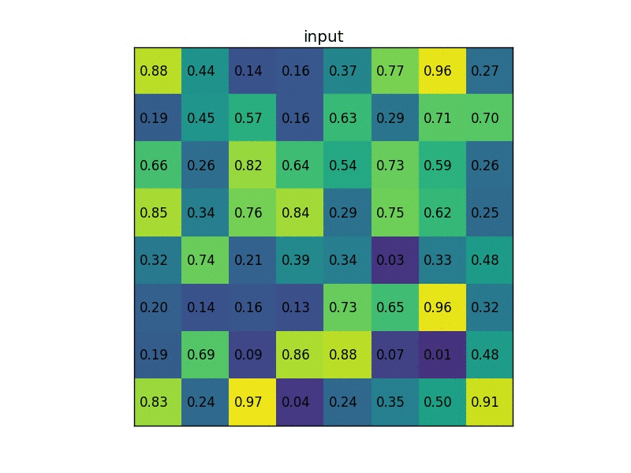

#File Chú thích các keyword xuất hiện trong bài báo

+ __Benchmark__: Trong Computer Science, một benchmark là một hành động thực thi một hoặc nhiều chương trình, nhằm mục đích đánh giá, so sánh độ hiểu quả của chương trình đối với một tập các đầu vào chuẩn. 

+ __Bounding box__: Là vùng viền bao quanh object cần detect. (tam giác, tròn) 

+ __Pixel mask__: Mặt nạ pixel -  là một hình ảnh hai chiều có giá trị pixel được sử dụng để lọc tập dữ liệu. Trên tấm ảnh, gía trị pixel 0 bị loại bỏ, giữ lại giá trị > 0
  https://cxc.cfa.harvard.edu/ciao/threads/masks/#:~:text=A%20pixel%20mask%20is%20a,them%20to%20create%20complex%20filters.  
  

+ __PASCAL VOC__: (PASCAL Visual Object Classification) là tập dữ liệu ảnh kinh điển được sử dụng rộng rãi trong chủ đề object detection
___
+ __ImageNet__: Là một cơ sở dữ liệu hình ảnh quy mô lớn được thiết kế để sử dụng trong nghiên cứu phần mềm nhận dạng đối tượng trực quan. Tính đến năm 2016, hơn 10 triệu tấm ảnh đã được ImageNet đánh dấu thủ công và ít nhất 1 triệu tấm đã được gán sẵn bounding box.
+ __ILSVRC__:  Cuộc thi nhận diện trực quan quy mô lớn của ImageNet (ImageNet Large Scale Visual Recognition Challenge), nơi các phần mềm cạnh tranh để phân loại và phát hiện các đối tượng và cảnh vật một cách chính xác.
___
+ __R-CNN__: (Regional CNN) Là thuật toán phổ biến dùng trong bài toán Object Detection. Ý tưởng cơ bản của thuật toán bao gồm 2 bước:
   + Từ tấm ảnh xác định ra một tập khoảng vài nghìn bounding box có chứa đối tượng, sử dụng thuật toán "selective search"
   + Với mỗi bounding box ta xác định xem đó là đối tượng nào
  
+ __Fast R-CNN__: Là phiên bản cải tiến của R-CNN, có thời gian train và test ngắn hơn, nên được sử dụng để detect realtime
  
+ __Faster R-CNN__: là phiên bản cải tiến tốt nhất cho đến hiện tại của R-CNN
  
  
  _https://towardsdatascience.com/r-cnn-fast-r-cnn-faster-r-cnn-yolo-object-detection-algorithms-36d53571365e_  
  _https://nttuan8.com/bai-11-object-detection-voi-faster-r-cnn/#R-CNN_Region_with_CNN_feature_  
  _https://deepmlml.com/rpn-explained.html_
___
+ __Caffemodel__: định dạng file trong tool Caffe - giúp cài đặt nhanh ConvNets bằng C++. Caffe có thể xử lý hơn 60 triệu
  bức ảnh mỗi ngày chỉ với một card đồ họa NVIDIA K40 với AlexNet. Ta có thể sử dụng nó như một toolkit cho tác vụ phân lớp ảnh.
  Tuy nhiên, toolkit này khó áp dụng cho các bài toán bên xử lý văn bản và tiếng nói.
  Các bài báo cung cấp các file này để ta chạy demo thử và không cần phải train lại.
___
+ __OverFeat__: là một feature extractor được huấn luyện trên tập dữ liệu ImageNet với Torch7 và dễ dàng để bắt đầu sử dụng.
  Perform classificaon,	localizaon,	and detecon	on	the	ImageNet	Dataset
___
+ __Tourch__: được viết bằng ngôn ngữ Lua, cung cấp một môi trường lập trình tương tự như MATLAB chuyên dùng cho các thuật toán ML thay cho Python vì nó tương thích tốt với C.

+ __GTFDB__:  
+ __GTSRB__: German Traffic Sign Recognition Benchmark, là một cuộc thi tổ chức ở IJCNN 2011. Cuộc thi cung cấp GTSRB dataset with 51,840 images of German road signs in 43
  classes. Có rất nhiều bài báo sử dụng tập data set này để huấn luyện.
____
+ __ROI__: Region of Interest - các vùng có khả năng chứa đối tượng từ feature map (kết quả đầu ra của ảnh sau khi qua lớp backbone CNN) 
+ __ROI Pooling__: Là một layer trong mô hình Fast R-CNN, có nhiệm vụ biến đổi các ROI kích thước khác nhau về cùng 1 kích thước cố định, 
  thông thường sẽ nhỏ hơn kích thước đầu vào. Ví dụ ROI max Pooling như sau
  
  Mục đích chính của việc thực hiện một nhóm như vậy là để tăng tốc thời gian đào tạo và kiểm tra và cũng để đào tạo toàn bộ hệ thống từ đầu đến cuối (theo cách thức chung).
  
____
+ __EdgeBoxes__: 