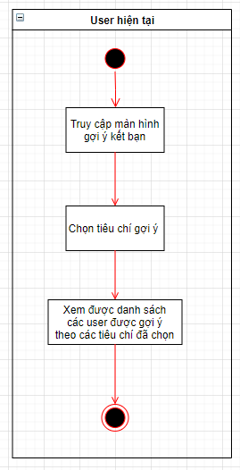

# CSDL NÂNG CAO - ĐỒ ÁN CÀI ĐẶT

### THÔNG TIN THU THẬP YÊU CẦU VÀ THIẾT KẾ PROPOSAL

___

## Yêu cầu 1: Nghiên cứu,khảo sát, mô tả phạm vi cho các quy trình nghiệp vụ của một HT thực tế

**Kết quả công việc:**

+ Đã chốt tìm hiểu về một **Social Network** để triển khai đồ án

## Trình bày

+ Social network là gì? Lịch sử phát triển
+ Đặc trưng của Social network
+ Các Social network phổ hiến hiện nay

___   

#### Xác định một số nghiệp vụ _CHÍNH_ của hệ thống, chức năng phải đủ lớn và phù hợp để áp dụng CSDL

##### Bước 1:Tìm hiểu và liệt kê một số chức năng chính của vài Social Network lớn trên thị trường:

https://blog.webico.vn/tong-hop-cac-kenh-social-media-lon-nhat-hien-nay/

__Cần giới hạn lại số lượng chức năng:__ tối thiểu 5 chức năng chính trọng yếu

+ **Lâm: Facebook**

    + **Chức năng 1: Kết bạn - Kết nối bạn bè:**

      |Chức năng|Mô tả khái quát|Hình ảnh
                                                                                                                                                                                                                                                                                                                                                                                                                                                                                                                                                                                                                                                                                                                                                                                                                                                                                                                                                                                                                                                |:---:|:---|:----
      |Danh sách bạn bè|Quản lý danh sách bạn bè   là các user đã kết bạn với mình. Khi user đã kết bạn với nhau thì có thể thấy profile, trạng thái của nhau|
      |Lời mời kết bạn|Quản lý lời mời kết bạn từ/đến các user khác|

    + **Chức năng 2: Đăng Feed, Đăng tin lên trang cá nhân:**

      |Chức năng|Mô tả khái quát|Hình ảnh
                                                                                                                                                                                                                                                                                                                                                                                                                                                                                                                                                                                                                                                                                                                                                                                                                                                                                                                                                                                                                                                |:---:|:---|:----
      |Đăng feed trên trang cái nhân| User soạn và đăng feed trên đầu trang cá nhân của mình|
      |Khám phá feed|Các Feed công khai của bạn bè sẽ hiển thị trên trang khám phá feed của mỗi user|
      |Tương tác feed|User có thể like,react, comment, share bất kỳ feed nào nếu là bạn bè hoặc là thành viên của hội|

    + **Chức năng 3: Chat và Video call:**

      |Chức năng|Mô tả khái quát|Hình ảnh
                                                                                                                                                                                                                                                                                                                                                                                                                                                                                                                                                                                                                                                                                                                                                                                                                                                                                                                                                                                                                                                |---:|---:|----:
      |Chat với bạn bè| User trò chuyện 1-1 với bạn bè và nhận thông báo|
      |Chat nhóm| User trò chuyện trong nhóm có nhiều thành viên, được mời vào trong nhóm bởi trưởng nhóm|
      |Video call| User Video trực tuyến 1-1 hoặc trong chung một nhóm|
    + **Chức năng 4: Quản lý nhóm hội/page:**

      |Chức năng|Mô tả khái quát|Hình ảnh
                                                                                                                                                                                                                                                                                                                                                                                                                                                                                                                                                                                                                                                                                                                                                                                                                                                                                                                                                                                                                                                  |---:|---:|----:
      |Quản lý thành viên|Trường nhóm thêm/xóa thành viên ra khỏi nhóm|
      |Đăng tin| Giống với đăng feed, nhưng chỉ cho các thành viên trong hội thấy với vai trò hội-thành viên|

    + **Chức năng 5: Tìm kiếm bạn bè, nhóm hội:**

      |Chức năng|Mô tả khái quát|Hình ảnh
                                                                                                                                                                                                                                                                                                                                                                                                                                                                                                                                                                                                                                                                                                                                                                                                                                                                                                                                                                                                                                                |---:|---:|----:
      |Tìm kiếm user|Gõ trên khung search để tìm kiếm các user, bạn bè, nhóm hội dựa vào keyword|

+ **Kiệt: Instagram**
    + Chức năng 1:
    + Chức năng 2:
    + Chức năng 3:
    + Chức năng 4:
    + Chức năng 5:
    + ...
+ **Minh: Twitter**
    + Chức năng 1:
    + Chức năng 2:
    + Chức năng 3:
    + Chức năng 4:
    + Chức năng 5:
    + ...

___

**Từ danh sách khảo sát trên, nhóm đã chọn ra các chức năng CHÍNH của một hệ thống Social Network cơ bản:**

+ Chức năng 1: Kết bạn
+ Chức năng 2: Đăng bài
    + Trên tường nhà mình
    + Trên newsfeed bạn bè
        + Sắp xếp các bài trên newsfeed theo độ ưu tiên
+ Chức năng 3: Gợi ý kết bạn
+ Chức năng 4: Thành lập nhóm
    + Broadcast bài đăng mới
+ Chức năng 5: Tìm kiếm
    + Bạn bè
    + Nhóm

 ___

## Xây dựng bảng mô tả yêu cầu hệ thống

_mô tả các nghiệp vụ, chức năng đã xác định ở bước trên_

+ Chưa có form mô tả yêu cầu, cần tham khảo các project thật
+ Lần lượt vẽ sơ đồ usecase cho từng chức năng
+ Vẽ mockup cho các flow
+ Đang tham khảo giáo trình

___

### 1: Chức năng 1: Kết bạn

+ Đối tượng tham gia:
    + User muốn kết bạn
    + User nhận lời mời
+ Mô tả các bước: Chức năng bắt đầu khi user truy cập vào một profile cá nhân của 1 user khác.
    + Bước 1: User 1 vào profile User 2
    + Bước 2: User 1 gửi Yêu cầu kết bạn đến User 2
    + Bước 3: User 2 thấy được danh sách các lời mời, và thực hiện đồng ý/ từ chối tương ứng
    + Bước 4: User 1 nhận phản hồi, cả 2 được thêm vào danh sách bạn bè của nhau, và có thể xem profile của nhau.
+ Kết quả:
    + User A và B thành bạn của nhau, được cập nhật danh sách bạn bè
    + User A có thể xem đầy đủ profile của user B và ngược lại
+ Hệ quả liên quan:
    + Hiển thị danh sách bạn bè

___
___

### 4: Chức năng 4: Thành lập Nhóm hội

__Chức năng này chia thành 2 nghiệp vụ chính: Tạo nhóm và đăng bài trong nhóm__

#### 4.1 Tạo nhóm:

+ Ý nghĩa: Hỗ trơ nhu cầu thành lập các nhóm riêng với mục đích riêng
+ Đối tượng tham gia:
    + User Trưởng nhóm
+ Trạng thái bắt đầu:
    + Trưởng nhóm vào giao diện tạo nhóm
+ Mô tả:
    + Bước 1: Chọn giao diện tạo nhóm
    + Bước 2.1: Điền tên nhóm
    + Bước 2.2: Chọn ảnh đại diện nhóm
    + Bước 2.3: Điền mô tả nhóm
    + Bước 3: Nhấn Tạo nhóm, nhóm được tạo có 1 thành viên
    + Bước 4: Vào màn hình chi tiết nhóm
    + Bước 5: Thêm thành viên:
        + 5.1: Vào màn hình danh sách bạn bè có thể thêm
        + 5.2: Chọn 1 user để thêm vào nhóm  (lặp lại nhiều lần)
        + 5.3: Nếu không chọn ai nữa, quay lại màn hình chi tiết nhóm
    + Bước 6: Kết thúc
+ Kết quả: 1 nhóm được tạo với 1 trưởng nhóm và n thành viên
+ Hệ quả liên quan:

#### 4.2 Đăng bài trong nhóm:

_(chức năng này gần giống với thao tác đăng bài trên trang cá nhân)_

+ Ý nghĩa: Hỗ trơ nhu cầu đăng thông báo lên nhóm
+ Đối tượng tham gia:
    + User Trưởng nhóm
    + User các thành viên trong nhóm
+ Trạng thái bắt đầu:
    + Trưởng nhóm vào trang chi tiết nhóm
+ Mô tả:
    + Bước 1:
    + Bước 2:
    + Bước 3:
    + Bước 4:
    + Bước 5:
    + Bước 6: Nhấn "Đăng"

+ Kết quả:
    + 1 Bài post được đăng vào trang chi tiết nhóm, vị trí đầu tiên
    + Các thành viên thấy bài post xuất hiện trên trang feed của mình
+ Hệ quả liên quan:
    + Danh sách bài post sẽ được nằm trên bảng tin nhóm, theo thứ tự từ mới tới cũ

### 3: Chức năng 3: Gợi ý kết bạn
+ Ý nghĩa: gợi ý các user có liên quan tới user hiện tại theo những tiêu chí nhất định
+ ĐỐi tượng tham gia
    + User muốn tìm gợi ý kết bạn (A)
    + Những user có liên quan tới user A
+ Mô tả các bước: chức năng bắt đầu khi user truy cập vào màn hình gợi ý kết bạn
    + Bước 1: User A truy cập vào màn hình gợi ý kết bạn
    + Bước 2: User A chọn tiêu chí gợi ý
        + Có bạn chung
        + Giới tính
        + Cùng tuổi
        + Cùng trường
        + Cùng quê
    + Bước 3: User A nhìn thấy danh sách những user khác được gợi ý theo các tiêu chí đã chọn
    
___

## Yêu cầu 2: Phân tích nghiệp vụ hệ thống, xác định loại CSDL phù hợp

___

+ ### Phân tích, thiết kế chức năng đã liệt kê
+ ### Lý giải loại CSDL nào áp dụng phù hợp cho từng chức năng, dựa trên đặc thù của chức năng và của loại CSDL

Link Sơ đồ mô tả yêu cầu hệ thống:

+ https://drive.google.com/file/d/1aiAWpaRydDQtTFf-b-Di8UnwJew8Sgv8/view?usp=sharing

+ **Chức năng 1: Kết bạn**
    - Sơ đồ hoạt động của quy trình kết bạn:
      

    - Lựa chọn Loại CSDL: Quan hệ bạn bè là mối quan hệ 2 chiều và yêu cầu tính nhất quán cao, do danh sách bạn bè của
      user thường thay đổi không quá nhiều, và có thể rất dài. Vì vậy ta nên chọn CSDL quan hệ truyền thống để lưu trữ
      thông tin user, và các yêu cầu kết bạn giữa các user với nhau.

+ **Chức năng 3: Gợi ý kết bạn**
    - Sơ đồ hoạt động:
      
    - Lựa chọn loại CSDL: với yêu cầu tìm những user có mối quan hệ với user hiện tại theo những tiêu chí đã chọn một cách hiệu quả nhất, ta chọn NoSQL graph database 
___
___
___

## Yêu cầu 3: Phân tích - thiết kế loại dữ liệu phù hợp cho các yêu cầu

___

+ ### Thiết kế dữ liệu lưu trữ/ mô hình dữ liệu cho từng chức năng
+ **Chức năng 1: Kết bạn**
    + Mô hình dữ liệu CSDL quan hệ chi tiết:
      
    + _Quan hệ User:_ Lưu thông tin cơ bản của một user
    + _Quan hệ BanBe:_ Lưu các lời mời kết bạn, kèm thời gian và trạng thái của lời mời (Đang chờ/Đồng ý/Từ chối). Danh
      sách bạn bè của một user có thể được truy vấn trong bảng này

___

___
___

## Yêu cầu 4: Cài đặt các tính năng hệ thống

___

#### Khai báo cấu trúc dữ liệu lên các DBMS tương ứng:

    + SQL bắt buộc:
        + Nêu rõ tập lệnh khai báo cấu trúc
        + Tập lệnh thao tác trên dữ liệu cho các nghiệp vụ chức năng
        + Các tập lệnh khác như index, partition,...

    + NoSQL bắt buộc:
        + MongoDB
        + Neo4j
        + Tự chọn thêm để mở rộng (Elastic Search)

### Thực hiện:

+ Nên đặt mức độ hoàn thành như thế nào? Làm theo chức năng hay theo hệ thống? => Theo chức năng
+ Microservice hay Monolithic? => Monolithic
+ Có muốn cài đặt trên một Server Cloud ko? Lâm nghĩ nên xài cloud, dễ setup môi trường
+ Lâm tính xài MySQL
+ Xài MongoDB với Neo4j thì đặc thù là gì ?
    + Neo4j cho query theo relationship rất tốt=> ứng dụng kết nối, mạng xã hội, tương tác,...
    + MongoDB thì chưa rõ

___

+ ### Chức năng 1: Kết bạn
    + Cài đặt sử dụng: MySQL
    + Tập lệnh khai báo cấu trúc: (Trích các table trong file export .sql)
    + Tập lệnh thao tác nghiệp vụ

___

#### Thiết kế giao diện cho chức năng

+ Tìm Template giao diện ở đâu?
+ Có cần đầu tư phần này?

___

#### Implement hoàn chỉnh

___
___

## Yêu cầu 5 (Nâng cao): Phân tích sử dụng kỹ thuật nâng cao hiệu suất khi khai thác dữ liệu

___

+ #### Phân tích xử lý và hiệu suất xử lý của hệ thống SQL, NoSQL, áp dụng để khai thác dữ liệu hiệu quả
    + Bước này cần chỉ ra và giải thích được vấn đề của hệ thống, từ đó chỉ ra giải pháp phù hợp

___

+ #### Thử nghiệm hiệu suất trên và trình bày kết quả thử nghiệm, có đo đếm rõ ràng
    + Dùng tool gì để benchmark? độ đo như thế nào? có trực quan không?

___

+ #### Viết báo cáo

___
