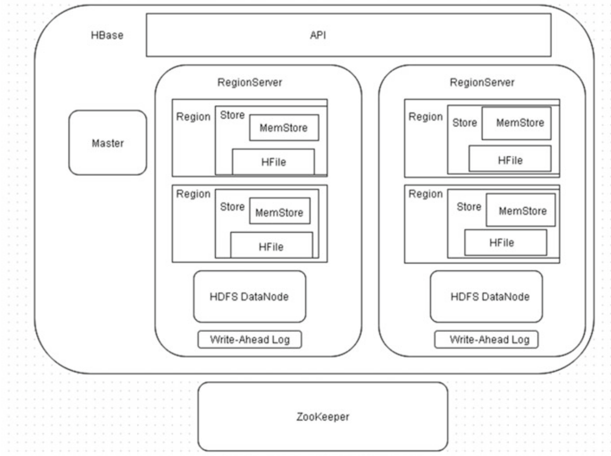

###Tài liệu Project HBase nhóm Cao Học K30 - HCMUS
_____________________________
_____________________________
_Yêu cầu 1) Tìm hiểu nội dung, đặc điểm, và các vấn đề liên quan đến loại lưu trữ dữ liệu được chỉ định_
#Chương 1: TỔNG QUAN COLUMN FAMILY
##1.1. Giới thiệu Column Family
###1.1.1. Định nghĩa
Column Family là một loại NoSQL Database...
###1.1.2. Đặc điểm
###1.1.4. Các vấn đề liên quan

##1.2. Các hệ CSDL dựa trên Column Family
+ Big table
+ HBase
+ Cassandra

_____________________________
_____________________________
_Yêu cầu 2) Tìm hiểu về loại sản phẩm NoSQL theo chỉ định_
#Chương 2: APACHE HBASE
##2.1. HBase là gì?
**HBase** là một column-oriented DBMS, lưu trữ dữ liệu theo cột thay vì theo hàng như RDBMS. HBase có nguồn gốc từ cơ sở dữ liệu BigTable của Google, chạy trên nền Hadoop Distributed File System (HDFS).

####Các đặc trưng của HBase:
+ Là dự án open source có khả năng scale theo chiều ngang (số lượng dữ liệu)
+ Được viết bằng Java
+ Xử lý tốt các loại dữ liệu thưa (nhiều giá trị rỗng)

####Một số ví dụ sử dụng HBase: 
+ E-Commerce
+ Social network
+ Hệ thống lưu trữ lịch sử chi tiết các trận đấu bóng đá

_____
+ Schema
+ Table
+ Column family & Column Qualifier
+ Region
+ Row-version
+ Block vs Block cache
##2.3. HBase vs RDBMS

##2.4. HBase Storage
##2.5. Kiến trúc HBase

Kiếm trúc cơ bản của một HBase Cluster bao gồm:
+ Master
+ RegionServers
+ Zookeeper

##2.6. Thực hành sử dụng Hbase
_Yêu cầu 3) Tài liệu kỹ thuật về nghiên cứu loại sản phẩm NoSQL qui định: cài đặt, các thao tác trên db: tạo db, thêm, xóa, sửa,... và các thao tác nâng cao
   khác (nếu có)_
###2.6.1. Hướng dẫn cài đặt chi tiết:
+ Hadoop cluster:
  + HDFS
  + Datanode
  + Namenode & secondary Namenode
  + Nodemanager
  + ResourceManager:
    + MapReduce framework
    + Zookeeper
+ HBase cluster:
  + HMaster
  + HRegionServers
  + Zookeeper
###2.6.2. Các thao tác & công cụ cơ bản:
+ HBase shell
+ HBase Java API
+ Bulk Loading Data
_____________________________
_____________________________
#Chương 3: KẾT LUẬN & MỞ RỘNG
###3.2. HBase Ecosystem
