###Tài liệu Project HBase nhóm Cao Học K30 - HCMUS
_____________________________
_____________________________
_Yêu cầu 1) Tìm hiểu nội dung, đặc điểm, và các vấn đề liên quan đến loại lưu trữ dữ liệu được chỉ định_
#Chương 1: TỔNG QUAN COLUMN FAMILY
##1.1. Giới thiệu Column Family
###1.1.1. Định nghĩa
Column Family là một database object trong Column-Oriented NoSQL Database, với dữ liệu được lưu trữ và truy xuất theo các cột thay vì các hàng như trong các loại cơ sở dữ liệu quan hệ 

###1.1.2. Đặc điểm
+ Mỗi Column Family bao gồm nhiều hàng
+ Mỗi hàng có thể chứa các cột tùy ý (không cần thiết phải giống nhau giữa các hàng)
+ Nhiều Column Family có liên hệ với nhau về mặt logic tạo thành 1 cơ sở dữ liệu hoàn chỉnh (Column Families)
+ Được tối ưu cho các hệ thống online analytical processing (các thao tác chủ yếu là query thông tin trên các cột để phân tích) (giảm khối lượng công việc và thời gian cần để thao tác với dữ liệu trên đĩa cứng)
+ Thích hợp với các hệ thống data warehousing và xử lý Big Data
###1.1.4. Các vấn đề liên quan
#### Ưu điểm
+ Compression: do dữ liệu trên mỗi Column Family chỉ gồm 1 loại, nên có thể chọn cách nén riêng cho từng Column Family, làm tăng hiệu quả
+ Dễ dàng mở rộng và chia nhỏ (scalability and partitioning)
+ Nhanh với những query chỉ cần dữ liệu trên 1 Column Family
+ Tốc độ tính toán các phép toán cần truy xuất trên toàn bộ tập dữ liệu (dataset) như SUM, COUNT, AVG, ... nhanh
#### Nhược điểm
+ Không hỗ trợ transaction
+ Chậm với các thao tác insert update delete
+ Chậm với các câu query cần truy xuất trên nhiều Column Family

##1.2. Các hệ CSDL dựa trên Column Family
+ Big table
+ HBase
+ Cassandra

_____________________________
_____________________________
_Yêu cầu 2) Tìm hiểu về loại sản phẩm NoSQL theo chỉ định_
#Chương 2: APACHE HBASE
##2.1. HBase là gì?
**HBase** là một loại NoSQL, column-oriented Database phát hành lần đầu năm 2008, lưu trữ dữ liệu theo cột thay vì theo
hàng như RDBMS. HBase có nguồn gốc từ cơ sở dữ liệu BigTable của Google, chạy trên nền Hadoop Distributed File System (HDFS),
phát triển bởi Apache. 

HBase được phân loại là một NoSQL lưu trữ dạng key-value. Value được định danh bởi một key, cả key và value đều được lưu 
trữ dạng ByteArray. Nói cách khác, HBase là một dạng NoSQL lưu trữ phi cấu trúc. Ở dạng lưu trữ có cấu trúc (RDBMS), cấu
trúc dữ liệu phải được khai báo đầy đủ rõ ràng,
và đối tượng được lưu trữ theo cột, dòng và có mối quan hệ chặt chẽ với nhau. Ngược lại, HBase cung cấp cách thức lưu trữ 
đa dạng các loại dữ liệu mà không cần khai báo tường minh trước.

####Các đặc trưng của HBase:
+ Là dự án open source có khả năng scale theo chiều ngang (scale out/horizontal scale)
+ Được viết bằng Java, chạy trên nền JVM
+ Được thiết kế để lưu trữ, xử lý dữ liệu lớn
+ Xử lý tốt các loại dữ liệu thưa (nhiều giá trị rỗng)
+ HBase là database lưu trữ dạng bảng mà không cần khai báo trước schema. Tại thời điểm tạo bảng, ta chỉ cần khai báo trước column family.

####Một số tính chất của HBase:
+ Distributed: HBase có 2 distributed mode: 
  + Pseudo-distributed (giả phân tán): Mỗi thành phần của HBase là một process riêng lẻ, và đều chạy trên 1 node. Ở mode
    này ta có thể lưu file local hoặc lưu trên HDFS. KHi chạy trên mode này dĩ nhiên khi node gặp sự cố, cả hệ thống sẽ bị ngưng. 
  + Fully-distributed (phân tán hoàn toàn): Mode này thường được dùng để vận hành sản phẩm thật vì được chạy trên một hệ 
    thống gồm nhiều node. Ở mode này HBase còn hỗ trợ cả auto-sharding, tức tự động chia tách và phân tán các bảng dữ liệu 
    khi bảng quá lớn. 
  
  
+ Flexible Data: HBase được lấy ý tưởng từ Google BigTable và chạy trên nền Hadoop. Đối tượng cơ bản mà nó lưu trữ là table (bảng).
  Một table sẽ bao gồm các column family (họ cột), trong mỗi column family lại chứa nhiều column. Sau cùng, dữ liệu sẽ được lưu thành các 
  row (dòng). Các dòng sẽ được sắp xếp theo thứ tự từ điển dựa vào key (khóa) tương ứng để phục vụ tối ưu khi truy vấn.
  Ngoài ra, HBase không quy định trước kiểu dữ liệu, vì tất cả các loại dữ liệu đều được lưu dưới dạng ByteArray.
  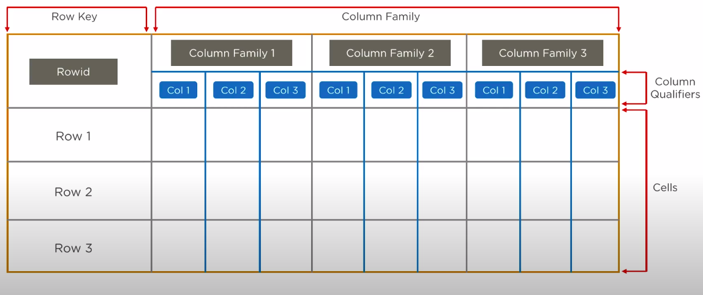
  

+ Non-Relational: NoSQL database vận hành theo cơ chế storage-and-query, nên sẽ không tồn tại các quan hệ giữa các bảng.
  
+ Big data storage: HBase lưu trữ dữ liệu trên HDFS nên cũng được thừa hưởng các đặc trưng của hệ thống này. Hệ thống có thể 
  xử lý hàng PB dữ liệu với độ trễ thấp, real-time. HBase được thiết kế để có thể truy vấn được các table lớn với tốc độ nhanh.

+ Scalable: Như đã trình bày ở phần đầu, HBase có thể scale theo chiều ngang (scale-out) bằng cách gắn thêm nhiều node mới, 
  sau đó các Region (nơi lưu trữ các table) tự động chia tách và tạo ra nhiều Region mới, tích hợp vào hệ thống.

##2.2 Vì sao cần HBase?
Với sự bùng nổ của Internet những năm gần đây và trong tương lai, đặc biệt trong lĩnh vực như Social network, social media, kinh doanh online,...
thì lượng dữ liệu phát sinh hàng ngày, hàng giờ là cực kỳ lớn và ngày càng gia tăng. 
Để đám ứng nhu cầu thu thập, lưu trữ, truy xuất và khai thác dữ liệu lớn, các loại database mới ra đời để giải quyết các bài toán,
tình huống cụ thể khi thao tác với dữ liệu lớn nói trên với performance tốt, khả năng scale tốt và dễ dàng truy xuất.
Trong số đó, HBase là loại column-base database mạnh mẽ và phổ biến trên thế giới.

####Các loại ứng dụng có thể dùng HBase: 
+ Hệ thống audit log
+ Tracking user action
+ Realtime counters, realtime analytics
+ Monitor các hệ thống
+ Hệ thống message
+ Lưu trữ dữ liệu thu thập từ web
+ Lưu trữ dữ liệu sparse (thưa)
+ Nhiều người dùng truy cập đồng thời (stream,...)

####Các loại ứng dụng không nên dùng HBase:
+ Cần đến transaction hoặc các quan hệ, ràng buộc chặt chẽ
+ Cần join dữ liệu
+ Dữ liệu quy mô nhỏ
+ 

##2.3. HBase vs RDBMS
Sau đây là bảng so sánh môt số đặc trưng, tính chất cơ bản của HBase và RDBMS

|Feature             | RDBMS            | HBase            |
| ------------------ | -----------------|------------------|
|Data volume         |TB of data        |PB of data
|Primary query language |SQL |Get, Put, Scan shell
|Data object         |Table             |Table       
|Relational          |Yes               |No       
|Join                |Yes               |No       
|Transactions        |Supported         |Not supported
|Indexes             |Primary, secondary, B-Tree,Clustered |Secondary indexes 
|Schema              |Fixed schema      |Schema-less       
|Storage model       |Table spaces       |StoreFiles (HFiles) in HDFS
|Oriented            |Row-oriented      |Column-oriented
|Caching             |Standard data/metadata cache with query cache |In-memory caching
|Architecture        |Monolithic        |Distributed
|Fault tolerant      |Some case         |Highly fault tolerant       |
|Scalability         |Hard              |Highly horizontal scalability       |
|Read/write throughput |~1.000s/second |~1.000.000s/second
|Sharding            |Limited support. Manual server sharding. Table partitioning |Auto-sharding|
|Write performance   |Does not scale well |Scales linearly
|Single point of failure |Yes |No

##2.4. HBase Data Model
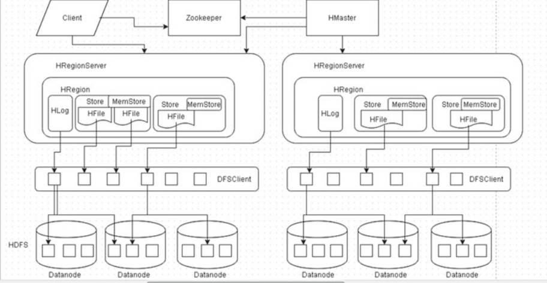

###Lưu trữ:
HBase sử dụng 2 định dạng file chính là HLog và HFile, được vào các HDFS Datanode thông qua DFSClient. Điều này giúp cho HBase có thể 
  tập trung vào việc tối hưu truy vấn và cập nhật dữ liệu, vốn không phải thế mạnh của HDFS nguyên thủy.
Tập hợp một số file như trên được quản lý bởi một Region (trình bày ở phần sau), thường được sao lưu thành 3 bản lưu ở 3 datanode khác nhau.

+ Column family & Column & Row: Mỗi file HFile riêng biệt sẽ chứa thông tin của một (và chỉ một) Column family. 
  Mỗi column family bao gồm nhiều column. Giá trị cần lưu trữ trong bảng là giao điểm giữa một column và một row, được xác định bằng row key.
Ở trong một table có 2 loại index theo thứ tự từ điển, index chính sẽ theo thứ tự các row key, còn index phụ sẽ index các column (theo mỗi row).  
Table trong HBase thường khá thưa, bởi vì mỗi row không nhất thiết phải có tất cả các column family của table đó.
  

+ Region: Region là các mảnh của một table hoàn chỉnh. Tập hợp một số region sẽ được quản lý bởi một HRegionServer. 

+ Key-Value: Cấu tạo một Key được mô tả như sau:
  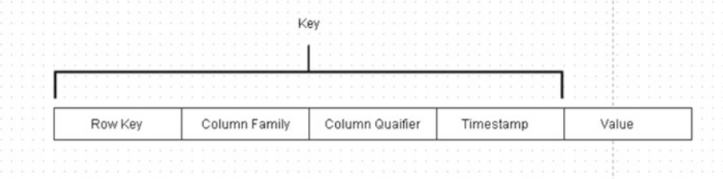
  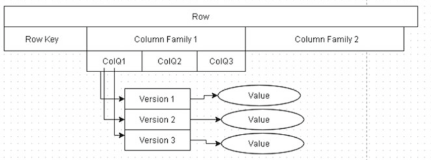
  

+ Row-version: Mỗi một ô trong table khi được thêm mới hoặc cập nhật thì đều phát sinh ra một version (timestamp). Ví dụ hình trên ColQ1 được cập nhật
3 version, sắp xếp từ mới tới cũ. Hình sau đây mô tả cách thức lưu trữ vật lý trong một HFile:
  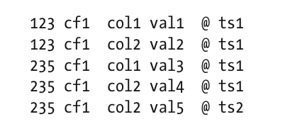

##2.5. Kiến trúc HBase
Chương này chủ yếu tìm hiểu kiến trúc HBase ở mode distributed.

Kiếm trúc cơ bản của một HBase Cluster bao gồm:
+ Master
+ RegionServers
+ Zookeeper

1. Master: Còn gọi là HMaster, chạy trên Namenode (của HDFS). Process này có nhiệm vụ quản lý toàn bộ cluster, bao gồm các công việc như:
    + Chỉ định region nào được lưu vào RegionServer nào lúc khởi tạo, hoặc lúc bị lỗi.
    + Load balancing
    + Monitor các ResgionServer
    + Quản lý các thay đổi trong metadata
  

2. RegionServer: Là process chạy trên Datanode (của HDFS), là nơi tiếp nhận lệnh từ Master, phụ trách quản lý data. Trong đó, mỗi RegionServer lưu trữ một số lượng Region được giao cho. Mỗi phân đoạn chứa số lượng row nhất định của một table
sẽ được lưu ở các RegionServer khác nhau. RegionServer bao gồm các thành phần chủ yếu sau:
   + Region(s): Là phân mảnh của một table cần được lưu trữ. Một region sẽ giữ một lượng row (sắp xếp theo đúng thứ tự được index) của table tương ứng.
  Table càng thêm nhiều row thì số region tách ra càng nhiều, và được sao lưu để phân tán qua các RegionServer khác.
   + Write-Ahead Log (WAL): Là nơi đầu tiên ghi dấu lại mọi cập nhật vào file HLog, trước khi cập nhật đó đi tới Memstore và tới HFile.
  Mục đích lưu dấu này là để tái hiện lại cập nhật trong trường hợp RegionServer bị lỗi.
   + Store: Gồm 2 thành phần là Memstore (lưu data trên memory) và HFile (lưu data trên file vật lý). Khi Memstore bị đầy hoặc
  đến ngưỡng nhất định, data sẽ được flush xuống Hfile.   

3. Zookeeper: Là đơn vị quản lý vận hành của toàn bộ kiến trúc trên. Một số công việc cụ thể như:
    + Thông báo đến các đơn vị khác trạng thái hiện tại của Master
    + Lưu trữ metadata của Master và recover lại Master trong trường hợp lỗi
    + Lưu trữ danh sách tất cả các region của hệ thống
  
Ngoài ra còn một số cơ chế Cache và Block-Cache hỗ trợ truy vấn, cơ chế chia tách table thành các region (Spliting) và gộp các region 
(Compaction) chưa được trình bày sâu trong báo cáo này. 

###Đường đi của data
Hình dưới đây minh họa đường đi của dữ liệu trong HBase:
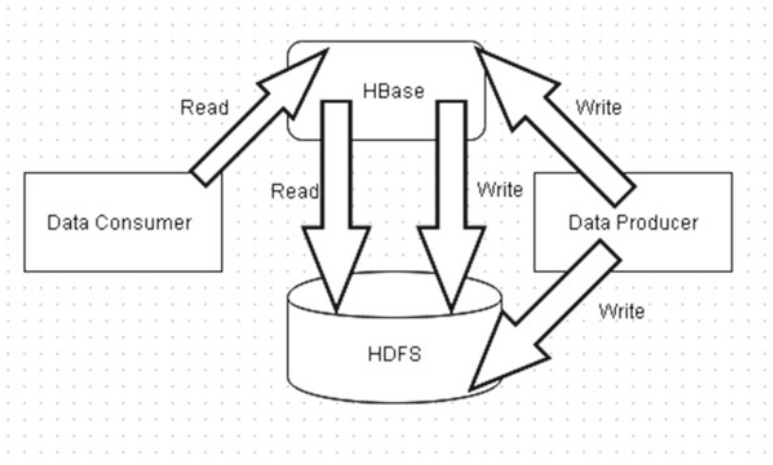
+ Read: Client read data từ HBase <- HBase lấy data từ HDFS
+ Write: Client white data vào HBase -> HBase write data vào HDFS. Bên cạnh đó, client cũng có option white data trực tiếp
  vào HDFS

Quá trình giao tiếp giữa HBase với HDFS được thông qua các đối tượng HDFS Client

________
##2.6. Thực hành sử dụng Hbase
_Yêu cầu 3) Tài liệu kỹ thuật về nghiên cứu loại sản phẩm NoSQL qui định: cài đặt, các thao tác trên db: tạo db, thêm, xóa, sửa,... và các thao tác nâng cao
   khác (nếu có)_
###2.6.1. Hướng dẫn cài đặt chi tiết:
Các bước cài đặt cần thiết cho từng thành phần của một HBase Cluster được mô tả cụ thể trong link các link tham khảo:
+ http://hbase.apache.org/book.html
+ https://computingforgeeks.com/how-to-install-apache-hadoop-hbase-on-ubuntu

Ở quy mô của báo cáo này sẽ hướng dẫn các bước cài đặt HBase ở mode _pseudo-distributed_. Cụ thể từng bước như sau:
+ Cài đặt Java: Tham khảo các bước trong link https://ubuntu.com/tutorials/install-jre#3-installing-oracle-jre
+ Cài đặt SSH-server, mặc định port của ssh là 22. Sau khi cài đặt và enable SSH, ta cần add ssh-key của client vào server
  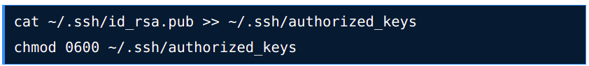
+ Cài đặt Hadoop:
  + Tải bản Hadoop version stable theo link https://hadoop.apache.org/releases.html, sau đó giải nén và move vào /usr/local/hadoop
    
    
  + Tạo và cập nhật các biến môi trường cho Hadoop:
    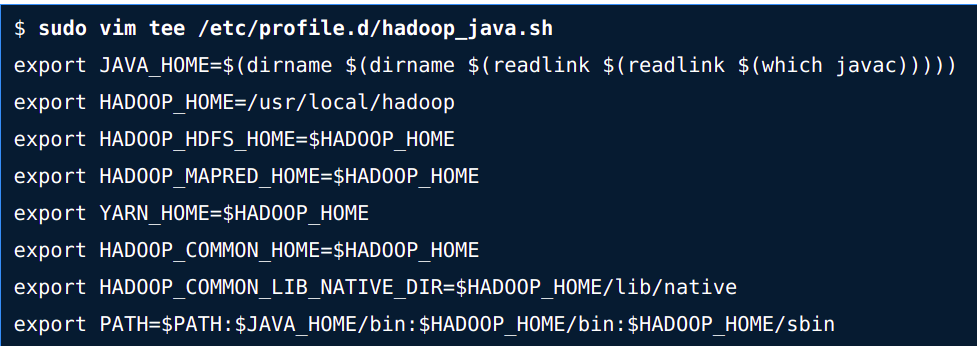
    
    
  Các file config quan trọng trong "/usr/local/hadoop/etc/hadoop/":
  + core-site.xml: file này chứa các cấu hình cơ bản để khởi động Hadoop cluster, ta gán cơ bản như sau
    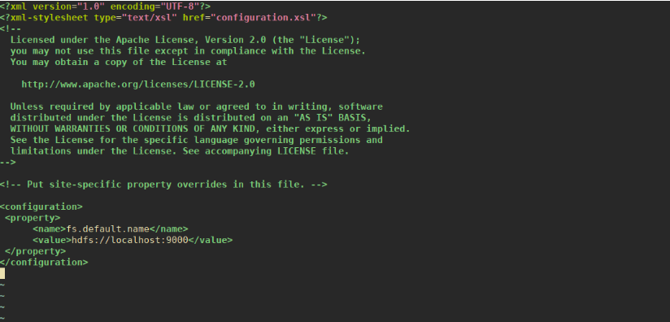
    
  + hdfs-site.xml: chứa cấu hình thư mục lưu trữ các tập tin  của HDFS
    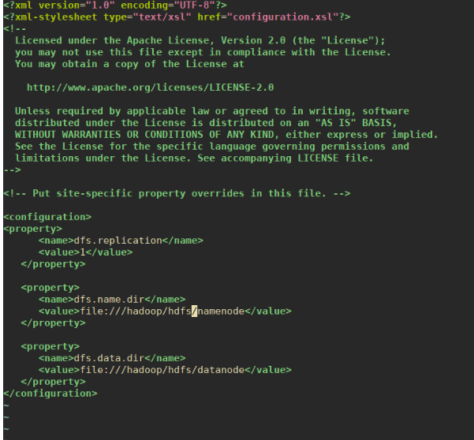
    
  + mapred-site.xml: Quy định framework được sử dụng cho MapReduce - mô hình tính toán của Hadoop:
    
    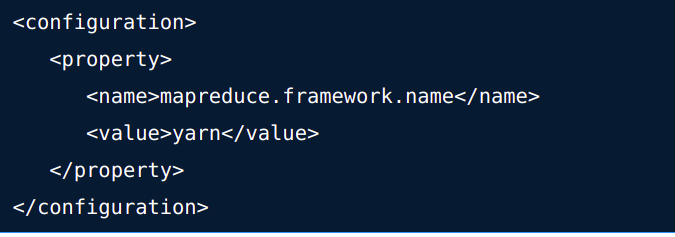
    
  + yarn-site.xml:
    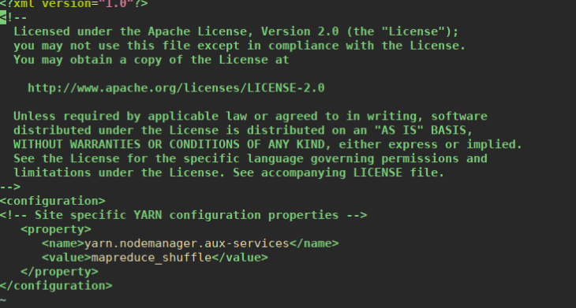
    
  + Cuối cùng khởi chạy Hadoop:
    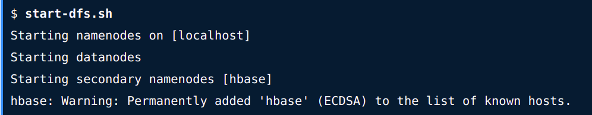
    
  + Ta truy cập vào http://0.0.0.0:50070 để xem màn hình quản lý Datanode của Hadoop
    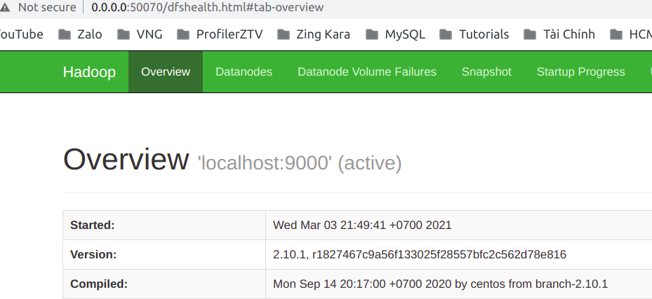
  
  
    
+ Cài đặt HBase cluster:
  + Tải HBase: https://downloads.apache.org/hbase/
  + Giải nén vào thư mục /opt/hbase
  + Thêm các biến môi trường vào tập tin ~/.bash_profile với nội dung sau:
         
        export HBASE_HOME="/opt/hbase"
        export PATH="$HBASE_HOME/bin:$PATH"
    
  + Sửa nội dung tập tin /opt/hbase/conf/hbase-env.sh với nội dung sau:
    
        export JAVA_HOME=/usr/java/default
        export HBASE_MANAGES_ZK=true
        export HBASE_PID_DIR=/opt/hbase/var
  + Cấu hình trong tập tin /opt/hbase/conf/hbase-site.xml với các thông tin quan trọng:
    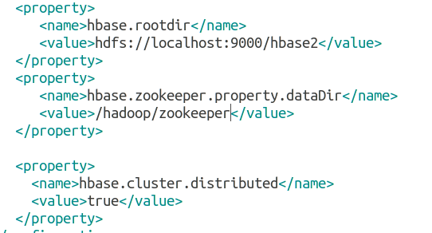
    
  + Khởi chạy HBase bằng lệnh __/opt/hbase/bin/start-hbase.sh__
    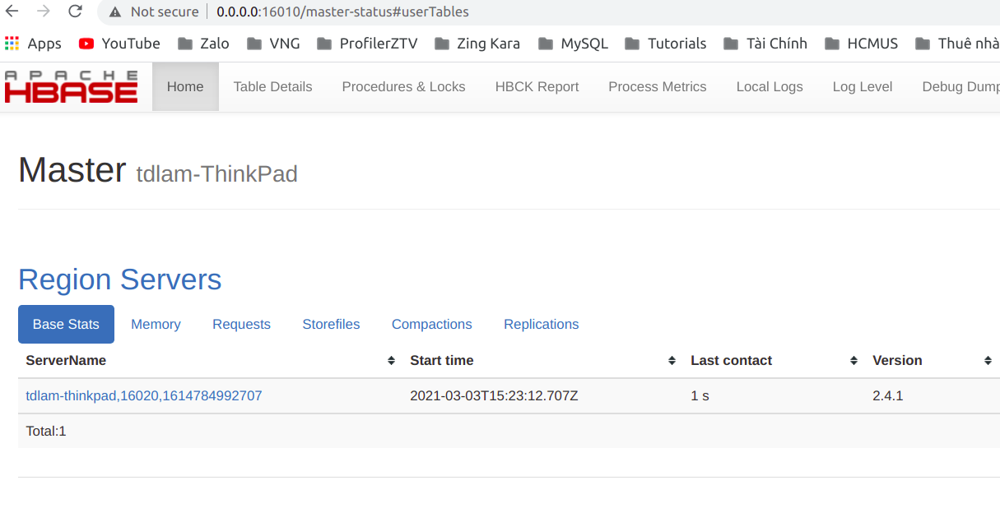
  
  
    
###2.6.2. Các thao tác & công cụ cơ bản:
+ HBase shell
+ HBase Java API
  + __org.apache.hadoop.hbase.client.Admin__: Class này dùng làm interface để quản lý các Table của HBase, và làm một số tác vụ quản trị khác như thêm, xóa, tra cứu, bật/tắt các Table; thêm/cập nhật các Column family của table.
  Code ví dụ được trình bày trong file UsingHBaseAdmin.java trong mã nguồn đính kèm báo cáo này.
  + org.apache.hadoop.hbase.client.Table: Là interface giao tiếp với một Table trong HBase. Ví dụ cụ thể mô tả trong file
  UsingHTable.java
+ hbtop (optional)
+ Bulk Loading Data (optional)
_____________________________
_____________________________
#Chương 3: KẾT LUẬN & MỞ RỘNG
###3.2. HBase Ecosystem
###3.3. HBase vs Cassandra
https://appinventiv.com/blog/hbase-vs-cassandra/
https://logz.io/blog/nosql-database-comparison/
