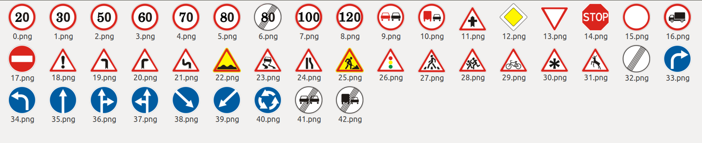
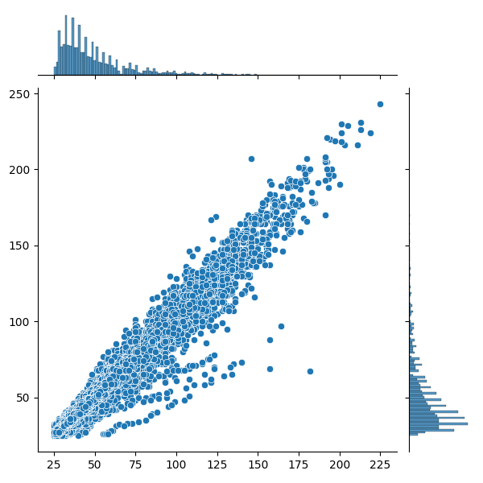

# ĐỒ ÁN CÀI ĐẶT HỆ THỐNG MULTIMEDIA

### Thành viên

+ Trần Đình Lâm
+ Trương Thế Kiệt
+ Đăng Nhật Minh

# HỆ THỐNG NHẬN BIẾT TỐC ĐỘ QUY ĐỊNH THÔNG QUA HÌNH ẢNH BIỂN BÁO GIAO THÔNG

___

## I. Giới thiệu bài toán

### I.1 Thực trạng - đặt vấn đề

### I.2 Các công nghệ sẵn có

___

## II. Phân tích - Thiết kế mô hình

### II.1 Mô hình tổng quan của ứng dụng

### II.2 Bước phân loại biển báo tốc độ duy định

#### 1. Phân tích bộ dữ liệu sử dụng:

Bước phân loại biển báo (Traffic sign classification), nhóm sử dụng bộ dữ liệu GTSRB để huấn luyện một mạng CNN đơn giản
để phân loại các biển báo giao thông. Cụ thể:

+ Dataset có tổng cộng 43 loại traffic sign, trong đó 8 loại biển báo quy định tốc độ tối đa bao gồm:20km/h,
  30,50,60,70,80,100,120
  
+ Trong đó, các hình được cung cấp không đồng đều về kích thước, và đặc biệt phân bố hầu hết ở khoảng kích thước 50x50
  
+ Từ đó ta có thể chọn ra số lượng đủ nhiều các hình thuộc 8 loại biển báo với khoảng xxx hình tổng cộng. Tập này dùng
  làm dữ liệu huấn luyện cho pha phân loại (classification) trong mô hình

### II.3 Bước phát hiện đối tượng biển báo

### II.4 Bước thể hiện trên giao diện ứng dụng

___

## III. Cài đặt thực nghiệm

___

## IV. Kết quả - Nhận xét

___

## Tài liệu tham khảo

+ https://benchmark.ini.rub.de/gtsrb_dataset.html
+ https://www.kaggle.com/gmerek/traffic-signs-detection-by-yolo-v3-opencv-31da0b