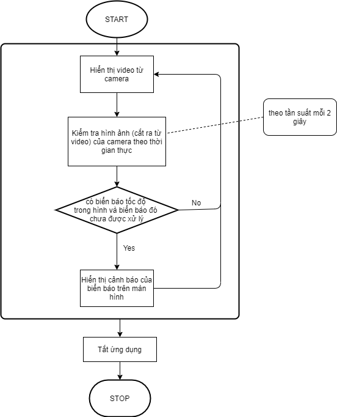
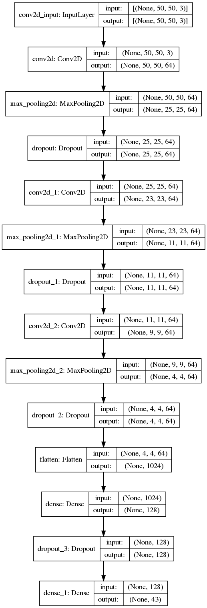
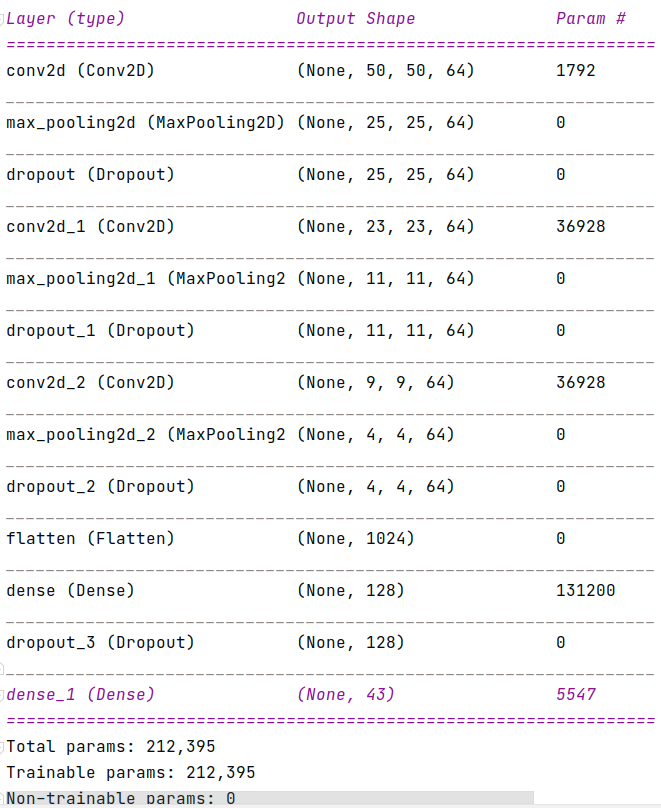
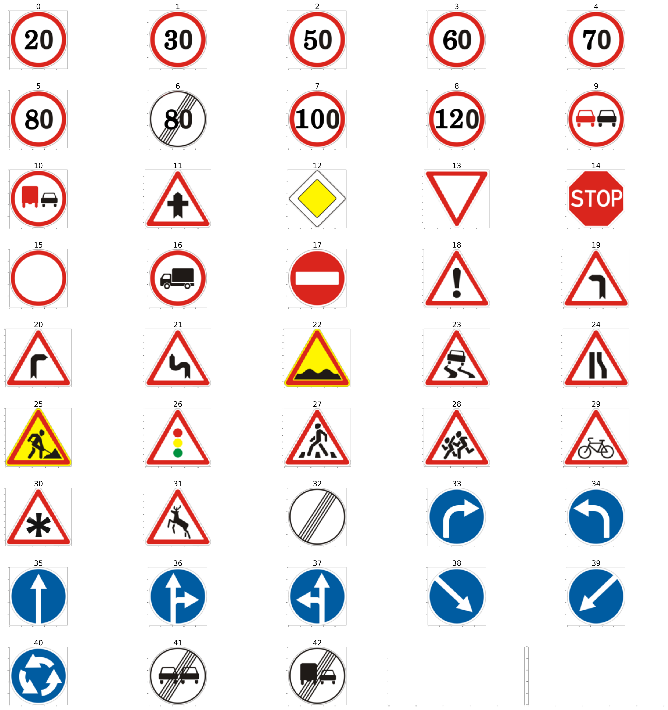
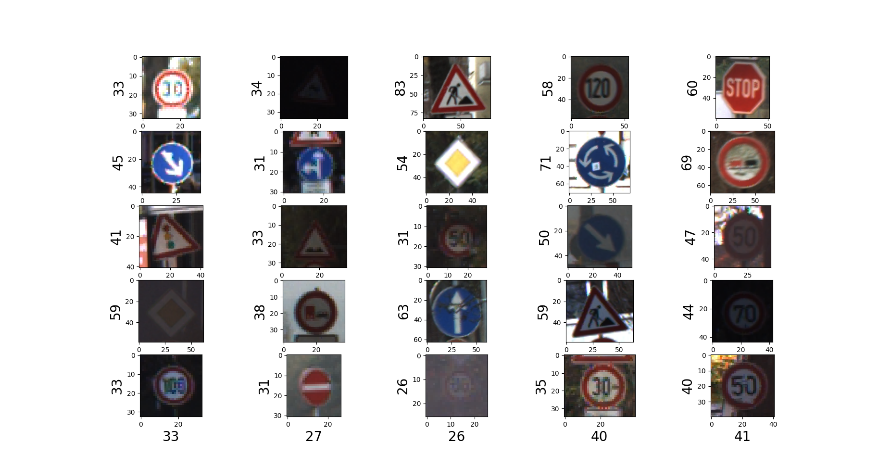

# MULTIMEDIA SYSTEM REPORT

## Tổng quan
+ Trong các loại biển báo giao thông, các biển báo quy định về tốc độ xuất hiện với tần suất khá lớn. Khi di chuyển trên đường, chúng ta đôi khi không nhớ ra ý nghĩa hoặc không chú ý tới các biển báo tốc độ đó, dẫn đến việc vi phạm luật giao thông
+ Với mong muốn giải quyết vấn đề này bằng những kiến thức đã học về mạng neural và xử lý hình ảnh, nhóm quyết định sẽ nghiên cứu để tạo ra một ứng dụng với đầu vào là video từ camera hành trình, giúp người dùng biết được những biển báo tốc độ trên đường và đưa ra cảnh báo về giới hạn tốc  một cách dễ dàng, nhanh chóng và trực quan nhất
## Mô tả ứng dụng
### Cách hoạt động
+ Từ dữ liệu đầu vào là video từ camera hành trình gắn trên xe, cứ sau một khoảng thời gian cố định, hệ thống cắt ra 1 khung hình (IMG_1) để xử lý.
+ Quá trình xử lý bao gồm: 
+ **Bước 1: nhận dạng biển báo giao thông trong ảnh**
    + Đưa ảnh IMG_1 vào YOLO để nhận dạng xem có biển báo giao thông trong hình hay không và xác định bounding box cho các biển báo đó
        + Nếu tìm ra được biển báo, chuyển qua bước 2
        + Nếu không có biển báo nào trong ảnh, kết thúc quá trình xử lý, trở lại trạng thái chờ
+ **Bước 2: phân loại biển báo tốc độ**
    + Từ dữ liệu đầu vào là bounding box của các biển báo trong ảnh IMG_1, mạng CNN sẽ phân loại để tìm ra tên biển báo tốc độ
    + Từ tên biển báo tốc độ, ta đưa ra cảnh báo cho người dùng
    + Kết thúc quá trình xử lý, trở lại trạng thái chờ  
### Sơ đồ hoạt động

## Mô hình nhận dạng biển báo
### Sơ lược về mô hình YOLO4
## Mô hình phân loại biển báo tốc độ
### Sơ lược về mô hình phân loại biển báo tốc độ sử dụng CNN
+ Dựa theo cấu trúc một số mạng CNN được sử dụng tương ứng cho tập dữ liệu GTSRB trên Kaggle [3], cùng một số điều chỉnh mới, nhóm đã xây dựng mô hình mạng CNN như hình dưới:

+ Theo đó, cấu trúc mạng bao gồm 6 layer chính:
    + Layer 1 đến layer 3: Convolutional với kernel size 3x3, sau đó kết hợp max pooling 2x2 và dropout 50%
    + Layer 4: Là một lớp Flatten để dàn phẳng output của layer 3
    + Layer 5 và Layer 6: Fully-connected layer
    + Đầu ra cuối cùng là vector 43 chiều, biểu thị 43 loại biển báo giao thông cần phân loại.
+ Sau khi cài đặt, các thông số mô tả mô hình biểu thị như hình sau:

    
### Tập dữ liệu huấn luyện
+ German Traffic Sign Recognition Benchmark(GTSRG) là bộ data được sử dụng để trainning và test trong khảo sát này. Bộ data này được phần chia thành 43 loại với tổng số lượng hình ảnh cho bộ dữ liệu train lên đến 39209 hình. 
    + Các loại biển báo trong bộ data GTSRG:
    
+ Hình ảnh trong mỗi loại biển báo rất đa dạng về độ lớn, độ tương phản, noise và blurred.    

### Chuẩn hóa dữ liệu
+ Do hình ảnh với size khác nhau, nên mỗi tấm ảnh từ nguyên gốc với size w x h x 3 sẽ được đưa về dạng được resize về 50x50x3. 
+ Sau khi chuẩn hóa xong thì dùng numpy để lưu lại 2 file vào folder "numpy", để không phải scan lại tập train.
+ Lúc này ta có được tập train kích thước (39209, 50, 50, 3)
### Quá trình huấn luyện
+ Tập dữ liệu được chia thành 2 tập để train và test
## Sử dụng trong thực tế
### Mô tả cách sử dụng
+ giới thiệu video dùng để test, chụp màn hình, demo, ...
