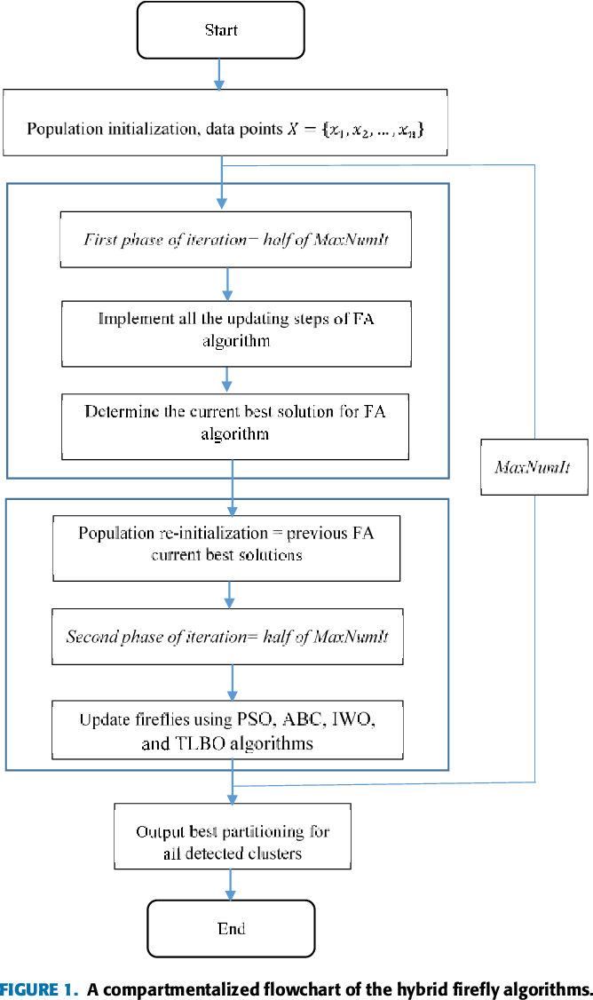

#Note lại các thuật ngữ xuất hiện trong paper

+ **Clustering:** Một bài toán phân nhóm toàn bộ dữ liệu X 
  thành các nhóm nhỏ dựa trên sự liên quan giữa các dữ liệu trong mỗi nhóm.
  + Ví dụ: phân nhóm khách hàng dựa trên hành vi  mua hàng. Điều này cũng giống như việc ta đưa cho một đứa trẻ rất nhiều mảnh ghép với các hình thù và màu sắc khác nhau, 
  ví dụ tam giác, vuông, tròn với màu xanh và đỏ, sau đó yêu cầu trẻ phân chúng thành từng nhóm. Mặc dù không cho trẻ biết
  mảnh nào tương ứng với hình nào hoặc màu nào, nhiều khả năng chúng vẫn có thể phân loại các mảnh ghép theo màu hoặc hình dạng.

  + Đặc điểm:
    + Số cụm dữ liệu không được biết trước
    + Có nhiều các tiếp cận, mối cách lại có vài kỹ thuật
    + Các kỹ thuật khác nhau thường mang lại kết quả khác nhau.
  + Tính chất của độ đo khoảng cách:
    + Tính không âm (non-negative): d(x,y) >=0 và d(x, y) = 0 khai và chỉ khi x trùng y.
    + Tính đối xứng (symmetic): d(x, y) = d(y, x)
    + Tính tam giác (traingle inequality): d(x, y) + d(y, z) >= d(x, z)
  + Các độ đo khoảng cách
    + Độ đo Euclid r1
    + Độ đo Euclid chuẩn (r = 2)
    + Độ đo Manhattan
    + Độ đo Cosine
    + Độ đo Hamming
    + Độ đo Jaccard
    + Độ đo Kullback-Leibler (KL)
  + Hình dưới đây mô tả khái quát các loại thuật toán clustering hiện có 
    
___
+ **Hierarchical clustering**: Phân cụm phân cấp 
  + Agglomerative: "đi từ dưới lên": Ban đầu chọn K là một số lớn gần bằng số điểm dữ liệu. Sau khi thực hiện phân cụm K-meas
  lần đầu, các cụm gần nhau được ghép lại thành một cụm. Lúc này khoảng cách giữa các cụm có thể được xác định bằng khoảng cách
  giữa các tâm cụm. Tiếp tục K-means ở các bước tiếp theo để giảm dần số lượng cụm.
    
    + Các tiêu chí chọn hai cụm để sát nhập:
      + _Centroid-linkage_: Sát nhập hai cụm có khoảng cách giữa hai tâm của hai cụm này là nhỏ nhất.
      + _Single-linkage_: khoảng cách giữa hai điểm gần nhau nhất thuộc hai cụm. Sát nhập hai cụm có khoảng cách này nhỏ nhất.
      + _Average-linkage_: trung bình các khoảng cách giữa hai cặp điểm bất kì thuộc hai cụm. Sát nhập hai cụm có khoảng cách này nhỏ nhất.
      + _Complete-linkage_: khoảng cách giữa hai điểm xa nhau nhất của hai cụm, sát nhập hai cụm có khoảng cách này là nhỏ nhất.
      + _Radius:_ bán kính của một cụm là khoảng cách từ tâm tới điểm xa nhất của cụm, sát nhập hai cụm nếu hai cụm tạo ra một cụm có bán kính nhỏ nhất.
      + _Diameter:_ đường kính của một cụm là khoảng cách của hai điểm xa nhau nhất trong cụm, sát nhập hai cụm nếu chúng tạo nên một cụm có đường kính nhỏ nhất.
      

  + Divisive: "đi từ trên xuống": Ban đầu k-means với K nhỏ để thu được các cụm lớn. Sau đó tiếp tục K-means trên mỗi cụm đến khi 
  kết quả chấp nhận được.
  + Ưu điểm của phân cụm phân lớp là không phải xác định trước số lượng cụm điều này khá vượt trội so với K-Means. Tuy nhiên, nó không hoạt động tốt với lượng dữ liệu khổng lồ.
  + Thuật toán phân cụm phân lớp có thể được sử dụng để xác định, dự đoán số cụm trước khi thực hiện thuật toán K-Means.
___
+ **Partitioning clustering**: là phương pháp non-hierarchical clustering phổ biến nhất, là phương pháp phân cụm one-level, 
  các cluster không thể hiện dưới dạng cấp bậc. Hướng tiếp cận cơ bản nhất trong Partition clustering là tách cụm độc quyền,
  giống như Hard-clustering, mỗi object chỉ thuộc một cluster duy nhất.
  + Thuật toán phân cụm theo phương pháp này, phổ biến và đơn giản nhất đó chính là K-Means
  
___
+ **NP:** In computational complexity theory, NP (nondeterministic polynomial time) is a complexity class used to classify 
  decision problems. NP is the set of decision problems for which the problem instances, where the answer is "yes", have 
  proofs verifiable in polynomial time by a deterministic Turing machine.
https://stackoverflow.com/questions/1857244/what-are-the-differences-between-np-np-complete-and-np-hard
+ **NP-Hard:** at least as hard as the hardest problems in NP
___
+ **fitness function/objective function:** hàm cần tối ưu hóa trong bài toán. Hàm này được chọn, hoặc suy ra từ yêu cầu của bài toán. 
Đây là hàm mục tiêu của bài toán, ta giải bài toán bằng cách tìm ra cực tiểu toàn cục (global optima) của hàm này, bằng các kỹ thuật, thuật toán hay 
  phương pháp tối ưu hóa.
___
+ **Evolution algorithm:** 
  + Một giải thuật tiến hóa (evolutionary algorithm - EA) là một thuật toán tối ưu hóa heuristic sử dụng các kỹ thuật bắt 
    nguồn từ các cơ chế tiến hóa hữu cơ (organic evolution) chẳng hạn như biến dị, tái tổ hợp và chọn lọc tự nhiên để tìm 
    một cấu hình tối ưu cho một hệ thống với các ràng buộc cụ thể.
___
+ **Metaheuristic**: Những kỹ thuật tối ưu hóa thường được dùng đề tìm kiếm các giải pháp cho bài toán tối ưu hóa toàn cục.
  Trong đó chia thành 2 loại kỹ thuật khác nhau: Thuật toán chính xác và thuật toán gần đúng. Thuật toán chính xác là các mô hình 
  toán học đã được dùng để tìm kiếm giải pháp tối ưu. Thuật toán gần đúng (metaheuristic) là giải pháp gần tối ưu trong một thời gian 
  giải thuật ngắn, phù hợp cho những công trình phức tạp.
  + Metaheuristic là một cách gọi chung cho các giải thuật heuristic trong việc giải quyết các bài toán tổ hợp khó.
  + Metaheuristic bao gồm những chiến lược khác nhau trong việc khám phá không gian tìm kiếm bằng cách sử dụng những phương thức 
  khác nhau và phải đạt được sự cân bằng giữa tính đa dạng và chuyên sâu của không gian tìm kiếm.
  + Một cài đặt thành công của metaheuristic trong một bài toán tổ hợp phải cân bằng giữa sự khai thác được kinh nghiệm thu thập được trong quá trình tìm kiếm để xác định 
  được những vùng với những lời giải có chất lượng cao gần tối ưu.
  + Trong bài toán tối ưu, bằng việc tìm kiếm trong một vùng lớn của những giải pháp khả thi (feasible solutions), metaheuristic 
  có thể tìm được lời gii3 gần tối ưu trong một khoảng thời gian ít hơn, tốn ít công sức hơn.
  + 2 thành phần chính của phương pháp metaheuristic là:
    + thăm dò  - exploration (đa dạng hóa): Quá trình khám phá không gian tìm kiếm và tránh bẫy trong các cực tiểu địa phương.
    + khai thác - exploiation (tăng cường): Quá trình cải thiện bất kỳ giải pháp hứa hẹn nào đã thu được cho đến thời điểm hiện tại.
___
+ **Firefly Algorithm:** Trong tối ưu hóa, thuật toán đom đóm là một metaheuristic do Xin-She Yang đề xuất năm 2007 và lấy cảm hứng từ hành vi 
  nhấp nháy của đom đóm. Thuật toán bầy đom đóm là một công cụ hiệu quả cho tối ưu hóa toàn cục
  
  Có 3 rule dùng để xây dựng thuật toán:
  + 1. Tất cả đom đóm có thể **bị thu hút** bởi các đom đóm khác **sáng hơn**.
  + 2. **Độ sáng** của mỗi con được xác định bằng một hàm **objective function**
  + 3. **Độ thu hút** tỉ lệ thuận trực tiếp đến độ sáng, và khoảng cách giữa 2 đom đóm càng xa thì độ thu hút và độ sáng đều giảm.
     + Có nghĩa là 1 con đom đóm sẽ di chuyển đến gần con khác sáng hơn
     + Khi không có con nào sáng hơn, nó di chuyển ngẫu nhiên
   
    
___
+ **Particle Swarm Optimization (PSO):** Swarm Optimization (SO) tối ưu hóa bầy đàn, là một trong những thuật toán xây dựng dựa trên khái niệm Swarm Intelligence,
để tìm kiếm lời giải cho bài toán tối ưu.
  + SO là một dạng của các thuật toán tiến hóa như  thuật giải di truyền(Genetic algorithm (GA)), Thuật toán đàn kiến(Ant colony algorithm). 
  + SO khác ở chỗ no thiên về sử dụng sự tương tác giữa các cá thể trong quần thể đó.
  + Được giới thiệu vào năm 1995 tại một hội nghị của IEEE bởi James Kennedy và kỹ sư Russell C. Eberhart
___
+ **Mutation Firefly Algorithm:** Thuật toán đom đóm đột biến được mô tả chung trong bài báo

___
+ **Hybrid Firefly Algorithm:** Thuật toán đom đóm lai
     
     
  + Đề xuất của paper cho mô hình thuật toán lai FA với 4 thuật toán tối ưu khác được chọn:
  
     
     
  
  
___
+ **FAPSO:** Thuật toán đom đóm FA lai với thuật toán tối ưu hóa bầy đàn PSO:
  + What:
  + Why: khi lai FA-PSO ta được gì?
    + Nó tận dụng được khả năng tìm kiếm ngẫu nhiên của FA, dựa vào cơ chế thu hút độc đáo của FA
    + Nó tận dụng được khả năng tìm kếm cục bộ của PSO, nhờ vào khả năng liên kết hiệu quả của bầy đàn 
    Từ đó giúp vài toán hội tụ nhanh hơn
  + How: Thuật toán thực hiện được mô tả chung cho 4 thuật toán thông qua mã giả được trình bày trong paper. Trong đó, thay vì chạy 
  N vòng lặp chỉ để thực hiện các bước cập nhật FA, thì các tác giả chia thành 2 pha:
    + N/2 vòng lặp đầu thực hiện các bước cập nhật FA như bình thường
    + N/2 vòng lặp sau, tái sử dụng lại tập quần thể đom đóm tìm được ở pha đầu, thực hiện cập nhật theo các bước của PSO 
___      
**Cluster quality statistic**
+ **Clustering validity:** Là khái niệm chỉ các chỉ số, phương pháp đánh giá (có lượng hóa) kết quả phân cụm của các thuật toán
  + Các phương pháp đánh giá thường dựa trên các tiêu chí internal và external
  + Nếu pp nào dựa trên cơ sở thống kê, thì sẽ bị gặp trở ngại bởi chi phí tính toán cao.
  + Đối với các tiêu chí internal, ta chia thành 2 chỉ số:
    + Cohesion: Sự gắn kết của các phần tử trong cùng 1 cụm.
    + Separation: Sự tách rời, tách biệt của một cụm so với các cụm còn lại.
    + Kết hợp giữa cả 2 chỉ số trên
  
  + Trong paper có sử dụng 2 độ đo/phương pháp đánh giá là Compact-Separated Index và Davis-Bouldin Index
  để đánh giá chất lượng phân cụm của 4 thuật toán lai đề xuất. 
___
+ **Compact-Separated:**  

___
+ **Davis-Bouldin:**  The DB index estimates the quality of clustering by evaluating:
  + intra-cluster (khoảng cách trung bình giữa tất cả các điểm trong cụm tính từ tâm cụm)
  + to inter-cluster (Khoảng cách giữa 2 tâm cụm)  
  gọi Wi là khoảng cách intra-cluster của cụm i, tập hợp Bi, tâm xi
    
     
    Trong đó V(R,xi) là khoảng cách giữa tập điểm dữ liệu R của cụm i, tới tâm xi
     
    Gọi H(ij) là khoảng cách inter-cluster giữa 2 tâm cụm khác nhau i và j (i<>j)
    
    
     
    J_DB càng nhỏ, phân cụm càng tốt.
     
+ Vậy ta cần tối ưu hóa giá trị J_DB này để tìm ra phân cụm tốt nhất 
___
+ **Automatic clustering:** Kỹ thuật tự động phân cụm dữ liệu mà không cần biết trước số cụm hay bất kỳ tri thức nào của dữ liệu.
___
+ **Local optima:** 
  + Là cực trị địa phương, (tối thiểu hoặc tối đa) của hàm mục tiêu cho một vùng nhất định của không gian đầu vào, chưa chắc đó là global optima.
  + Một hàm mục tiêu có thể có nhiều optima cục bộ hoặc nó có thể có một optima cục bộ duy nhất, trong trường hợp đó, optima cục bộ cũng là optima toàn cục.
___ 

+ **Artificial bee colony optimization (ABC):** Thuật toán ong bầy đàn
___ 
+ **Invasive weed optimization (IWO):** Thuật toán tối ưu hóa cỏ dại xâm lấn
___
+ **Teaching learning-based optimization (TLBO):**
___
+ **Swarm intelligence:** Trí tuệ bầy đàn 
___
+ selection pressure and population diversity
+ classification error percentage (CEP)
+ fuzzy c-means
+ Davies – Bouldin (DB)
+ Compact-Separated (CS)
+ Variance reduction exponent
+ inertia weight damping
+ Friedman rank-sum test
+ Wilcoxon post-hoc test

## links
+ https://en.wikipedia.org/wiki/Firefly_algorithm  
+ https://www.youtube.com/watch?v=QRtt_cJSMNk&ab_channel=Dr.HarishGarg  
+ https://viblo.asia/p/hierarchical-clustering-phan-cum-du-lieu-maGK7q2elj2  
+ https://bigdatauni.com/tin-tuc/phuong-phap-clustering.html
+ https://en.wikipedia.org/wiki/Particle_swarm_optimization
+ https://uk.mathworks.com/matlabcentral/fileexchange/74769-the-standard-firefly-algorithm-fa

+ A. E. Ezugwu, ‘‘Nature-inspired Metaheuristic techniques for automatic
clustering: A survey and performance study,’’ Social Netw. Appl. Sci.,
vol. 2, no. 2, p. 273, Feb. 2020
https://link.springer.com/content/pdf/10.1007/s42452-020-2073-0.pdf
+ Agbaje MB, Ezugwu AE, Els R (2019) Automatic data clustering using hybrid frefy particle swarm optimization algorithm.
  IEEE Access 7:184963–184984. https://doi.org/10.1109/ACCES
  S.2019.2960925