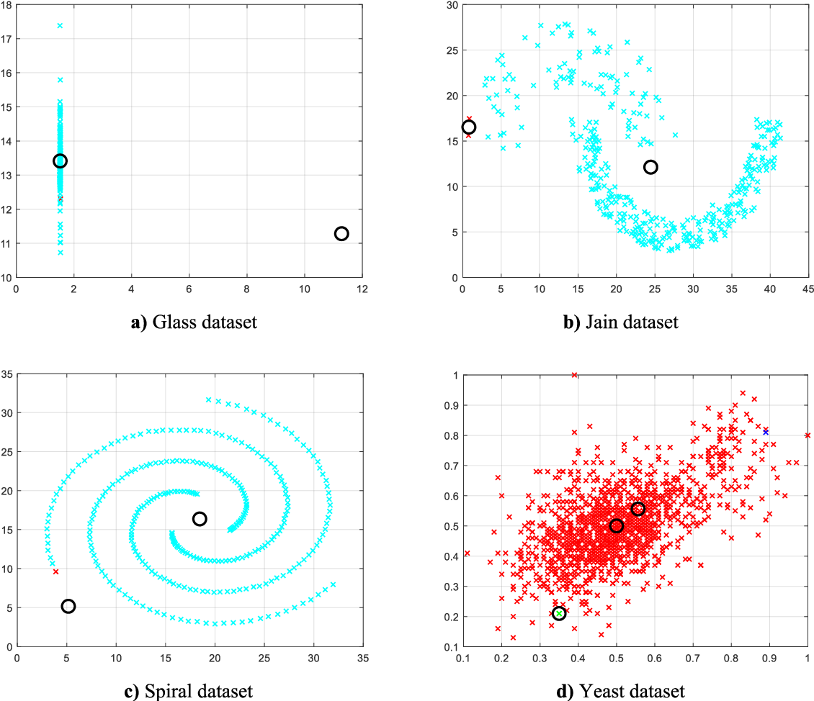
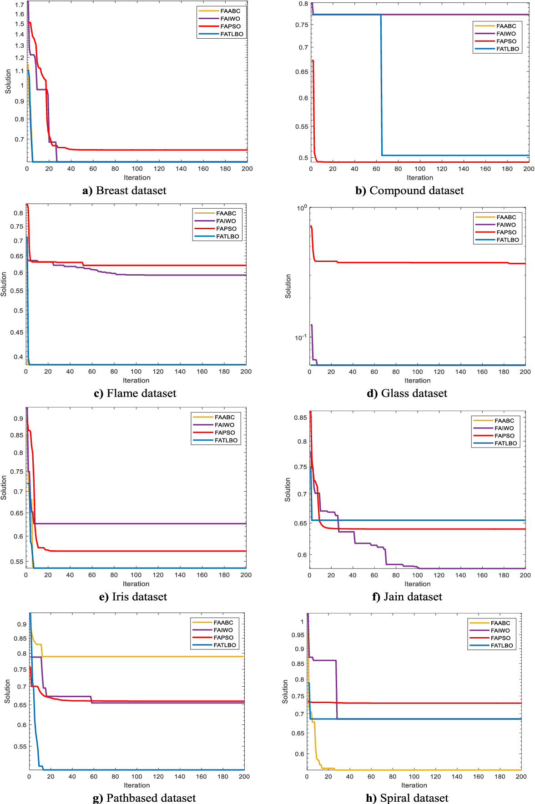
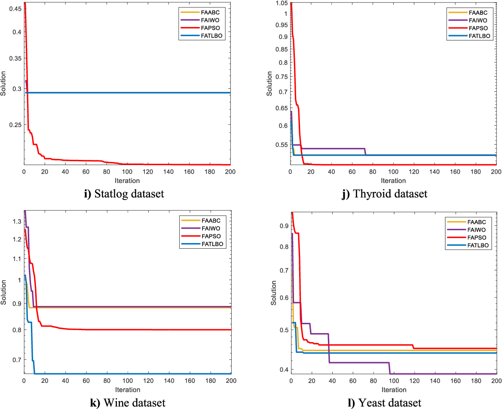
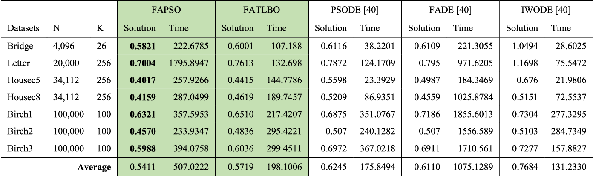

# BÀI DỊCH PAPER

Nghiên cứu hiệu suất so sánh thuật toán đom đóm lai để phân cụm dữ liệu tự động

+ https://www.semanticscholar.org/paper/A-Comparative-Performance-Study-of-Hybrid-Firefly-Ezugwu-Agbaje/87a471ac21d86339c841c7bc5e1429341ce80d22

___

## ABSTRACT

+ Trong phân tích gom cụm, mục tiêu luôn là mở rộng các phương pháp tốt nhất có thể để tự động xác định số lượng các
  cụm. Tuy nhiên, vì sự thiếu thông tin biết trước, và sự không chắc chắn liên quan đến các đặc điểm của đối tượng dữ
  liệu, rất khó để chọn ra một số lượng các cluster thích hợp, đặc biệt là khi xử lý các đối tượng dữ liệu nhiều chiều,
  đa dạng về kích thước và mật độ.
+ Trong vài thập kỷ trở lại đây, các nhà nghiên cứu khác nhau đã đề xuất và phát triển nhiều phương pháp mô phỏng lấy
  cảm hứng từ tự nhiên để giải quyết bài toán cluster. Nhiều nghiên cứu đã chỉ ra rằng thuật toán đom đóm rất mạnh, hiệu
  qủa và gần với tự nhiên, đã được áp dụng thành công để giải các bài toán khác nhau về tối hưu NP-hard. Tuy nhiên, sự
  đa dạng trong quy trình tìm kiếm được sử dụng trong thuật toán đom đóm có thể dẫn đến các vấn đề về tối ưu, làm chậm
  tốc độ, và tốc độ hội tụ đối với quy mô lớn.
+ Do đó, bài báo này nghiên cứu về việc áp dụng 4 thuật toán đom đóm lai với nhiệm vụ phân nhóm tự động các tập dữ liệu
  quy mô lớn, mật độ dày, không được gán nhãn trước. Ngược lại với hầu hết các kỹ thuật phân tích kinh điển
  heuristic-based về phân nhóm dữ liệu, thuật toán đom đóm lai được đề xuất không yêu cầu bất cứ kiến thức trước nào về
  các đối tượng cả. Thay vào đó, các phương pháp này tự động xác định số lượng cụm tối ưu theo kinh nghiệm và trong quá
  trình thực thi chương trình. Hai nhóm chỉ số hợp lệ phổ biến, là Compach-Separated và Davis-Bouldin, được sử dụng để
  đánh giá tính ưu việt của các thuật toán đom đóm lai đã đề xuất.
+ Xa hơn nữa, 12 tập dữ liệu thực nghiệm tiêu chuẩn từ UCI Machine Learning Repository được sử dụng để đánh giá mức độ
  mạnh mẽ và hiệu quả của các thuật toán so với những thuật toán tối ưu hóa kinh điển, và các kết quả gom nhóm liên quan
  từ tài liệu. Kết quả thử nghiệm cho thấy rằng các phương pháp phân nhóm mới đạt hiệu quả tốt hơn so với các thuật toán
  cũ, dựa trên các chỉ số hợp lệ tiêu chuẩn.

+ Index Terms: Automatic clustering, firefly algorithm, firefly-based hybrid algorithms, clustering validity index.

___

## I. INTRODUCTION

+ Phân cụm dữ liệu là một kỹ thuật phân loại unsupervised quan trọng, liên quan đến tiến trình gom nhóm dữ liệu mà ở đó,
  các item giống nhau được nhóm vào một cụm dựa vào các thông số tương tự nhau [1]-[4]. gom cụm cũng thường được dùng
  cho nhiều ứng dụng hấp dẫn trong thế giới thực, như tiếp thị, sinh học, phân tích hình ảnh, thư viện, bảo hiểm, khai
  thác dữ liệu, y học, phân tích thống kê, nhận diện cộng đồng, và các lĩnh vực khoa học kỹ thuật khác [5]-[7].
+ Mặc dù phân tích gom cụm đã được sử dụng lần đầu trong 2 lĩnh vực khoa học xã hội, cụ thể là nhân loại học và tâm lý
  học [8], xa hơn nữa, nó cũng được sử dụng cho lý thuyết phân loại đặc điểm trong tâm lý nhân cách bởi Cattel vào đầu
  năm 1943 [8],[9].
+ Phương pháp trong gom cụm dữ liệu đã được mở rộng với sự liên quan đáng kể trong việc áp dụng cho các nghiên cứu mới,
  trong các lĩnh vực như KHDL, Machine learning. Cần lưu ý rằng việc phân cụm dữ liệu ra thành các nhóm có ý nghĩa là
  một nhiệm vụ quan trọng của cả AI và Data mining.
+ Thông thường, thuật ngữ clustering thường được gán với một phép gán nhãn dữ liệu không giám sát, ở đó kết quả của quá
  trình phân tích này phụ thuộc rất nhiều vào tính ưu việt và hiệu quả của các thuật toán, phương pháp phân nhóm được sử
  dụng.
+ Trong các thập niên trước, nhiều thuật toán heuristic-based đã đưa ra để giải bài toán phân cụm. Mỗi thuật toán được
  thiết kế và cài đặt dựa trên 2 phân lớp chính của phương thức gom cụm [10]-[11]:
    + hierarchical - phân cụm phân cấp: Các thuật toán này tạo ra một cấu trúc phân cấp dạng cây, đại diện cho một cụm
      nhóm dính với nhau, của một số điểm dữ liệu. Thuật toán phổ biến nhất trong nhóm này là thuật toán single-link (
      liên kết đơn) và complete-link (liên hết hoàn toàn) [12]
    + partitioning - phân cụm phân nhóm: ngược lại, các thuật toán này phân phối các điểm dữ liệu vào các cụm không
      overlap nhau. Nói cách khác, thuật toán phân nhóm tạo ra các phân vùng dữ liệu đơn lẻ thay vì xậy dựng một cấu
      trúc cây như trên [13].
+ Một trong những thách thức lớn của các thuật toán kể trên là làm sao chọn số lượng cụm thích hợp ở đầu ra cuối cùng.
  Thuật toán k-means có lẽ là phương pháp phổ biến nhất cho vấn đề này. Tuy nhiên, sự thành công của các thuật toán kể
  trên phụ thuộc nhiều vào việc có thông tin xác định trước về các đối tượng dữ liệu và giải pháp yêu cầu ban đầu, trong
  đó hầu hết các trường hợp có thể dễ dàng làm cho thuật toán mắc kẹt xung quanh local optima [8]. Đây là những nhược
  điểm nghiêm trọng khiến cho các nhà nghiên cứu phải đưa ra các giải pháp hữu hiệu khác để khắc phục, bao gồm việc sử
  dụng một số cải tiến và các thuật toán thông minh, kết hợp với các thuật toán phức tạp hơn, và các vấn đề phân cụm dữ
  liệu nhiều chiều.
+ Một vài thuật toán cải tiến được sử dụng để xử lý các vấn đề kể trên là:
    + Genetic algorithm (GA)
    + Differential evolution (DE)
+ Trong khi đó một số kỹ thuật thông minh (swarm intelligence) cũng được áp dụng hiệu quả để giải quyết vấn đề phân
  cụm[14],[15] như:
    + particle swarm optimization (PSO):
    + ant colony optimization (ACO):
    + firefly algorithm (FA):
    + invasive weed optimization (IWO):
    + artificial bee colony optimization (ABC):
    + teaching learning-based optimization (TLBO):
+ Ví dụ:
    + Zabihi và Nasiri [16] đề xuất việc sử dụng thuật toán ABC theo history-driven để giải quyết phân cụm dữ liệu, với
      cơ chế ghi nhớ dựa trên phân vùng không gian nhị phân đã được kết hợp vào thuật toán ABC, để cải thiện hiệu suất
      phân cụm.
    + Merwe và Engelbrecht đã đề xuất việc sử dụng PSO để giải quyết vấn đề phân cụm [17].
    + Tương tự, Zhao [18] đã làm về việc cải thiện hiệu suất của thuật toán k-mean bằng cách lai nó với PSO để tránh bị
      ảnh hưởng trực tiếp bởi các trung tâm cụm ban đầu.
    + Liu và công sự [15] phát triển một thuật toán dựa trên GA để tìm ra nhóm có chất lượng tốt cho một cụm không xác
      định.
    + Nikkam và cộng sự [19] đã đề xuật một thuật toán cải tiến hiệu quả kết hợp ACO và các thuật toán simulated
      annealing (SA) để giải quyết. Kết quả mô phỏng của ACO-SA cho thấy thuật toán kết hợp hoạt động hiệu quả hơn SA cơ
      bản, ACO và k-mean riêng lẻ.
    + Satapathy và Naik [20] đã phát triển một thuật toán TLBO đã được sử dụng để tìm các tâm của một số lượng cụm do
      người dùng chỉ định.
+ Các ví dụ liên quan khác:
    + Sahoo và Kumar [21] đề xuất hai chỉnh sửa đối với phương pháp TLBO để nâng cao hiệu suất của nó, trong đó thay vì
      khởi tạo ngẫu nhiên, một phương pháp được sử dụng để khai tác tâm của các cụm ban đầu.
    + Zhao và Zhou [22] đề xuất một thuật toán fuzzy c-mean dựa trên IWO
    + Liu [23] sử dụng thuật toán IWO đa mục tiêu
    + Wang và cộng sự [24], đề xuất một thuật toán thụ phấn cho hoa flower pollination algorithm (FPA) với bee
      pollinators.
    + Agarwal và Mehta [25] đã nghiên cứu ứng dụng nâng cao thuật toán thụ phấn hoa
+ Các ví dụ gần đây:
    + Senthilnath và cộng sự [26] đã tiến hành đánh giá hiệu suất nghiên cứu về việc sử dụng FA tiêu chuẩn. Kết quả được
      so sánh với PSO, ABA và các thuật toán khác.
    + Hơn nữa, một nghiên cứu tương tự về phân tích hiệu suất của thuật toán đom đóm để phân cụm dữ liệu cũng đã được
      xem xét trong [27] bởi Banati và Bajaj
    + Trong năm 2012, Abshouri và Bakhtiary [28] đã đề xuất một FA lai mới kết hợp thuật toán FA và K-Harmonic Means
+ Tuy nhiên, hầu hết các thuật toán đề cập ở trên được test và và chứng minh là mang lại các giải pháp chuất lượng vượt
  trội, yêu cầu các thuật toán phải được cung cấp tri thức cụ thể trước đó về các đặc điểm, đặc trưng của dữ liệu. Chẳng
  hạn như phải chỉ định trước số cụm và các thuộc tính liên quan của dữ liệu.
+ Vấn đề là, trong thực tế các bộ dữ liệu, số lượng cụm không được biết trước, đặc biệt đối với các tập quá lớn. Hơn
  nữa, việc tự động xác định số cụm dữ liệu cần thiết rất khó khăn [15].
+ Do đó, __mục tiêu cụ thể__ của bài báo này là phát triển một phương pháp phân nhóm dựa trên FA được cải tiến, sẽ tự
  động cung cấp phân vùng thích hợp mà không cần bất kỳ tri thức biết trước về đặc điểm của dữ liệu. Ngoài ra, nghiên
  cứu này đề xuất việc triển khai 4 thuật toán FA để giải quyết một loạt các vấn đề trong phân cụm một cách tự động, bao
  gồm:
    + Tối ưu thuật toán đom đóm lai (FAABC)
    + Firefly algorithm artificial bee colony (FAABC)
    + Firefly algorithm invasive weed optimization (FAIWO)
    + Firefly algorithm teaching-learning-based optimization
      (FATLBO)
+ Để cải tiến FA, một cách thức lựa chọn đột biến được kết hợp vào thuật toán FA chuẩn để duy trì sự cân bằng giữa
  selection pressure và population diversity.
+ 2 chỉ số được dùng để phân tích và làm thước đo là:
    + Davies – Bouldin (DB) [35]
    + Compact-Separated (CS) [36]
+ Kết quả thực nghiệm trên bộ dữ liệu thực tế được minh họa, để chứng minh hiệu suất của các thuật toán được đề xuất, so
  với các phương pháp hiện có.
+ Bố cục của bài báo như sau:
    + Section II: Trình bày chi tiết và toàn diện hơn các thuật toán state-of-the-art.
    + Section III: Trình bày chi tiết về phương pháp, thiết kế của thuật toán FA đề xuất. Một số khái niệm toán học liên
      quan đến phân cụm cũng được thảo luận.
    + Section IV: Mô tả các số liệu thực nghiệm và kết quả so sánh.
    + Section V: Nhận xét, kết luận và các hướng nghiên cứu trong tương lai.

___

## II. RELATED WORK

+ Thuật toán đom đóm (FA), nhờ vào tính mạnh mẽ, hiệu quả, khả năng xử lý vấn đề trong nhiều lĩnh vực khác nhau (bao gồm
  cả NP-hard), tính linh hoạt và những lợi ích khác, đã được áp dụng vào giải quyết nhiều vấn để khác nhau. Một bài đánh
  giá toàn diện về FA đã thảo luận về các lĩnh vực đa dạng, mà thuật toán này đã giải quyết được, và ứng dụng rộng rãi
  trong thế giới thực với kết quả khả quan đã được thực hiện bởi Fister vào năm 2014 [41]
  Trong bài báo, tác giả đã đi xa hơn, để đề xuất các hướng đi trong tương lai cho thuật toán.
+ FA mặc dù đã được nghiên cứu và theo dõi trong nhiều lĩnh vực, tuy nhiên việc triển khai nó và phạm vi phân nhóm tự
  động vẫn còn rất nông cạn, chưa chuyên sâu. Rất ít công trình thực hiện việc áp dụng thuật toán đom đóm trong phân
  cụm, và thực sự khó nhằn trong việc tìm kiếm các nghiên cứu trước đây nói về ứng dụng của thuật toán này.
+ Một nghiên cứu về hiệu suất của FA được thực hiện bởi Senthilnath [26]. Họ nhận ra các điểm mạnh của FA và đã áp dụng
  classification error percentage (CEP) để generate ra tâm tốt nhất của các cụm. FA chuẩn đã được cài đặt để phân cụm
  tập trung nhiều hơn vào sự hấp dẫn, quy mô dân số, khoảng cách, và CEP đã được áp dụng để kiểm tra phương pháp tạo ra
  cụm tối ưu. Xa hơn nữa, FA được so sánh với ABC, PSO và 9 phương pháp khác. Kết quả cho thấy sự hiệu quả của FA vượt
  trội hơn về độ tin cậy, hiệu quả, hiệu suất.
+ Hassanzadeh và Meybodi đã trình bày một phương pháp kết hợp dựa trên FA và k-means để phân cụm dữ liệu [42]. Các mô
  hình đề xuất được gọi là K-FA đã được thực hiện. FA được dùng để tìm ra tâm cụm do người dùng chỉ định số lượng cụm,
  sau đó FA được mở rộng bằng thuật toán k-mean, để hỗ trợ tinh chỉnh tâm này.
+ Ngoài ra, global-optima được dùng để cải thiện FA chuẩn. Một thí nghiệm đã chỉ ra rằng K-FA vượt trội hơn 3 thuật toán
  cluster khác về việc có hiệu quả hơn, giảm thiểu khoảng cách trong cụm, cho phép k-mean được khởi tạo thích hợp hơn.
+ Banati và Bajaj đã tiến hành phân tích hiệu suất của FA để phân cụm dữ liệu trong [27]. Phương pháp đề xuất gọi là
  FClust, dựa trên centroid-based, thông qua hành vi nhấp nháy của đom đóm, vào hàm chính của bài toán phân cụm để được
  giải pháp tối ưu. Hiệu suất của FClust được đánh giá bằng 2 tiêu chí thống kê [43]:
    + trace within criteria (TWR)
    + variance ratio criteria(VRC) [43]
      So sánh kết quả mô phỏng của FClust với PSO, DE cho thấy FClust đạ giá trị tốt nhất về độ lệch chuẩn trong phép đo
      VRC. Hơn nữa, chất lượng của giải pháp FClust cũng được đánh giá bằng cách tiếp cần phân phối (Run lengt
      distribution - RLD) [44]. RLD cho thấy rằng FCLust đạ được giá trị tốt nhất và tốc độ hội tụ nhanh hơn.

[comment]: <> (  ![]&#40;./photos/hinh1.png&#41; )

[comment]: <> (  FIGURE 1. A compartmentalized flowchart of the hybrid firefly algorithms.)

[comment]: <> (  ![]&#40;./photos/6-Figure2-1.png&#41; )

[comment]: <> (  FIGURE 2. Flowchart of the hybrid firefly algorithms.)

[comment]: <> (  ![]&#40;./photos/7-Figure4-1.png&#41; )

[comment]: <> (  FIGURE 4. Average computational time consumed by the four hybrid firefly algorithms on DB measure for all the datasets)

[comment]: <> (  for 40 replications.)

+ Năm 2015, Kaushik và Arora đã tích hợp FA với một thuật toán di truyền cải tiến [45], được gọi là FGA. Mô hình được đề
  xuất chọn dân số ban đầu của nó từ một nhóm dân số dựa trên thuật toán đom đóm, tức là dân số ban đầu được tạo ra từ
  các giải pháp toàn cục tốt nhất. FAG hoạt động theo 2 cách:
    + 1, FA cổ điển được áp dụng cho các tập dân số được khởi tạo ngẫu nhiên, tạo ra nhiễm sắc thể chromosomes của một
      bộ
    + 2, các nhiễm sắc thể sau đó được định vị trong vùng giao nhau, chúng tham gia vào các hoạt động đột biến và trao
      đổi chéo của thuật toán di truyền GA.
+ Ngoài ra, ở giai đoạn khởi tạo FGA, nó dẫn đến tối ưu toàn cục, điều này ngăn quá trình mắc kẹt trong local optima.
  Kết quả kiểm tra, khi so sánh với GA cơ bản và thuật toán đom đóm, cho thấy FGA có inter-cluter tốt hơn, và khoảng
  cách intra-cluster tốt hơn, dẫn đến kết quả tốt hơn.

+ Nayak [47] cài đặt một FA cải tiến hơn với thuật toán fuzzy c-means gọi là FAFCM và FAFCM cải tiến cho các tập dữ liệu
  thế giới thực. FA cải tiến đã giải quyết những thiếu sót của phương pháp fuzzy c-means, của entrapment local optima,
  và độ nhạy cao khi khởi tạo. FAFCM bao gồm 2 giai đoạn:
    + 1, một FA chuẩn với phân cụm fuzzy c-means. pha này xử lý các hạn chế của thuật toán fuzzy c-means bằng cách tối
      thiểu objective function.
    + 2, một FA cải tiến với phân cụm fuzzy c-means. Pha này tinh chỉnh các tâm cụm đã được xác định ở phase 1, và cũng
      hỗ trợ tiếp tục tối thiểu hóa hàm mục tiêu.
+ FAFCM được so sánh với 3 thuật toán phân cụm khác, kết quả cho thấy FAFCM có kết quả thống nhất với tập test, và tốc
  độ hội tụ nhanh hơn. Tuy nhiên, số lượng cụm đã được các định trước khi FAFCM gán vào.

[comment]: <> (  ![]&#40;./photos/9-Figure6-1.png&#41;)

[comment]: <> (  FIGURE 6. Clustering results of hybrid FAABC of some datasets on DB-index.)

+ Một phương pháp lai hiệu quả dựa trên FA và thuật toán dynamic k-means được phát triển bởi Sundararajan and
  Karthikeyan[48]. Thuật toán này gọi là hybrid modified firefly and dynamic k-means. Thuật toán dynamic k-means được
  kết hợp để có thể tìm ra số cụm tối ưu trong thời gian thực thi, cũng như để cải tiến chất lượng phân cụm và tính tối
  ưu. Mô hình hoạt động theo cách đó, nó xác định các tâm cụm mới bằng cách thêm một tâm mới vào bộ đếm counter ở mỗi
  vòng lặp, cho đến khi chất lượng cụm yêu cầu đạt được, và mô hình hoạt động đủ tốt. Kết quả thực nghiệm cho thấy chất
  lượng cụm tốt hơn trong thời gian ngắn hơn với tối ưu tốt hơn, so với các thuật toán khác.

+ Ezugwu [40] đã trình bày một nghiên cứu khảo sát sâu rộng về Các thuật toán metaheuristic lấy cảm hứng từ thiên nhiên,
  được áp dụng để giải quyết các vấn đề về phân cụm tự động. Hơn nữa, tác giả đã thực hiện một so sánh một số thuật toán
  nổi tiếng về global metaheuristic để giải quyết phân cụm tự động, trong đó 3 thuật toán hybrid swarm intelligence and
  evolutionary algorithms:
    + article swarm differential evolution algorithm
    + firefly differential evolution algorithm
    + invasive weed optimization differential evolution algorithm
       
      Kết quả thử nghiệm cho thấy thuật toán FA phù hợp hơn để phân nhóm trong cả trường hợp đối tượng đa chiều so với
      các state-of-the-art.

+ Tất cả các tài liệu và phân tích so sánh khác nhau đều chỉ ra rằng FA là một thuật toán metaheuristic rất hiệu quả và
  mạnh mẽ để giải quyết vấn đề này trong thế giới thực. Hơn nữa, những phát hiện từ Ezugwu [40] và Agbaje et al. [49] về
  hiệu suất đầy hứa hẹn của FA trong phân nhóm tự động đã dẫn dắt chúng tôi đi vào nghiên cứu này, để làm rõ hơn về sự
  vượt trội của cả thuật toán FA và các biến thể, cải tiến của nó trong phân nhóm tự động.
+ Sau khi các phân tích sâu rộng được thực hiện, chúng tôi đã tổng hợp các phương pháp phân cụm khả thi sau đây, với các
  thông số chỉ mục kèm theo được xác định, được trình bày trong bảng 1:

 
TABLE 1. A summary of metaheuristic algorithms that have been applied to automatic clustering problems.

 
TABLE 1. (Continued.) A summary of metaheuristic algorithms that have been applied to automatic clustering problems.

___

## III. THE FIREFLY ALGORITHM

+ Thuật toán Firefly (Firefly algorithm - FA)là một thuật toán tối ưu hóa lấy cảm hứng từ thiên nhiên được phát triển
  bởi Xin-She Yang vào cuối năm 2007 và đầu năm 2008 [29], [30]. Khái niệm thiết kế thuật toán FA lấy cảm hứng từ sự
  chiếu sáng động của thuộc tính ánh sáng từ những con đom đóm thường được tìm thấy ở hầu hết các vùng nhiệt đới và các
  vùng ôn đới. Có khoảng 2000 loài đom đóm, trong số đó có nhiều con tạo ra phát ra ánh sáng nhấp nháy trong những
  khoảng thời gian đều đặn.
+ Ánh sáng do những loài côn trùng này tạo ra thường được dùng như tín hiệu (để thông báo cho các con khác trong đàn)
  được sử dụng để dụ những con đom đóm khác và cũng có thể dùng để gửi cảnh báo về con mồi tiềm năng [31].
+ Như một trí thông minh bầy đàn mới lạ thuật toán metaheuristic dựa trên dân số (novel swarm intelligence
  population-based metaheuristic algorithm), FA đã được sử dụng để giải quyết các vấn đề tối ưu hóa thiết kế kỹ thuật
  phi tuyến khác nhau, như được báo cáo trong [32]. Hơn nữa, các nghiên cứu đã có cũng cho thấy rằng FA rất có triển
  vọng trong việc giải quyết các bài toán tối ưu hóa số NP khó nhất (NP-hard numerical optimization problem) trong cả
  không gian liên tục và không gian rời rạc [33].
+ Mô hình toán học và biểu diễn thuật toán FA tiêu chuẩn được biểu diễn trong các phương trình từ (1) đến (5). Trong
  phương trình (1), cường độ ánh sáng I của đèn pin đom đóm được cho là tỷ lệ nghịch với tỷ lệ với bình phương khoảng
  cách của nó (ký hiệu là r). Điều này ngụ ý rằng cường độ ánh sáng của từng con đom đóm giảm dần với khoảng cách tăng
  dần . Tuy nhiên, điều này là do khi khoảng cách tăng lên, ánh sáng được tỏa ra vào môi trường xung quanh [33]. (giống
  giống kiểu cường độ âm thanh tỉ lệ với khoảng cách theo hàm mũ gì đó)

+ // TODO: insert pt (1) vô đây

Căn chỉnh bối cảnh vấn đề với thiết kế của thuật toán FA (Aligning the problem landscape to the FA algorithm design), mô
hình tối ưu hóa có thể được xây dựng theo cách cách mà ánh sáng đom đóm tỷ lệ thuận với giá trị của fitness function cần
được tối ưu hóa. Các nguyên tắc thiết kế sau đây được sử dụng để xây dựng FA cơ bản [31]: nó được giả định rằng tất cả
các loài đom đóm giống hệt nhau về giới tính, sức hấp dẫn của mỗi con đom đóm tỷ lệ thuận với chất lượng ánh sáng của nó
cường độ được tạo ra, cường độ của ánh sáng được tạo ra bởi bất kỳ đom đóm được xác định bởi giá trị của hàm fitness cần
được tối ưu hóa . Trong thiết kế thuật toán FA, cường độ ánh sáng và sự hấp dẫn được coi là đóng một vai trò quan trọng
trong thực hiện và hiệu suất thuật toán. Thông thường, trong trường hợp các vấn đề về tối đa hóa, cường độ ánh sáng,
được tạo ra tại một điểm xác định (y) tỷ lệ thuận với giá trị phù hợp của fitness function, đó là I (y) / F (y). Như
hình trong pt (2), cường độ ánh sáng thay đổi theo khoảng cách và cường độ ánh sáng phát ra môi trường xung quanh.

// TODO: insert pt (2) vô đây

+ trong đó I0 biểu thị cường độ ánh sáng ban đầu tại r D 0, γ là hệ số hấp thụ ánh sáng, còn r là khoảng cách. Từ pt (2)
  , bằng cách kết hợp ảnh hưởng của luật bình phương nghịch đảo và sự hấp thụ, điểm kỳ dị (the singularity) tại r D 0
  được phá vỡ (circumvented) trong biểu thức 1 / r ^ 2 [30], [33]. Dựa trên pt (3), sức hấp dẫn của đom đóm (β) tỷ lệ
  với cường độ ánh sáng của đom đóm.

+ // TODO: insert pt (3) vô đây

+ trong đó β0 chỉ độ hấp dẫn tại r D 0. Số đo khoảng cách giữa hai con đom đóm xi và xj bất kỳ được xác định theo khoảng
  cách Euclide

+ // TODO: insert pt (4) vô đây

+ trong đó d là thứ nguyên của vấn đề (problem dimension). Sự chuyển động của đom đóm từ một điểm (i) đến điểm khác (j)
  được xây dựng như thể hiện trong eq. (5):

+ // TODO: insert pt (5) vô đây

+ trong đó α 2 [0; 1]; γ 2 [0; 1). Tham số Ei là một số ngẫu nhiên thu được từ phân phối Gaussian. Ei có thể được được
  thay thế bằng rand - 0: 5, trong đó rand 2 [0; 1]. Thuật ngữ thứ ba (αEi) trong pt (5) cho thấy chuyển động của đom
  đóm từ một điểm đến một điểm khác, liên quan đến sức hấp dẫn của chúng (with regards to their attractiveness)

+ Trong bài báo này, để cải thiện khả năng thăm dò và khai thác (exploration and exploitation capability) của FA, để
  thuật toán có thể xử lý các nhiệm vụ phân cụm nhiều chiều (clustering tasks of high dimensionality) hiệu quả hơn, khái
  niệm chiến lược đột biến (mutation strategy) được đưa vào quá trình tìm kiếm của thuật toán đom đóm. Lý tưởng nhất,
  chiến lược đột biến FA được sửa đổi (modified mutation strategy) khám phá và khai thác không gian tìm kiếm bằng cách
  tận dụng các tính năng mong muốn hơn (leveraging more desirable features) từ những con đom đóm hấp dẫn và thêm chức
  năng tương tự để nâng cao sức hấp dẫn (adding such functionality to enhance the attractiveness) của những con đom đóm
  kém sáng hơn. Sự mở rộng việc sửa đổi các tính năng cải thiện (The extent of the enhancement feature modification) là
  cần thiết cho bất kỳ con đom đóm nào có độ sáng yếu được xác định bằng cách tính xác suất đột biến (MP) của đom đóm
  đó.
+ Do đó, người ta cho rằng những con đom đóm có độ sáng tuyệt vời sẽ có MP thấp hơn, trong khi những con đom đóm có
  cường độ ánh sáng thấp sẽ có MP cao hơn. Nhìn chung, khái niệm sử dụng MP là có khả năng cao cải thiện các giải pháp
  chất lượng thấp và khả năng giảm chất lượng các giải pháp tốt là thấp. Xác suất toán tử đột biến được sử dụng để tạo
  ra sự đa dạng bổ sung giữa bầy đom đóm được hoán vị (commutated) như sau

+ // TODO: insert pt (6) vô đây

+ trong đó f (xnew) là fitness (tỉ lệ với ánh sáng phát ra ???) của đom đóm mới và f (xold) là fitness của đom đóm đầu
  tiên. Các bước chính của FA đột biến được tóm tắt như được minh họa trong danh sách Thuật toán 1.

+ // TODO: insert thuật toán 1 vô đây

+ A. FIREFLY-BASED HYBRIDS AND CLUSTERING PROBLEM DESCRIPTION

+ Các phương pháp lai được đề xuất được mô tả trong bài báo này tập trung vào việc khai thác lợi thế khác nhau của cả FA
  và các thuật toán đại diện khác (other representative algorithms), cụ thể là các thuật toán PSO, ABC, IWO và TLBO.
  Điều thú vị không kém là tất cả các thuật toán được đề cập ở trên đều hoạt động tốt cho một loạt các vấn đề tối ưu hóa
  toàn cầu (global optimization problems). Trong nghiên cứu này, chúng tôi đề xuất một tập hợp các thuật toán lai mới
  dựa trên thuật toán đom đóm bằng cách kết hợp một số ưu điểm của tất cả các thuật toán riêng lẻ đã đề cập ở trên. Các
  thuật toán kết hợp được đề xuất kết hợp cơ chế thu hút của FA với khả năng liên kết hiệu quả của PSO, ABC, IWO và TLBO
  để duy trì sự cân bằng tốt giữa việc thăm dò và khai thác không gian tìm kiếm vấn đề. Ngoài ra, sự kết hợp được thực
  hiện như vậy cũng để tăng độ chính xác của lời giải, tốc độ hội tụ và sự đa dạng của phân bố (diversity of the
  population). Chúng tôi đã triển khai bốn thuật toán kết hợp, đó là FAPSO, FAABC, FAIWO và FATLBO, để giải quyết các
  vấn đề phân cụm dữ liệu. Đáng chú ý là FA được cải tiến và bốn metaheuristics khác được thực hiện song song để thúc
  đẩy cụ thể việc chia sẻ thông tin giữa quần thể bầy đàn và do đó nâng cao hiệu quả tìm kiếm [37].

+ Chiến lược triển khai được sử dụng bởi bốn thuật toán kết hợp mới bắt đầu quá trình tìm kiếm của nó bằng cách sử dụng
  FA làm thuật toán tìm kiếm tối ưu hóa toàn cầu (global optimization search algorithm), vì khả năng khám phá mạnh mẽ
  của nó và sau đó giới thiệu riêng lẻ bốn thuật toán khác một cách riêng lẻ và sau đó sử dụng chúng như một thuật toán
  tối ưu hóa tìm kiếm cục bộ (local optimization search algorithm) để nâng cao khả năng thâm canh (intensification
  capability) của các phương pháp lai mới. Cơ chế tìm kiếm cục bộ có ý nghĩa quan trọng trong việc thiết kế thuật toán
  kết hợp mới, đặc biệt khi quá trình tìm kiếm đi xuống đường dẫn của các giải pháp tối ưu cục bộ (descends the paths of
  the local optimal solutions), nó sẽ ngăn các thuật toán mắc kẹt vào cực tiểu cục bộ (prevent the algorithms from
  entrapment into local minima). Do đó, lợi thế, như đã đề cập ở trên, được tận dụng để cải thiện cả khả năng khai thác
  và thăm dò của các thuật toán lai dựa trên FA được đề xuất. Hơn nữa, một trong những chất lượng nâng cao chính (main
  enhancement quality) của cơ chế kết hợp và tập hợp lại (hybridization and regrouping mechanism) của các thuật toán mới
  là để đảm bảo rằng việc tìm kiếm các giải pháp ứng cử viên (candidate solutions) chỉ tập trung vào vùng hứa hẹn (
  promising region) của không gian tìm kiếm giải pháp (solution search spaces). Cơ chế này rất quan trọng, vì nó hỗ trợ
  phương pháp được đề xuất không tìm kiếm giải pháp ứng cử viên trong các vùng kém hứa hẹn hơn của không gian tìm kiếm.
  Một kỹ thuật tương tự đã được thực hiện ở [37], nơi FA được kết hợp với thuật toán tiến hóa vi phân (differential
  evolution algorithm).

+ lực và hiệu quả của các phương pháp lai dựa trên FA được đề xuất được đánh giá bằng cách sử dụng các chỉ số giá trị CS
  và DB (CS and DB validity indices) được thảo luận trong phần III của bài báo này. Hai chỉ số hợp lệ này cũng giúp xác
  định số lượng cụm tối ưu thích hợp và tìm cách phân vùng tốt nhất cho các cụm được phát hiện. Đối với giai đoạn đầu
  tiên của việc triển khai thuật toán lai, các thuật toán lai dựa trên FA bắt đầu quá trình tối ưu hóa tìm kiếm của
  chúng với việc tạo ra quần thể đom đóm khởi tạo (initialization population of fireflies). Sau đó, fitness function của
  từng giải pháp ứng viên do FA tìm thấy được tính toán và xác định bằng cách sử dụng hai phép đó phân cụm hợp lệ (
  clustering validity measures).
+ Ngược lại, các giải pháp mới này với các giá trị phù hợp nhất được cập nhật bằng cách sử dụng các toán tử của FA.
+ Trong giai đoạn tối ưu hóa thứ hai, quy trình tương tự được lặp đi lặp lại bằng cách sử dụng các toán tử của thuật
  toán PSO, ABC, IWO và TLBO, tương ứng để tối ưu hóa lại các giải pháp thu được trong giai đoạn đầu tiên. Lưu ý rằng
  hai giai đoạn của kỹ thuật tối ưu hóa tạo thành chu kỳ đầu tiên của giai đoạn đánh giá cho việc triển khai FAPSO,
  FAABC, FAIWO và FATLBO.
+ Điều thú vị là ở đây đề cập đến bốn thuật toán lai dựa trên FA sử dụng giải pháp tốt nhất được tạo ra bởi kết quả tìm
  kiếm của FA trong giai đoạn đầu tiên làm quần thể tìm kiếm ban đầu của nó.
+ (It is interesting to mention here that the four FA-based hybrids use the best solution generated by the FA search
  results in the first phase as its initial search population)
+ Đối với quá trình đánh giá, những local best trước đó và global best trong quần thể mới được so sánh và giải pháp ứng
  cử viên có giá trị fitness tốt nhất được cập nhật cho phù hợp. Như đã nêu trước đó, các chỉ số CS và DB được sử dụng
  bởi bốn phương pháp để tính toán final fitness function của mỗi giải pháp, mà các phương pháp lai dựa trên FA sử dụng
  để xác định giải pháp ứng viên tốt nhất và thực hiện các cập nhật cần thiết. Cuối cùng, giải pháp tốt nhất được xác
  định dựa trên giải pháp nào có giá trị CS-index hoặc DB-index nhỏ nhất. Toàn bộ quá trình của các thuật toán lai dựa
  trên FA được lặp lại cho đến khi đạt được các tiêu chí kết thúc (termination criteria are reached). Danh sách Thuật
  toán 2 cho thấy các bước được đề cập ở trên đối với các thuật toán FA-hybrid. Hình 1 minh họa lưu đồ phân vùng của
  phương pháp được đề xuất, trong khi Hình 2 minh họa lưu đồ thực hiện của các phương pháp lai tổng quát. Nói chung,
  hình này cũng đại diện cho các quá trình phân cụm của bốn lần triển khai thuật toán kết hợp. Tuy nhiên, đáng chú ý là
  một phần đóng góp chính của bài báo hiện nay là đề xuất về một nghiên cứu hiệu suất quan trọng và đánh giá một số
  thuật toán đom đóm lai cho nhiệm vụ phân cụm tự động. Không có ghi chép nào về một nghiên cứu tương tự trong tài liệu
  tồn tại tính đến thời điểm viết bài báo này.

+ Như đã đề cập trước đó, các phương pháp triển khai thuật toán kết hợp bao gồm hai giai đoạn. Giai đoạn đầu tiên sử
  dụng thuật toán FA đã sửa đổi bằng cách tạo ngẫu nhiên bầy ban đầu (initial swarm), trong đó số lượng đom đóm bằng số
  cụm và quần thể bầy được phân bố đồng đều trên các kích thước của tập dữ liệu, trong trường hợp này là không gian tìm
  kiếm vấn đề phân cụm. Sau khi khởi tạo bầy, nhiệm vụ tiếp theo là đánh giá bầy tốt nhất theo fitness function được xác
  định bởi các chỉ số hợp lệ DB và CS [40]. Lưu ý rằng vị trí bầy đàn tốt nhất, ví dụ, đại diện cho điểm dữ liệu đạt
  được khoảng cách tối thiểu đến bầy đàn từ các lần tìm kiếm trước đó.
+ PSO, ABC, IWO và TLBO hoạt động trên tập giải pháp mới (new set of the solution) được tạo ra bởi phương trình cập nhật
  FA được đưa ra trong (5). Các tham số của logarit tương ứng được sử dụng để xác định các mô hình chuyển động (movement
  patterns) tiếp theo của các chiến lược tối ưu hóa của chúng như đã được giải thích trước đó. Lặp đi lặp lại các vị trí
  khác nhau của các tập hợp mới được cập nhật cho đến khi đáp ứng được trường hợp điều kiện kết thúc thỏa đáng và quá
  trình mô phỏng thuật toán được kết thúc.

+ B. CLUSTERING PROBLEM DESCRIPTION

+ Trong nghiên cứu hiệu suất này, chúng tôi đề xuất một loạt các thuật toán đom đóm lai để giải quyết các vấn đề phân
  cụm dữ liệu tự động.
+ Như được mô tả trong [34] để xử lý các vấn đề phân cụm dữ liệu tự động, chúng tôi áp dụng cách tiếp cận tương tự để
  triển khai các biến thể của thuật toán đom đóm lai. Cho rằng tập dữ liệu F được định nghĩa là F = {f1, f2, ..., fn}
  được chia thành các nhóm không chồng chéo của cụm G = {g1, g2, ..., gn}, sao cho thứ nguyên wi (i = 1, 2, ..., n) là
  p. Đối với mỗi cụm G = {g1, g2, ..., gn}, có một centroid di = (i = 1, 2, ..., C) được đại diện cho mỗi cụm, tức là, D
  = (d1, d2, ..., dC) là trọng tâm của G = {g1, g2, ..., gC}. Đối với vectơ dữ liệu p-chiều, các điều kiện sau phải xảy
  ra

+ // TODO: insert 7 8 9 here

+ Ở giai đoạn khởi tạo của mỗi thuật toán lai, kích thước quần thể (bầy đàn) K được xác định là W = {w1, w2, ..., wK}.
  Như đã mô tả ở trên, xem mỗi thành viên ai trong tập hợp là một vectơ Q × p-chiều, Fn × p, được định nghĩa là Wi =
  w1 *, w2 *, wq * (w11, w12, ..., w1p), (w21, w22, ..., w2p), ..., (wQ1, wQ2, ..., wQp). Mục tiêu chính của phương pháp
  tối ưu hóa trong bốn phép lai được đề xuất của thuật toán đom đóm trong nghiên cứu này là tối thiểu hóa, trong đó
  chúng tôi sử dụng hai chỉ số hợp lệ cụm phổ biến và được sử dụng nhiều nhất là chỉ số CS và DB, để giảm thiểu tổng
  khoảng cách giữa các tập dữ liệu fi (i = 1, 2, ..., n) và tâm di (i = 1, 2, ..., C).
+ Ranh giới trên và giới hạn dưới của số nhóm trong quần thể tương ứng được xác định là, Varmin được biểu thị là kj * =
  min {F1, F2, ..., Fp} và Varmax được biểu thị là mj * = max {F1, F2 ,. .., Fp}. Nói chung, biên dưới là k = (k1 *,
  k2 *, ..., kC *) và biên trên là m = (m1 *, m2 *, ..., mC *), đối với không gian nghiệm. Để giải quyết vấn đề phân cụm
  tự động, hạt (particle) thứ i Wi được đánh giá như sau:

+ // TODO: insert 10 here

+ trong đó rand(1, Q x p) là một vector của một số ngẫu nhiên được phân phối đồng đều (uniformly distributed random
  number) mà trả về một số nguyên nằm giữa 0 và 1

+ C. CLUSTERING VALIDITY INDEX

+ Trong phần này, chúng tôi thảo luận về hai chỉ số hợp lệ được sử dụng trong nghiên cứu để đo lường và phân tích hiệu
  quả của bốn phép lai được đề xuất của thuật toán đom đóm, cũng như chất lượng của giải pháp phân cụm thu được.
+ Nói chung, chỉ số hiệu lực cụm tốt cung cấp hai mục đích quan trọng; thứ nhất, nó giúp xác định số lượng cụm và thứ
  hai, nó xác định phân vùng tốt nhất (tối ưu) (determines the best (optimal) partition) [35]. Tương tự như vậy, một chỉ
  số hiệu lực cụm tốt được kỳ vọng sẽ xử lý hai lĩnh vực chính của việc phân chia cụ thể là sự gắn kết và sự tách biệt (
  cohesion and separation). Tính liên kết: trong trường hợp này chỉ đơn giản có nghĩa là các đối tượng hoặc điểm dữ liệu
  trong một cụm phải nhỏ gọn và giống hệt nhau (tương tự) và càng tốt (should be compact and identical (similar) and as
  possible). Một độ lệch trong fitness phương sai (fitness variance) của các đối tượng trong một cụm cho thấy độ nhỏ gọn
  tốt (good compactness) của một cụm như vậy.
+ Mặt khác, sự phân tách trái ngược với sự gọn nhẹ (separation in contrast to cluster compactness) của cụm phải khác
  biệt và phân biệt với nhau (different and distinct to each other).
+ Tuy nhiên, bước này có thể được nhìn thấy trong khoảng cách giữa các trung tâm cụm, điều này cho thấy sự phân tách
  cụm.
+ (This step can be, however, seen in the distance among cluster centers, which indicates the cluster separation)
  Davis và Bouldin [36] còn tuyên bố thêm rằng chỉ số hợp lệ phân cụm cũng nên thể hiện các thuộc tính sau:

+
    1. Khả năng liên quan đến sự can thiệp tối thiểu hoặc không có sự can thiệp của con người hoặc thông số kỹ thuật
       trong quá trình hoạt động của nó.
+
    2. Khả năng mở rộng tính toán khôn ngoan cho các bộ dữ liệu lớn.
+
    3. Khả năng tạo ra kết quả chính xác cho bộ dữ liệu với kích thước tùy ý

+ Đối với phân nhóm rõ ràng hoặc cứng, một số chỉ số hợp lệ được sử dụng nhiều nhất và nổi tiếng là chỉ số CS [35] và
  chỉ số DB [36], cũng được sử dụng trong nghiên cứu này như đã nói ở trên. Đối với hầu hết các chỉ số hợp lệ, chúng
  được coi là kỹ thuật tối ưu hóa tối thiểu hóa hoặc tối ưu hóa theo mặc định. Tương tự như vậy, các đầu ra thực thi của
  chúng chứng tỏ một phân vùng phân cụm tốt. Do chiến lược tối ưu hóa của họ, các chỉ số hợp lệ phân cụm được áp dụng
  tốt nhất với các thuật toán tối ưu hóa như PSO, DE, GA, v.v. Trong nghiên cứu này, chúng tôi xác định chỉ số hợp lệ
  cụm là một hàm J, sao cho một phân nhóm B nhất định , và một độ đo tương tự V nó được định nghĩa là J (B; V). Hàm J (
  B; V) trả về một số thực cho biết chỉ số hợp lệ của cụm hoặc tính phù hợp của nhiệm vụ phân cụm B. Hai chỉ số hợp lệ
  được sử dụng cho nghiên cứu của chúng tôi sẽ được thảo luận thêm trong phần tiếp theo.

+
    1) COMPACT-SEPARATED INDEX

___

## IV. SIMULATION EXPERIMENTS

+ Thí nghiệm được thực hiện trên máy cấu hình:
    + CPU 3.60 GHz Intel(R) Core(TM) i7-7700
    + RAM 16GB
    + Windows 10
+ Toàn bộ thuật toán được lập trình trên MATLAB R2018b và các phân tích thống kê được thực hiện trên IBM SPSS Version 25

### A. PARAMETER SETTING

Trong phần này, chúng tôi sẽ trình bày các cài đặt cụ thể các tham số cho 4 thuận toán đã đề xuất. Các cài đặt thông số
được mô tả trong bảng 2(a)
 
_TABLE 2. (a) Parameter configurations of ABC, IWO, PSO, and TLBO algorithms. (b) Characteristics of the twelve
benchmark datasets._

+ Đối với mỗi thuật toán được đề xuất, chúng tôi khởi tạo một tập số lượng population bằng nhau ở mỗi lần lặp, trong
  trường hợp này là 40 lần chạy cho tất cả các thử nghiệm. Các cài đặt tham số cho FA được mô tả như sau:
    + size của population là 25, số lượng tối đa MaxIt là 200
    + Hệ số light absorption γ=1 (hệ số hấp thụ ánh sáng)
    + hệ số attraction coefficient β=2 (hệ số hấp dẫn)
    + hệ số mutation m=2
    + tỉ lệ mutation damping α=1.
+ Các cấu hình tham số của ABC, IWO, PSO, TLBO được trình bày chi tiết hơn trong bảng 2a.

+ Các thuật ngữ chính trong tham số:
    + tham số _a_ là giới hạn trên của hệ số gia tốc acceleraton coefficient.
    + _Smin_ và _Smax_ là số seed tối thiểu/tối đa
    + _E_ là variance reduction exponent
    + _sigma_initial_ và _sigma_final_ là giá trị độ lệch chuẩn lúc đầu và lúc cuối
    + _c1_ và _c2_ là hệ số học personal và global
    + _wdamp_ tỉ số inertia weight damping
    + _w_ là inertia weight được tính theo công thức , với _t_
      là số lần lặp. Lưu ý rằng giá trị của w được điều chỉnh liên quan đến lần lặp t để tránh hybrid FAPSO khỏi lao vào
      sự hội tụ quá sớm.

### B. DATASETS DESCRIPTION

12 tập data được sử dụng là các tập data phổ biến, dễ sử dụng từ UCI Machine Learning Repository. Mô tả ngắn gọn về một
vài dataset:

+ Breast Cancer Wisconsin (Original) dataset: Tập dữ liệu này được thu thập từ chuẩn đoán ung thư vú từ bệnh viện Đại
  học Wiscosin. Nó chưa hai class khối u (2 lành tính và 4 ác tính), 699 điểm dữ liệu với 10 thuộc tính.
+ Glass dataset: tập dữ liệu này được lấy từ Dịch vụ Khoa học Pháp y Hoa Kỳ, được xác định theo hàm lượng oxide của
  chúng. Việc phân loại tập data này tạo tiền đề cho các cuộc điều tra tội phạm từ các hiện trường vụ án, nơi các tấm
  kính để lại có thể được sử dụng làm nguồn bằng chứng nếu được xác định chính xác. 9 nhân tố hóa học khác nhau (chỉ số
  khúc xạ RI, Natri Na, Nhôm Al, Silicon Si, Kali K, Canxi Ca, Bari Ba, Sắt Fe, Magie Mg) được sử dụng như một tiêu
  chuẩn để xác định một loại glass trong 6 loại glass. Tập này bao gồm 214 điểm dữ liệu với 10 thuộc tính.
+ Iris dataset: Tập data bao gồm 3 biến thể khác nhau của hoa iris
    + Iris Setosa
    + Iris Versicolor
    + Iris Virginica  
      3 loại này bao gồm 150 cá thể với 4 thuộc tính
+ Statlog (Heart) dataset: Bộ này dựa trên việc chuẩn đoán bệnh tim từ 4 CSDL khác nhau, được tạo ra dựa trên 13 thuộc
  tính khác nhau. Bao gồm 250 case và 13 thuộc tính
+ Wine dataset: Tập dữ liệu về rượu được thu thập bằng cách sử dụng phân tích hóa học để xác định nguồn gốc của rượu
  được trồng ở cùng 1 vùng miền, nhưng từ 3 người trồng khác nhau ở Ý. Phân tích này có thể xác định số lượng cấu thành
  trong 13 thành phần được tìm thấy trong mỗi loại của 3 loại rượu. Bộ này chứa 178 mẫu với 13 thuộc tính.
+ Yeast dataset: Bộ dữ liệu nấm men được dùng để dự đoán các vị trí các vị trí localization của protein trong các tế
  bào. Bộ này gồm 1484 mẫu và 8 thuộc tính.
+ Chi tiết về các tập data còn lại, cụ thể là, Jain dataset, Pathbased dataset, Spiral dataset, and Thyroid được đề cập
  trong [38][39][40]. 12 bộ dữ liệu được tóm tắt trong bảng 2b ở trên.

### C. RESULTS AND DISCUSSION

Trong phần này, chúng tôi trình bày và thảo luận về các kết quả trung bình thu được bởi standard FA và 4 thuật toán FA
đã đề xuất. Các thuật toán được so sánh dựa trên các giá trị trung bình của chỉ số CS và DB. Trong bảng 3, các giá trị
được in đậm chỉ rằng thuật toán thu được giải pháp tốt nhất so với các thuật toán khác. Tất cả các kết quả được trình
bày trong nghiên cứu này được mô tả ở 4 chữ số thập phân và chúng tôi chủ yêu tập trung vào chất lượng của giải pháp
được tạo ra bởi mỗi thuật toán, cũng như thời gian thực hiện ở mỗi thuật toán để tìm kiếm các giải pháp gần tối ưu nhất.
 
_TABLE 3. Numerical results comparison of average solutions obtained by muted FA and the four hybrid algorithms based on
the CS and DB indices over 40 replications._  
 
 
_TABLE 4. Numerical results for the four hybrid firefly algorithms based on the CS and DB indices on over 40
replications._ 

+ Đối với phép đo CS, chỉ ra rằng FA hoạt động tốt trên tập Breast dataset và Flame dataset. Tương tự, FAABC work tốt
  trên tập Flame. Hơn nữa, FAPSO đã đạt được hiệu suất tốt nhất 9/12 bộ data, cụ thể là Compound, Iris, Jain, Pathbased,
  Spiral, Statlog, Thyroid, Wine and, Yeast datasets.
+ Bên phía DB index, hiệu suất tốt nhất là của FATLBO, trong 5 dataset Flame, Iris, Pathbased, Spiral and, Yeast. Theo
  sau là FAPSO với 4 bộ dữ liệu Glass, Jain, Thyroid, and Wine datasets. Mặc dù vậy, FA tiêu chuẩn đã làm khá tốt trên 3
  tập Breast, Compound, and Statlog. Cả FAABC và FAIWO đều không vượt trội trong chỉ số DB. Điều này chứng minh rằng FA
  hoạt động tốt hơn các thuật toán khác trên bộ dữ liệu Breast dataset trên cả 2 phép đo. Ngược lại FAIWO không tỏ ra
  vượt trội hơn ai ở cả 2 phép đo CS và DB.

+ Nhìn chung, sự so sánh giữa FA chuẩn và các biến thể lai của nó, cho thấy răng các giải pháp optimal fitness đạt được
  bởi FAPSO trên chỉ số CS có giá trị thấp hơn, nghĩa là hiệu suất tốt hơn. Hơn thế nữa, hiệu suất của thuật toán FAPSO
  có thể đạt xuất sắc trên nhiều bộ dataset hơn bất kỳ thuật toán nào khác. Tuy nhiên, đối với chỉ số DB, FATLBO nổi lên
  là thuật toán hoạt động tốt nhất, sau đó là FAPSO, rồi đến FA chuẩn. Kết luận, chúng ta có thể suy ra FAPSO là một
  thuật toán phân nhóm tự động rất hiệu quả.

___

+ Tiếp theo, chúng tôi trình bày và thảo luận về kết quả của 4 thuật toán bằng cách sử dụng thống kê để tìm ra giải pháp
  tốt nhất, kém nhất, trung bình và độ lệch chuẩn. Các giá trị được đánh dấu in đậm cho biết thuật toán work tốt nhất.
    + Như đã thấy ở CS index:
        + FAABC, FAIWO và FATLBO đã đạt được kết quả tương tự trên tập Breast
        + cũng như FAABC and FATLBO trên Compound dataset.
        + Tương tự là FAPSO trên Flame, Iris, Jain, Thyroid, Wine and Yeast datasets.
        + FAPSO và FATLBO đạt tốt nhất trên Pathbased
        + FAABC thì trên Spiral. Mức độ nhất quán và ổn định được thể hiện trong kết quả thu được trong bộ dữ liệu Glass
          và Statlog, trên tất cả bốn phương pháp kết hợp. Do đó, FAPSO thể hiện sự vượt trội so với các thuật toán khác
          trên CS index.
    + Ở DB index:
        + FAABC, FAIWO và FATLBO đã thu được kết quả tốt nhất nhưng giống hệt nhau đối với tập Breast. Kết quả này tương
          tự như kết quả của chỉ số CS, tức là hiệu suất của 3 thằng này là giống nhau ở cả 2 phép đo.
        + FAPSO đạt tốt nhấ trên Compound, Glass, Statlog and Thyroid.
        + FAABC, FAIWO and FATLBO giống nhau ở tập Breast, Flame và Yeast.
        + FAABC and FATLBO giống nhau ở Iris and Wine.
        + FAABC tốt nhất ở Spiral
        + FATLBO trên Jain and Pathbased
+ Mặc dù một số trường hợp bằng nhau giữa 2 hay nhiều thuật toán, không thể phủ nhật FAPSO hoạt động tốt hơn các thuật
  toán khác trên 4 tập Compound, Glass, Statlog and Thyroid. FAPSO cũng thu được kết quả tốt trên tổng thể. Dựa trên
  những đánh giá này, ta có thể nói rằng chỉ số CS đánh giá hợp lý hơn DB cho cả 4 thuật toán và trên 12 tập dữ liệu.
+ Hình 3 và 4 cho thây thời gian tính toán trung bình của mỗi thuật toán qua 2 chỉ số trên.
  
   
    + Trong 2 biểu đồ trên, FAACB biểu thị bằng màu vàng, FAIWO màu tím, FAPSO màu đỏ, FATLBO màu xanh lam. Thời gian
      thực thi trung bình được lập tương ứng với bộ dữ liệu
        + Đối với CS index trong hình 3, FAPSO có thời gian kém nhất trên 12 tập.
        + Tiếp theo là FAIWO, FATLBO.
        + FAABC chạy tốt nhất.
    + Như đã đề cập, mặc dù FAPSO là giải pháp tốt nhất trong CS index, nó lại tiêu tốn thời gian đáng kể nhất.
    + Tương tự đối với DB index, thứ tự tốt nhất là FAABC, FATLBO, FAPSO, FAIWO.

___

### D. STATISTICAL ANALYSIS TEST

+ Để so sánh thêm, chúng tôi đã thực hiện kiểm tra thống kê phi tham số Friedman rank-sum test, dùng để xác định các sự
  khác biệt đáng kể giữa nhiều thuật toán, Như trình bày trong bảng 5, cho thấy rằng đối với CS index, FAPSO có rank tốt
  nhất trên 7/12 bộ dữ liệu, gồm Iris, Jain, Pathbased, Spiral Thyroid, Wine and Yeast. tương tự Glass and Statlog cho
  thấy sữ tương đồng giữa 4 thuật toán, như trong bảng 4 đã trình bày.
  
  _TABLE 5. Mean ranks achieved by the Friedman test for the four proposed hybrid firefly algorithms._ 

+ FATLBO xếp cùng FAPSO trong 3 bộ Breast Compound and Flame.
+ Tuy nhiên, thực tế củng cố FAPSO là thuật toán hiệu quả.
+ Ở DB index, FAPSO and FATLBO bằng nhau (Compound, Jain, Statlog, Thyroid, and Yeast cho FAPSO) và (reast, Flame, Iris,
  Pathbased and Spiral datasets for the FATLBO)
+ Cuối cùng, FAABC, FAIWO and FATLBO bằng nhau trong Glass.

+ Để so sánh thêm và củng cố cho phép đo Friedman, Chúng tôi thực hiện thêm Wilcoxon pos-hoc test để xác định các khác
  biệt giữa các thuật toán.
   
  _TABLE 6. p-values produced by the Wilcoxon rank-sum test for equal medians on CS index._ 
   
  _TABLE 7. p-values produced by the Wilcoxon rank-sum test for equal medians on DB index._ 

+ Table 6 và Table 7 báo cáo các p-value được tạo ra bởi phân tích này để so sánh các cặp thuật toán với nhau, trên cả
  CS và DB. Hầu hết các giá trị là dưới p-values chúng tôi đã điều chỉnh là (p ≤ 0.0083).
+ Chúng tôi đã thu được một số lượng lớn các giá trị có ý nghĩa thống kê trên FAPSO theo cặp với các thuật toán khác
  trong cả CS và DB. Điều này càng chứng tỏ tính ưu việt của FAPSO.

___

### E. CLUSTERING PROCESS

+ Kết quả phân nhóm của một số bộ data được chọn dựa trên CS và DB trên 4 thuật toán kết hợp đã đề xuất được mô tả trong
  hình 5 đến hình 12.
   
  _FIGURE 5. Clustering results of hybrid FAABC of some datasets on CS-index_ 
+ trong hình 5, ta có 3 cụm hoàn hảo cho tập Compound, có 1 cụm cho Flame, Pathbased and Yeasts.
   
  _FIGURE 6. Clustering results of hybrid FAABC of some datasets on DB-index.
  _ 
+ Trong hình 6, ta có phân cụm tốt nhưng ngoại lai màu đỏ trên tập Glass and Jain. và chuỗi màu đỏ trong Spiral cluster.
   
  _FIGURE 7. Clustering results of hybrid FAIWO of some datasets on CS-index._ 
   
  _FIGURE 8. Clustering results of hybrid FAIWO of some datasets on DB-index._ 
+ hình 7 và hình 8 cho thấy kết quả phân nhóm cho FAIWO. Tập dữ liệu Compoud có chính xác 3 cụm,Statlog có 1 cụm. Một
  chuỗi ngoại lệ màu xanh trong tập Flame và Iris như trong hình 7.
+ trong hình 8, Compound có 3 nhóm, Pathbased là 1 group với mỗi chuỗi ngoại lệ màu đỏ, Thyroid có 3 lớp xanh, lục, đỏ.
  Wine dataset có 1 lớp, nhưng có lớp ngoại lệ màu xanh.
   
  _FIGURE 9. Clustering results of hybrid FAPSO of some datasets on CS-index._ 
+ trong hình 9 trên tập Compound, một phần nhỏ trên tập đỏ và lớp màu vàng trộn với màu xanh, nhưng tập dữ liệu được
  chia thành 6 lớp. Ngoài ra, một số ngoại lệ không được phân nhóm đúng cách, là hóm màu xanh lá cây. Đối với tập dữ
  liệu Jain, có 3 cụm với một số ngooại lệ xanh lá cây gắn với lớp màu đỏ.
+ Ngoài ra tập Pathbased và Spiral, có 5 và 6 lớp rõ ràng.
   
  _FIGURE 10. Clustering results of hybrid FAPSO of some datasets on DB-index._ 
+ Trong hình 10, tất cả tập dữ liệu được chọn đều có phân nhóm hoàn hảo, ngoại trừ Yeast có vài ngoại lệ xung quanh.
   
  _FIGURE 11. Clustering results of hybrid FATLBO of some datasets on CS-index._ 
   
  _FIGURE 12. Clustering results of hybrid FATLBO of some datasets on DB-index._ 
+ Một kết quả phân nhóm FATLBO trong hình 11 và 12. Hình 11 FATLBO đạt được 1 nhóm trên mỗi tập đã chọn, với vài ngoại
  lệ đỏ, xanh và lục không đáng kể. Compound có 3 cụm xác định, 1 cụm cho Flame, Spiral và Yeast, với ngoại lệ màu lục,
  đỏ, lam như hình 12.

___

### F. ALGORITHM CONVERGENCE CURVES

Sự hội tụ của 4 thuật toán được thể hiện trong hình 13 và 14. Đánh giá tổng thể cho các thuật toán tương ứng trên cả CS
và DB cho thấy rằng, FAPSO hội tụ tốt hơn 3 cái còn lại. Sau đó đến FATLBO, FAABC và FAIWO là kém nhất.
 
 
 
 
___

### G. HIGH-DIMENSIONAL DATASET AND PARAMETER FINE-TUNING

+ Trong phần này, một thử nghiệm bổ sung đã đucợ thực hiện để xác định scaling perfomance của 2 thuật toán tốt nhất là
  FAPSO và FATLBO trên 7 tập dữ liệu có high dimensional. Hiệu suất của 2 thuật toán được xác nhận thêm bằng cách thinh
  chỉnh các tham số, trong trường hơp này là 50 và 100. Một mặt, thước đo tham số điều chỉnh hỗ trợ đánh giá tác động
  của sự điều chỉnh này đến 2 thuật toán, có thể ảnh hưởng phần nào tích cực hoặc tiêu chực đến hiệu suất của từng cái
  riêng lẻ.
+ Kết quả thí nghiệm tinh chỉnh thể hiện trong bảng 8 và 9
   
   
+ Lưu ý rằng kết quả của FAPSO và FATLBO được so sánh với kết quả của 3 thuật toán lai trong paper:
    + particle swarm optimization differential evolution (PSODE) [40]
    + firefly algorithm differential evolution (FADE) [40]
    + invasive weed optimization differential evolution (IWODE) [40].  
      Mỗi thuật toán được triển khai thực nghiệm trong cùng điều kiện.
+ Đối với 2 thuật toán chính, một số cải tến hiệu suất đáng chú ý về chất lượng được so sánh với các phương pháp lai
  khác từ tài liệu [40].
+ Tuy nhiên, những cải tiến quan sát được là do thời gian tính toán, đã tăng lên đáng kể như thấy trong bảng 8 và 9.
    + FAPSO thu được trung bình 0.5411 và 0.5700
    + FATBO 0.5719 và 0.6096 cho cả 2 population size là 50 và 100.
        Tuy nhiên, với sự gia tăng population size, không có sự cải thiện đáng kể nào từ hybrid FATLBO.
+ Về thời gian tính toán, nhược điểm lớn của việc tinh chỉnh tham số là thời gian chạy tăng lên đáng kể:
    + FAPSO chi phí tính toán tăng theo cấp số nhân so với population size.
+ Tuy nhiên, điều này đúng với dự đóan vì quá trình thực hiện kết hợp làm tăng chi phí xử lý, được ghi nhận ở cả FAPSO
  và FATLBO.

___

### H. ALGORITHM COMPLEXITY

+ Khi xác định độ phức tạp của một thuật toán metaheuristic, không có một câu trả lời nào phù hợp cho tất cả.
+ Mặc dù vậy độ phức tạp chi tiết có thể phụ thuộc vào cấu trúc của thiết kế và quá trình cài đặt [29]
+ Tuy nhiên, đối với 5 thuật toán metaheuristic được đề xuất trong paper, có thể dễ dàng ước tính độ phức tạp của chúng.
+ Đối với FA cải tiến, độ phức tạp được define là  với n là số population size, trong case n=25
  và t là số lần lặp.
+ Cũng lưu ý rằng mục đích đơn giản hóa quá trình thực hiện, tất cả 5 thuật toán đều có 2 vòng lặp bên trong khi đi qua
  toàn bộ tập hợp n. Do đó, đối với 4 đề xuất, độ phức tạp là , vì mỗi phần của 4 thuật toán chỉ
  sử dụng một nửa population size. Ngoài ra, vì các giá trị của n và t được dùng là nỏ (n=25, t=200), chi phí tính toán
  tương đối nhỏ vì độ phức tạp là tuyến tính theo t.
+ Cũng lưu ý rằng chi phí tính toán dựa trên các đánh giá của hàm mục tiêu đã được định nghĩa trước.
+ Hơn nữa, tương tự một số thuật toán metaheuristic khác, FA được dùng làm đại diện cốt lõi có một số hạn chế:
    + Hiệu suất phụ thuộc nhiều vào việc tinh chỉnh thông số fine-tuning
    + Sự da dạng trong FA có thể giảm tốc độ tính toán và tốc độ hội tụ
    + FA không phù hợp cho các vấn đề phức tạp, vì có thể bị mắc kẹt trong optima cục bộ trong khi tìm các ứng viên khả
      thi [29]
+ Tuy nhiên, bởi vì mỗi phương pháp lai phụ thuộc vào FA, hiệu suất của chúng cũng có thể bị hạn chế, chính xác là do
  các hiệu ứng điều chỉnh tham số và quá trình đa dạng hóa hoặc cơ chế thăm dò của thuật toán cơ sở FA. Những hạn chế
  này đã gặp phải khi các thuật toán kết hợp phải chịu tác vụ phân cụm liên quan đến việc sử dụng các tập dữ liệu nhiều
  chiều.

___

## V. CONCLUSION

+ Trong nghiên cứu này, 4 thuật toán lai dựa trên FA đã được triển khai thành công để giải các bài tóan phân cụm dữ liệu
  tự động.
+ Theo đó, một nghiên cứu hiệu suất của các thuật toán này đã được thực hiện. Các kết quả mô phỏng thí nghiệm thu được
  cho thấy FAPSO hoạt động tốt hơn so với các loại khác (FAABC, FAIWO, FATLBO) về chất lượng và tốc độ hội tụ.
+ Mặt khác, FATLBO hoạt động tương đối tốt và gần được như FAPSO, vì chất lượng gần bằng và tốc độ tốt hơn.
+ Tuy nhiên, FAIWO tỏ ra kém hiệu quả về chất lượng và tốc độ thực thi.
+ Trong tương lai, chúng tôi dự định áp dụng các thuật toán kết hợp dựa trên FA cải tiến tương tự bài báo này.
+ Tương tự, sẽ rất thú vị khi thấy một số phần mở rộng high-level của các thuật toán phân cụm tự động đã đề xuất, có thể
  xác định được tập cấu hình tham số tối ưu nhất cho từng quá trình riêng lẻ.
+ Cuối cùng, khả năng kết hợp các thuật toán FA với một số phương pháp Deep Learning clustering như Deep embedding
  clustering [83], deep clustering network [84], pairwise constraints clustering [85], deep embedding network [86],
  joint unsupervised learning of deep representation for images [84], deep learning with non-parametric clustering [87],
  convolutional neural network clustering [88] and deep clustering with convolutional autoencoder embedding [90]... với
  kích thước dữ liệu lớn và các đặc trưng phức tạp hơn.