# FILE TỔNG HỢP CÁC NGHIÊN CỨU CỦA NHÓM VỀ ĐỀ TÀI CLUSTERING

# I. TỔNG QUAN - GIỚI THIỆU

## I.1. Bài toán Custering

+ Bài toán clustering là một bài toán phân nhóm toàn bộ dữ liệu X thành các nhóm nhỏ dựa trên sự liên quan giữa các dữ
  liệu trong mỗi nhóm.
+ Ví dụ: phân nhóm khách hàng dựa trên hành vi mua hàng. Điều này cũng giống như việc ta đưa cho một đứa trẻ rất nhiều
  mảnh ghép với các hình thù và màu sắc khác nhau, ví dụ tam giác, vuông, tròn với màu xanh và đỏ, sau đó yêu cầu trẻ
  phân chúng thành từng nhóm. Mặc dù không cho trẻ biết mảnh nào tương ứng với hình nào hoặc màu nào, nhiều khả năng
  chúng vẫn có thể phân loại các mảnh ghép theo màu hoặc hình dạng.

+ Đặc điểm của bài toán clustering:
    + Số cụm dữ liệu không được biết trước
    + Có nhiều các tiếp cận, mối cách lại có vài kỹ thuật
    + Các kỹ thuật khác nhau thường mang lại kết quả khác nhau.

+ Tính chất của độ đo khoảng cách sử dụng trong clustering:
    + Tính không âm (non-negative): d(x,y) >=0 và d(x, y) = 0 khai và chỉ khi x trùng y.
    + Tính đối xứng (symmetic): d(x, y) = d(y, x)
    + Tính tam giác (traingle inequality): d(x, y) + d(y, z) >= d(x, z)

+ Các độ đo khoảng cách thường dùng (cần liệt kê ra công thức các độ đo)
    + Độ đo Euclid r1  
      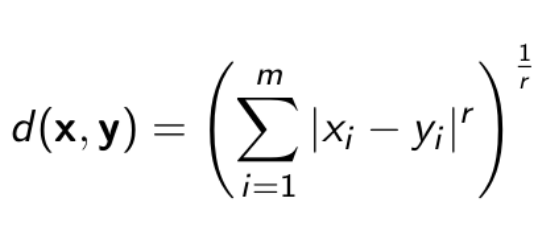
    + Độ đo Euclid chuẩn (r = 2) 
      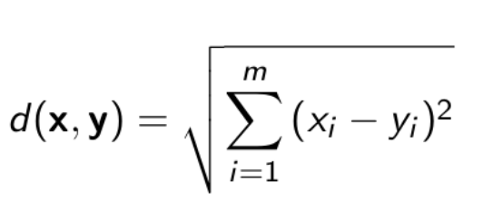
    + Độ đo Manhattan 
      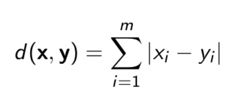
    + Độ đo Cosine 
      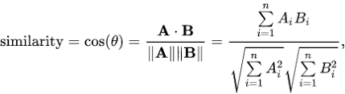
    + Độ đo Jaccard 
      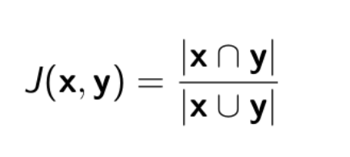
      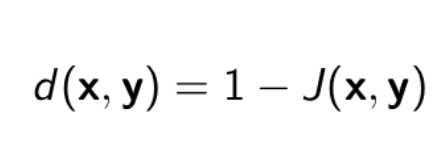
    + Độ đo Hamming
    + Độ đo Kullback-Leibler (KL)
    + ...

## I.2. Phân loại các thuật toán Custering

+ Hình dưới đây mô tả khái quát các loại thuật toán clustering hiện có
  

### I.2.1 **Hierarchical clustering**: Phân cụm phân cấp

+ Agglomerative: "đi từ dưới lên": Ban đầu chọn K là một số lớn gần bằng số điểm dữ liệu. Sau khi thực hiện phân cụm
  K-meas lần đầu, các cụm gần nhau được ghép lại thành một cụm. Lúc này khoảng cách giữa các cụm có thể được xác định
  bằng khoảng cách giữa các tâm cụm. Tiếp tục K-means ở các bước tiếp theo để giảm dần số lượng cụm.
  
    + Các tiêu chí chọn hai cụm để sát nhập:
        + _Centroid-linkage_: Sát nhập hai cụm có khoảng cách giữa hai tâm của hai cụm này là nhỏ nhất.
        + _Single-linkage_: khoảng cách giữa hai điểm gần nhau nhất thuộc hai cụm. Sát nhập hai cụm có khoảng cách này
          nhỏ nhất.
        + _Average-linkage_: trung bình các khoảng cách giữa hai cặp điểm bất kì thuộc hai cụm. Sát nhập hai cụm có
          khoảng cách này nhỏ nhất.
        + _Complete-linkage_: khoảng cách giữa hai điểm xa nhau nhất của hai cụm, sát nhập hai cụm có khoảng cách này là
          nhỏ nhất.
        + _Radius:_ bán kính của một cụm là khoảng cách từ tâm tới điểm xa nhất của cụm, sát nhập hai cụm nếu hai cụm
          tạo ra một cụm có bán kính nhỏ nhất.
        + _Diameter:_ đường kính của một cụm là khoảng cách của hai điểm xa nhau nhất trong cụm, sát nhập hai cụm nếu
          chúng tạo nên một cụm có đường kính nhỏ nhất.

+ Divisive: "đi từ trên xuống": Ban đầu k-means với K nhỏ để thu được các cụm lớn. Sau đó tiếp tục K-means trên mỗi cụm
  đến khi kết quả chấp nhận được.
+ Ưu điểm của phân cụm phân lớp là không phải xác định trước số lượng cụm điều này khá vượt trội so với K-Means. Tuy
  nhiên, nó không hoạt động tốt với lượng dữ liệu khổng lồ.
+ Thuật toán phân cụm phân lớp có thể được sử dụng để xác định, dự đoán số cụm trước khi thực hiện thuật toán K-Means.

### I.2.1 **Partitioning clustering**:

+ Là phương pháp non-hierarchical clustering phổ biến nhất, là phương pháp phân cụm one-level, các cluster không thể
  hiện dưới dạng cấp bậc. Hướng tiếp cận cơ bản nhất trong Partition clustering là tách cụm độc quyền, giống như
  Hard-clustering, mỗi object chỉ thuộc một cluster duy nhất.
+ Thuật toán phân cụm theo phương pháp này, phổ biến và đơn giản nhất đó chính là K-Means
+ Nổi trội trong cụm phương pháp clustering này là các thuật toán Search-base lấy cảm hứng từ tự nhiên như GA,...

___

## I.2. Bài toán Optimization

+ Optimization là quá trình tìm giá trị tốt nhất(maximum/minimum) trong không gian dữ liệu lớn của một hàm mục tiêu bằng
  cách sử dụng các thuật toán. Trong đó việc tìm kiếm được giá tối ưu hóa được xem là vấn đề NP-Hard.
+ Trong bài toán Optimization, hàm mục tiêu là hàm cần tối ưu hóa trong bài toán. Hàm này được chọn, hoặc suy ra từ yêu
  cầu của bài toán. ta giải bài toán bằng cách tìm ra cực tiểu toàn cục (global optima) của hàm này, bằng các kỹ thuật,
  thuật toán hay phương pháp tối ưu hóa.
+ Những kỹ thuật tối ưu hóa thường được dùng đề tìm kiếm các giải pháp cho bài toán tối ưu hóa toàn cục. Trong đó chia
  thành 2 loại kỹ thuật khác nhau: Thuật toán chính xác và thuật toán gần đúng. Thuật toán chính xác là các mô hình toán
  học đã được dùng để tìm kiếm giải pháp tối ưu. Thuật toán gần đúng (metaheuristic) là giải pháp gần tối ưu trong một
  thời gian giải thuật ngắn, phù hợp cho những công trình phức tạp.
+ Thuật toán metaheuristic thường có thể tìm được lời giải gần tối ưu trong một khoảng thời gian ít hơn hơn, tốn ít công
  sức hơn. Thành phần chính của những phương pháp metaheuristic là thăm dò(exploration)- quá trình khám phá không gian
  tìm kiếm và tránh bẫy trong các cực trị địa phương(local optimal), khai thắc(exploiation)-Quá trình cải thiện bất kỳ
  giải pháp hứa hẹn nào đã thu được cho đến thời điểm hiện tại.

___

# II.CƠ SỞ LÝ THUYẾT

## II.1. Thuật toán đom đóm

+ Standard FA

+ Thuật toán đom đóm (Firefly algorithm - FA) là một thuật toán tối ưu hóa lấy cảm hứng từ thiên nhiên, dựa trên trí
  thông minh bầy đàn được phát triển bởi Xin-She Yang (2009) bắt chước cách bầy đom đóm giao tiếp với nhau
+ Đom đóm là một loại côn trùng có cánh và có thể phát ra ánh sáng nhấp nháy về đêm. Ánh sáng này dùng để thu hút các
  con đom đóm khác di chuyển về phía nó, và cảnh báo về các mối nguy hiểm hoặc nguồn thức ăn

+ Cường độ ánh sáng trên đường đi sẽ giảm dần do bị hấp thụ một phần bởi môi trường, cho cường độ ánh sáng I tại điểm cách O một khoảng r, I tỉ lệ nghịch với bình phương khoảng cách 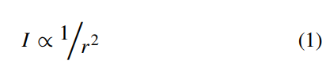 
+ Cường độ ánh sáng của mỗi con đom đóm phát ra sẽ tỉ lệ với hàm cần tối ưu của bài toán.

+ Thuật toán đom đóm được phát triển dựa trên giả thuyết rằng
	+ Khi một con đom đóm (A) bị thu hút bởi một con con đom đóm khác (B) thì nó chỉ dựa trên độ sáng (mà nó cảm nhận được) của con đom đóm B và không bị ảnh hưởng bởi các yếu tố khác (giới tính đom đóm, mùi hương, mùa, ...)
	+ Độ thu hút tỉ lệ thuận với cường độ ánh sáng phát ra, một con đom đóm ít phát sáng hơn sẽ bị thu hút bởi một con đom đóm phát sáng sáng hơn, độ thu hút sẽ giảm dần theo khoảng cách giữa hai con đom đóm
	Nếu hai con đom đóm có cùng độ sáng (và là độ sáng lớn nhất trong quần thể) thì chúng sẽ di chuyển ngẫu nhiên

+ Độ sáng cảm nhận được tại 1 điểm và độ thu hút là 2 yếu tố quan trọng trong thuật toán đom đóm. Cường độ ánh sáng do con đom đóm phát ra tỉ lệ thuận với giá trị của hàm mục tiêu tại điểm mà con đom đóm đang đứng, và trong quá trình truyền đi, độ sáng sẽ thay đổi theo độ lớn khoảng cách và lượng ánh sáng bị hấp thụ bởi môi trường, kết hợp lại, ta có phương trình
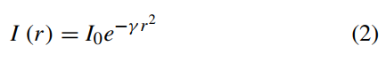 
+ với I0 là cường độ tại điểm cớ khoảng cách r = 0, gamma là hệ số hấp thụ ánh sáng của môi trường, r là khoảng cách
+ Vì độ thu hút tỉ lệ với cường độ ánh sáng cảm nhận được, ta có phương trình
+ 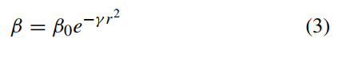 
+ trong đó beta0 là độ thu hút tại điểm r = 0

+ Khoảng cách Euclid giữa 2 con đom đóm xi và xj được tính bởi công thức
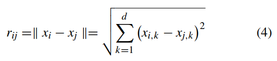 
+ với d là số chiều của dữ liệu.
+ Sự chuyển động của 1 con đom đóm được xác định bởi công thức
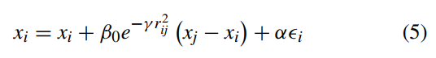 
+ với alpha thuộc [0,1], gamma thuộc [0, vô cùng], epsilon_i là một số ngẫu nhiên từ phân phối Gauss (và có thể thay bằng rand - 0.5, với rand thuộc [0,1]).

Mã giả của thuật toán đom đóm được mô tả như sau
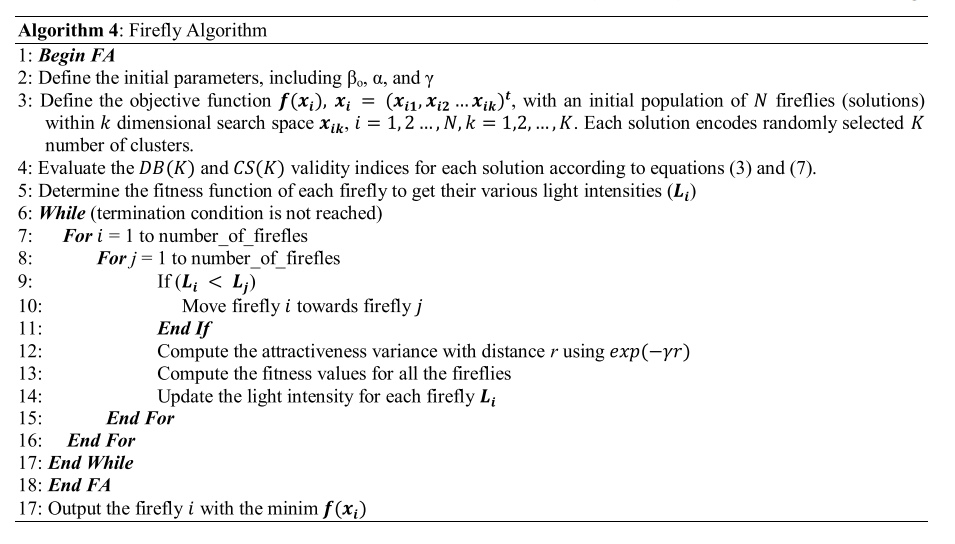 

+ Mutation FA/Hybrid FA (optional)

+ Trong bài báo, để tăng khả năng khai thác và khám phá của thuật toán đom đóm, để có thể áp dụng vào những bài toán nhiều chiều một cách hiệu quả hơn, nhóm tác giả đã cải tiến thuật toán đom đóm bằng cách giới thiệu thuật ngữ mutation strategy (MP) để làm tăng độ thu hút của những con đom đóm có cường độ ánh sáng thấp hơn, thuật toán đom đóm sau khi được cải tiến sẽ có dạng như sau:
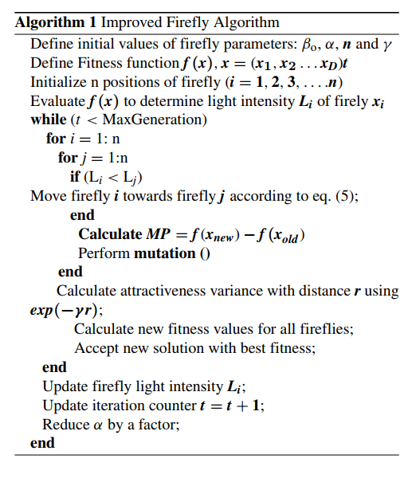 

## II.2. Sơ lược Các thuật toán tối ưu được lai

___

### PSO

___

### ABC

___

### IWO: Invasive weed optimization

+ IWO: thuật toán tối ưu cỏ dại xâm lấn, lấy cảm hứng từ các quần thể cỏ dại ngoài tự nhiên dựa vào hành vi sống, sự
  thích nghi tốt với môi trường.
+ Thuật toán chia làm 4 giai đoạn:
    + Initialization: Khởi tạo quần thể ngẫu nhiên các hạt trên không gian tìm kiếm
    + Reproduction: Các hạt phát triển thành cây, và sinh ra nhiều hạt, tùy thuộc vào giá trị hiện tại
    + Spatial dispersal: Các hạt sinh ra được tiếp tục phân tán, rồi phát triển thành cây mang giá trị
    + Competitive exclusion: Khi đạt được số lượng cây quy định, tiến hành chọn lọc ra các cây có giá trị cao (low
      fitness), bỏ đi các cây khác kém hơn.
+ Quá trình loại trừ theo cơ chế sau:
    + Mỗi cá thể đều sinh ra hạt dựa vào giá trị hiện tại của chính nó
    + Các hạt sinh ra được phân tán ngẫu nhiên
    + Giá trị của mỗi cá thể được so sánh với cha của nó, và chỉ giữ lại các cây có giá trị cao.
+ Công thức sinh hạt như sau: 
  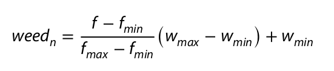 
    + **f:** giá trị sức sống hiện tại của cá thể
    + **f_max** và **f_min** là 2 ngưỡng sức sống của quần thể hiện tại
    + **w_max** và **w_min** là 2 ngưỡng số lượng cá thể đã đặt ra
+ Quá trình phân tán hạt giống mô tả trong công thức:
  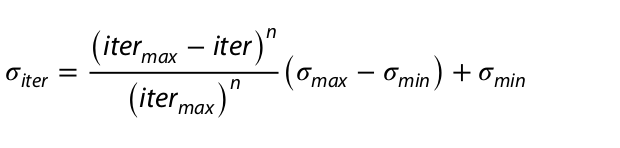 
    + **iter_max** là số vòng lặp tối đa
    + 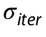 là độ lệch chuẩn hiện tại
    + **n** là hệ số điều chỉnh
+ Mã giả của thuật toán:
  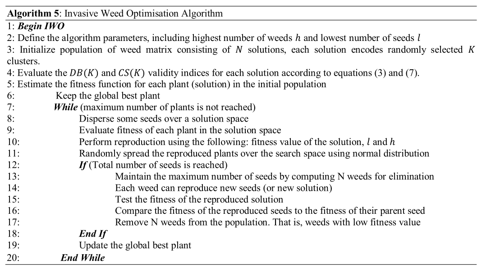

___

### TLBO: Teaching learning-based optimization

+ TLBO: Tối ưu hóa dạy và học

___

# III.LỊCH SỬ CẢI TIẾN

## III.1. Thành tựu trước đó, các nghiên cứu đã có

## III.2. Vấn đề gặp phải & bài toán đặt ra của các paper trước

___

# IV.NỘI DUNG CHÍNH CỦA PAPER

## IV.1. Các hàm mục tiêu được sử dụng

## IV.2. 4 thuật toán lai được đề xuất

### IV.2.1 FAPSO:
 + Là thuật toán lai giữa FA và PSO, được nhóm tác giả đề xuất trước đó vào tháng 12 năm 2019. Ở bài public này nhóm tác giả 
   cũng sử dụng 2 phép đánh giá hiệu quả phân cụm dựa vào CS và DB.
 + Dưới đây là mã giả của thuật toán:
 + 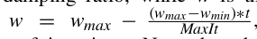
 + Lưu đồ thuật toán:
   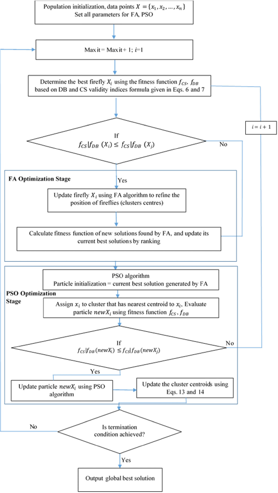

### IV.2.2 FAABC - FAIWO - FATLBO:

## IV.3. Thực nghiệm và so sánh

___

# V. NHẬN XÉT - KẾT LUẬN

## V.1. Nhận xét về tính đúng đắn của đề xuất

## V.2. Nhận xét về tính thực tế của đề xuất

___

# VI: THỬ NGHIỆM CÀI ĐẶT THUẬT TOÁN TRÊN MỘT TẬP DATA

___
___
___
___
___
___

# TÀI LIỆU THAM KHẢO

+

paper: https://www.semanticscholar.org/paper/A-Comparative-Performance-Study-of-Hybrid-Firefly-Ezugwu-Agbaje/87a471ac21d86339c841c7bc5e1429341ce80d22

+ paper: Mehrabian AR, Lucas C (2006) A novel numerical optimiza- tion algorithm inspired from weed colonization. Ecol
  Inform 1(4):355–366

+

k-mean: https://machinelearningcoban.com/2017/01/01/kmeans/?fbclid=IwAR1izcp2yXBUpJiKPnCw_geiURx6qUrfwDiSfPP7R8he33kOvFBFYldT3oA#-gioi-thieu

___