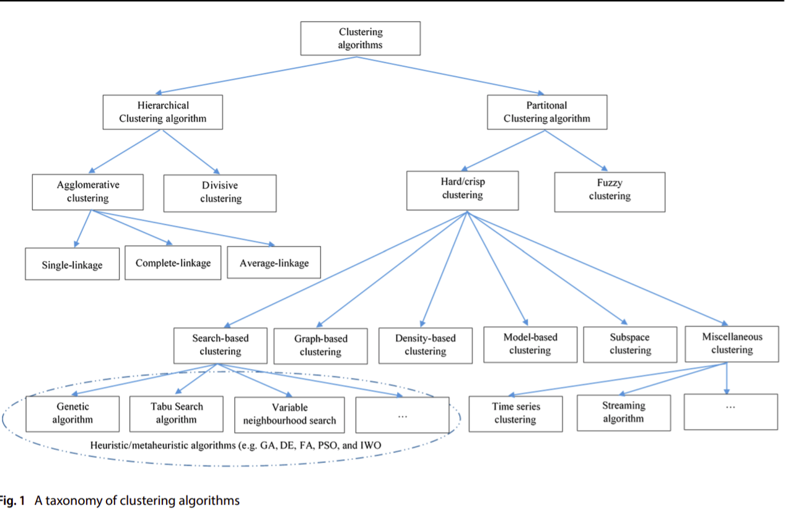
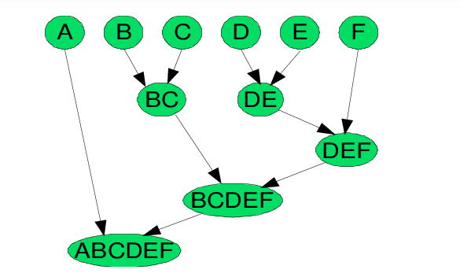

# FILE TỔNG HỢP CÁC NGHIÊN CỨU CỦA NHÓM VỀ ĐỀ TÀI CLUSTERING

#I. TỔNG QUAN - GIỚI THIỆU
##I.1. Bài toán Custering
  + Bài toán clustering là một bài toán phân nhóm toàn bộ dữ liệu X
    thành các nhóm nhỏ dựa trên sự liên quan giữa các dữ liệu trong mỗi nhóm.
  + Ví dụ: phân nhóm khách hàng dựa trên hành vi  mua hàng. Điều này cũng giống như việc ta đưa cho một đứa trẻ rất nhiều mảnh ghép với các hình thù và màu sắc khác nhau,
   ví dụ tam giác, vuông, tròn với màu xanh và đỏ, sau đó yêu cầu trẻ phân chúng thành từng nhóm. Mặc dù không cho trẻ biết
   mảnh nào tương ứng với hình nào hoặc màu nào, nhiều khả năng chúng vẫn có thể phân loại các mảnh ghép theo màu hoặc hình dạng.

  + Đặc điểm của bài toán clustering:
      + Số cụm dữ liệu không được biết trước
      + Có nhiều các tiếp cận, mối cách lại có vài kỹ thuật
      + Các kỹ thuật khác nhau thường mang lại kết quả khác nhau.
  
  + Tính chất của độ đo khoảng cách sử dụng trong clustering:
      + Tính không âm (non-negative): d(x,y) >=0 và d(x, y) = 0 khai và chỉ khi x trùng y.
      + Tính đối xứng (symmetic): d(x, y) = d(y, x)
      + Tính tam giác (traingle inequality): d(x, y) + d(y, z) >= d(x, z)
  
  + Các độ đo khoảng cách thường dùng (cần liệt kê ra công thức các độ đo)
      + Độ đo Euclid r1
      + Độ đo Euclid chuẩn (r = 2)
      + Độ đo Manhattan
      + Độ đo Cosine
      + Độ đo Hamming
      + Độ đo Jaccard
      + Độ đo Kullback-Leibler (KL)
##I.2. Phân loại các thuật toán Custering
  + Hình dưới đây mô tả khái quát các loại thuật toán clustering hiện có
    
###I.2.1 **Hierarchical clustering**: Phân cụm phân cấp
  + Agglomerative: "đi từ dưới lên": Ban đầu chọn K là một số lớn gần bằng số điểm dữ liệu. Sau khi thực hiện phân cụm K-meas
    lần đầu, các cụm gần nhau được ghép lại thành một cụm. Lúc này khoảng cách giữa các cụm có thể được xác định bằng khoảng cách
    giữa các tâm cụm. Tiếp tục K-means ở các bước tiếp theo để giảm dần số lượng cụm.
    
      + Các tiêu chí chọn hai cụm để sát nhập:
          + _Centroid-linkage_: Sát nhập hai cụm có khoảng cách giữa hai tâm của hai cụm này là nhỏ nhất.
          + _Single-linkage_: khoảng cách giữa hai điểm gần nhau nhất thuộc hai cụm. Sát nhập hai cụm có khoảng cách này nhỏ nhất.
          + _Average-linkage_: trung bình các khoảng cách giữa hai cặp điểm bất kì thuộc hai cụm. Sát nhập hai cụm có khoảng cách này nhỏ nhất.
          + _Complete-linkage_: khoảng cách giữa hai điểm xa nhau nhất của hai cụm, sát nhập hai cụm có khoảng cách này là nhỏ nhất.
          + _Radius:_ bán kính của một cụm là khoảng cách từ tâm tới điểm xa nhất của cụm, sát nhập hai cụm nếu hai cụm tạo ra một cụm có bán kính nhỏ nhất.
          + _Diameter:_ đường kính của một cụm là khoảng cách của hai điểm xa nhau nhất trong cụm, sát nhập hai cụm nếu chúng tạo nên một cụm có đường kính nhỏ nhất.

+ Divisive: "đi từ trên xuống": Ban đầu k-means với K nhỏ để thu được các cụm lớn. Sau đó tiếp tục K-means trên mỗi cụm đến khi
  kết quả chấp nhận được.
+ Ưu điểm của phân cụm phân lớp là không phải xác định trước số lượng cụm điều này khá vượt trội so với K-Means. Tuy nhiên, nó không hoạt động tốt với lượng dữ liệu khổng lồ.
+ Thuật toán phân cụm phân lớp có thể được sử dụng để xác định, dự đoán số cụm trước khi thực hiện thuật toán K-Means.
###I.2.1 **Partitioning clustering**:
+ Là phương pháp non-hierarchical clustering phổ biến nhất, là phương pháp phân cụm one-level,
các cluster không thể hiện dưới dạng cấp bậc. Hướng tiếp cận cơ bản nhất trong Partition clustering là tách cụm độc quyền,
giống như Hard-clustering, mỗi object chỉ thuộc một cluster duy nhất.
+ Thuật toán phân cụm theo phương pháp này, phổ biến và đơn giản nhất đó chính là K-Means
+ Nổi trội trong cụm phương pháp clustering này là các thuật toán Search-base lấy cảm hứng từ tự nhiên như GA,...  
___
##I.2. Bài toán Optimization
___
#II.CƠ SỞ LÝ THUYẾT
##II.1. Sơ lược Các thuật toán tối ưu
 + PSO
 + ABC
 + IWO
 + TLBO
##II.2. Thuật toán đom đóm
 + Standard FA
 + Mutation FA/Hybrid FA (optional)
___
#III.LỊCH SỬ CẢI TIẾN
##III.1. Thành tựu trước đó, các nghiên cứu đã có
##III.2. Vấn đề gặp phải & bài toán đặt ra của các paper trước 
___
#IV.NỘI DUNG CHÍNH CỦA PAPER
##IV.2. 4 thuật toán lai được đề xuất
###IV.2.1 FAPSO:
###IV.2.2 FAABC:
###IV.2.3 FAIWO:
###IV.2.4 FATLBO:

##IV.3. Thực nghiệm và so sánh

___
#V. NHẬN XÉT - KẾT LUẬN
##V.1. Nhận xét về tính đúng đắn của đề xuất 
##V.2. Nhận xét về tính thực tế của đề xuất 
___
#VI: THỬ NGHIỆM CÀI ĐẶT THUẬT TOÁN TRÊN MỘT TẬP DATA 
___
___
___
___
___
___
# TÀI LIỆU THAM KHẢO
+ paper: https://www.semanticscholar.org/paper/A-Comparative-Performance-Study-of-Hybrid-Firefly-Ezugwu-Agbaje/87a471ac21d86339c841c7bc5e1429341ce80d22
+ k-mean: https://machinelearningcoban.com/2017/01/01/kmeans/?fbclid=IwAR1izcp2yXBUpJiKPnCw_geiURx6qUrfwDiSfPP7R8he33kOvFBFYldT3oA#-gioi-thieu
___