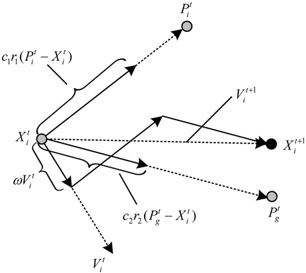
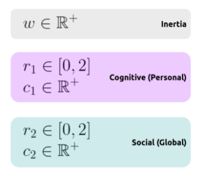
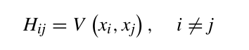

# FILE TỔNG HỢP CÁC NGHIÊN CỨU CỦA NHÓM VỀ ĐỀ TÀI CLUSTERING

# I. TỔNG QUAN - GIỚI THIỆU

## I.1. Bài toán Custering

+ Bài toán clustering là một bài toán phân nhóm toàn bộ dữ liệu X thành các nhóm nhỏ dựa trên sự liên quan giữa các dữ
  liệu trong mỗi nhóm.
+ Ví dụ: phân nhóm khách hàng dựa trên hành vi mua hàng. Điều này cũng giống như việc ta đưa cho một đứa trẻ rất nhiều
  mảnh ghép với các hình thù và màu sắc khác nhau, ví dụ tam giác, vuông, tròn với màu xanh và đỏ, sau đó yêu cầu trẻ
  phân chúng thành từng nhóm. Mặc dù không cho trẻ biết mảnh nào tương ứng với hình nào hoặc màu nào, nhiều khả năng
  chúng vẫn có thể phân loại các mảnh ghép theo màu hoặc hình dạng.

+ Đặc điểm của bài toán clustering:
    + Số cụm dữ liệu không được biết trước
    + Có nhiều các tiếp cận, mối cách lại có vài kỹ thuật
    + Các kỹ thuật khác nhau thường mang lại kết quả khác nhau.

+ Tính chất của độ đo khoảng cách sử dụng trong clustering:
    + Tính không âm (non-negative): d(x,y) >=0 và d(x, y) = 0 khai và chỉ khi x trùng y.
    + Tính đối xứng (symmetic): d(x, y) = d(y, x)
    + Tính tam giác (traingle inequality): d(x, y) + d(y, z) >= d(x, z)

+ Các độ đo khoảng cách thường dùng (cần liệt kê ra công thức các độ đo)
    + Độ đo Euclid r1  
      
    + Độ đo Euclid chuẩn (r = 2) 
      
    + Độ đo Manhattan 
      
    + Độ đo Cosine 
      
    + Độ đo Jaccard 
      
      
    + Độ đo Hamming
    + Độ đo Kullback-Leibler (KL)
    + ...

## I.2. Phân loại các thuật toán Custering

+ Hình dưới đây mô tả khái quát các loại thuật toán clustering hiện có
  

### I.2.1 **Hierarchical clustering**: Phân cụm phân cấp

+ Agglomerative: "đi từ dưới lên": Ban đầu chọn K là một số lớn gần bằng số điểm dữ liệu. Sau khi thực hiện phân cụm
  K-meas lần đầu, các cụm gần nhau được ghép lại thành một cụm. Lúc này khoảng cách giữa các cụm có thể được xác định
  bằng khoảng cách giữa các tâm cụm. Tiếp tục K-means ở các bước tiếp theo để giảm dần số lượng cụm.
  
    + Các tiêu chí chọn hai cụm để sát nhập:
        + _Centroid-linkage_: Sát nhập hai cụm có khoảng cách giữa hai tâm của hai cụm này là nhỏ nhất.
        + _Single-linkage_: khoảng cách giữa hai điểm gần nhau nhất thuộc hai cụm. Sát nhập hai cụm có khoảng cách này
          nhỏ nhất.
        + _Average-linkage_: trung bình các khoảng cách giữa hai cặp điểm bất kì thuộc hai cụm. Sát nhập hai cụm có
          khoảng cách này nhỏ nhất.
        + _Complete-linkage_: khoảng cách giữa hai điểm xa nhau nhất của hai cụm, sát nhập hai cụm có khoảng cách này là
          nhỏ nhất.
        + _Radius:_ bán kính của một cụm là khoảng cách từ tâm tới điểm xa nhất của cụm, sát nhập hai cụm nếu hai cụm
          tạo ra một cụm có bán kính nhỏ nhất.
        + _Diameter:_ đường kính của một cụm là khoảng cách của hai điểm xa nhau nhất trong cụm, sát nhập hai cụm nếu
          chúng tạo nên một cụm có đường kính nhỏ nhất.

+ Divisive: "đi từ trên xuống": Ban đầu k-means với K nhỏ để thu được các cụm lớn. Sau đó tiếp tục K-means trên mỗi cụm
  đến khi kết quả chấp nhận được.
+ Ưu điểm của phân cụm phân lớp là không phải xác định trước số lượng cụm điều này khá vượt trội so với K-Means. Tuy
  nhiên, nó không hoạt động tốt với lượng dữ liệu khổng lồ.
+ Thuật toán phân cụm phân lớp có thể được sử dụng để xác định, dự đoán số cụm trước khi thực hiện thuật toán K-Means.

### I.2.1 **Partitioning clustering**:

+ Là phương pháp non-hierarchical clustering phổ biến nhất, là phương pháp phân cụm one-level, các cluster không thể
  hiện dưới dạng cấp bậc. Hướng tiếp cận cơ bản nhất trong Partition clustering là tách cụm độc quyền, giống như
  Hard-clustering, mỗi object chỉ thuộc một cluster duy nhất.
+ Thuật toán phân cụm theo phương pháp này, phổ biến và đơn giản nhất đó chính là K-Means
+ Nổi trội trong cụm phương pháp clustering này là các thuật toán Search-base lấy cảm hứng từ tự nhiên như GA,...

___

## I.2. Bài toán Optimization

+ Optimization là quá trình tìm giá trị tốt nhất(maximum/minimum) trong không gian dữ liệu lớn của một hàm mục tiêu bằng
  cách sử dụng các thuật toán. Trong đó việc tìm kiếm được giá tối ưu hóa được xem là vấn đề NP-Hard.
+ Trong bài toán Optimization, hàm mục tiêu là hàm cần tối ưu hóa trong bài toán. Hàm này được chọn, hoặc suy ra từ yêu
  cầu của bài toán. ta giải bài toán bằng cách tìm ra cực tiểu toàn cục (global optima) của hàm này, bằng các kỹ thuật,
  thuật toán hay phương pháp tối ưu hóa.
+ Những kỹ thuật tối ưu hóa thường được dùng đề tìm kiếm các giải pháp cho bài toán tối ưu hóa toàn cục. Trong đó chia
  thành 2 loại kỹ thuật khác nhau: Thuật toán chính xác và thuật toán gần đúng. Thuật toán chính xác là các mô hình toán
  học đã được dùng để tìm kiếm giải pháp tối ưu. Thuật toán gần đúng (metaheuristic) là giải pháp gần tối ưu trong một
  thời gian giải thuật ngắn, phù hợp cho những công trình phức tạp.
+ Thuật toán metaheuristic thường có thể tìm được lời giải gần tối ưu trong một khoảng thời gian ít hơn hơn, tốn ít công
  sức hơn. Thành phần chính của những phương pháp metaheuristic là thăm dò(exploration)- quá trình khám phá không gian
  tìm kiếm và tránh bẫy trong các cực trị địa phương(local optimal), khai thắc(exploiation)-Quá trình cải thiện bất kỳ
  giải pháp hứa hẹn nào đã thu được cho đến thời điểm hiện tại.

___

# II.CƠ SỞ LÝ THUYẾT

## II.1. Thuật toán đom đóm

+ Standard FA

+ Thuật toán đom đóm (Firefly algorithm - FA) là một thuật toán tối ưu hóa lấy cảm hứng từ thiên nhiên, dựa trên trí thông minh bầy đàn được phát triển bởi Xin-She Yang (2009) bắt chước cách bầy đom đóm giao tiếp với nhau
+ Đom đóm là một loại côn trùng có cánh và có thể phát ra ánh sáng nhấp nháy về đêm. Ánh sáng này dùng để thu hút các con đom đóm khác di chuyển về phía nó, và cảnh báo về các mối nguy hiểm hoặc nguồn thức ăn

+ Ý tưởng của thuật toán: ở thời điểm ban đầu mỗi con đom đóm trong bầy sẽ ở một vị trí ngẫu nhiên trong không gian tìm kiếm và di chuyển theo một hướng ngẫu nhiên. Khi một con đom đóm tìm thấy thức ăn, nó sẽ phát ra ánh sáng với cường độ tỉ lệ với lượng thức ăn tìm được. Mỗi con đóm đóm sẽ dựa vào ánh sáng để di chuyển về nơi có nhiều thức ăn nhất

+ Cường độ ánh sáng trên đường đi sẽ giảm dần do bị hấp thụ một phần bởi môi trường, cho cường độ ánh sáng I tại điểm cách O một khoảng r, I tỉ lệ nghịch với bình phương khoảng cách  
+ Cường độ ánh sáng của mỗi con đom đóm phát ra sẽ tỉ lệ với hàm cần tối ưu của bài toán.

+ Thuật toán đom đóm được phát triển dựa trên giả thuyết rằng
	+ Khi một con đom đóm (A) bị thu hút bởi một con con đom đóm khác (B) thì nó chỉ dựa trên độ sáng (mà nó cảm nhận được) của con đom đóm B và không bị ảnh hưởng bởi các yếu tố khác (giới tính đom đóm, mùi hương, mùa, ...)
	+ Độ thu hút tỉ lệ thuận với cường độ ánh sáng phát ra, một con đom đóm ít phát sáng hơn sẽ bị thu hút bởi một con đom đóm phát sáng sáng hơn, độ thu hút sẽ giảm dần theo khoảng cách giữa hai con đom đóm
	+ Nếu hai con đom đóm có cùng độ sáng (và là độ sáng lớn nhất trong quần thể) thì chúng sẽ di chuyển ngẫu nhiên

+ Độ sáng cảm nhận được tại 1 điểm và độ thu hút là 2 yếu tố quan trọng trong thuật toán đom đóm. Cường độ ánh sáng do con đom đóm phát ra tỉ lệ nghịch với giá trị của hàm mục tiêu tại điểm mà con đom đóm đang đứng, và trong quá trình truyền đi, độ sáng sẽ thay đổi theo độ lớn khoảng cách và lượng ánh sáng bị hấp thụ bởi môi trường, kết hợp lại, ta có phương trình
 
+ với I0 là cường độ tại điểm cớ khoảng cách r = 0, gamma là hệ số hấp thụ ánh sáng của môi trường, r là khoảng cách
+ Vì độ thu hút tỉ lệ với cường độ ánh sáng cảm nhận được, ta có phương trình
+  
+ trong đó beta0 là độ thu hút tại điểm r = 0

+ Khoảng cách Euclid giữa 2 con đom đóm xi và xj được tính bởi công thức
 
+ với d là số chiều của dữ liệu.
+ Sự chuyển động của 1 con đom đóm được xác định bởi công thức
 
+ với alpha thuộc [0,1], gamma thuộc [0, vô cùng], epsilon_i là một số ngẫu nhiên từ phân phối Gauss (và có thể thay bằng rand - 0.5, với rand thuộc [0,1]).

Mã giả của thuật toán đom đóm được mô tả như sau
 
+ đầu tiên khởi tạo các tham số cần thiết cho thuật toán, và giới hạn số lần lặp tối đa
+ trong mỗi lần lặp, ta so sánh độ thu hút của từng con đom đóm với các con còn lại trong quần thể, và di chuyển con đom đóm đó theo những con có độ thu hút lớn hơn nó.

+ Mutation FA/Hybrid FA (optional)

+ Trong bài báo, để tăng khả năng khai thác và khám phá của thuật toán đom đóm, để có thể áp dụng vào những bài toán nhiều chiều một cách hiệu quả hơn, nhóm tác giả đã cải tiến thuật toán đom đóm bằng cách giới thiệu thuật ngữ mutation strategy (MP) để làm tăng độ thu hút của những con đom đóm có cường độ ánh sáng thấp hơn, thuật toán đom đóm sau khi được cải tiến sẽ có dạng như sau:
 

## II.2. Sơ lược Các thuật toán tối ưu được lai

___

### PSO

+ Particle Swarm Optimazation (PSO) là một kĩ thuật tối ưu ngẫu nhiên dựa trên trí thông minh bầy đàn (population based stochastic optimization technique) được giới thiệu bởi Eberhart và Kennedy vào năm 1995 lấy cảm hứng từ cách di chuyển và trao đổi thông tin khi kiếm ăn của các thành viên trong quần thể bầy chim và đàn cá
+ Tại thời điểm ban đầu, mỗi thành viên trong quần thể ở một vị trí ngẫu nhiên và bay theo một hướng ngẫu nhiên. Sau một thời gian, một số thành viên tìm được thức ăn, và gửi tín hiệu tới các thành viên khác trong bầy tùy theo lượng thức ăn tìm thấy được. Dựa vào thông tin đó, những thành viên khác sẽ di chuyển về nơi có nhiều thức ăn nhất (mà nó biết).
+ Ta có thể kết hợp PSO với một số thuật toán khác khi giải quyết các bài toán về tối ưu.
+ Cá thể: mỗi cá thể được xem như một giải pháp tiềm năng để đạt được global minimum trong không gian tìm kiếm. Không con nào biết được chính xác global minimum ở đâu, nhưng dựa vào vị trí của mỗi con có thể tính được giá trị của hàm mục tiêu cần tối ưu
+ Ở lúc ban đầu, mỗi cá thể sẽ được khởi tạo vị trí và vận tốc ngẫu nhiên
 
 
+ Quần thể: qua mỗi lần lặp, vector vận tốc của mỗi cá thể được thay đổi một cách ngẫu nhiên dựa theo hướng của vị trí nhiều thức ăn nhất của cá thể đó tìm được (personal best), và hướng của vị trí có nhiều thức ăn nhất của quần thể (global best)
 
 
 
+ trong đó 
    + trọng số r1 và r2 là duy nhất cho mỗi cá thể và mỗi lần lặp, c1 và c2 là hệ số cho biết độ phụ thuộc của vận tốc mới vào personal best và global best, w là hệ số ứng với vận tốc hiện tại
    + P t best(i) là điểm personal best của cá thể thứ i tại lần lặp thứ t, P t bestglobal là điểm global best tại lần lặp thứ t
+ Bộ trọng số đó sẽ quyết định vận tốc mới của cá thể, cân bằng giữa khai phá và tìm kiếm (exploitaion and exploration)
 
+ trong hình minh họa trên ta có thể thấy:
	+ với c1 lớn và c2 = 0, quần thể không hội tụ do mỗi cá thể chỉ tập trung vào personal best của nó
	+ với c1 = 0 và c2 lớn, quần thể hội tụ rất nhanh sau vài lần lặp 

+ Mã giả của PSO như sau
 

___

### ABC
+ Artificial Bee Colony (ABC) algorithm là thuật toán meta-heuristic dựa trên bầy đàn được giới thiệu năm 2005 bởi Karaboga để tối ưu các bài toán số.
+ ACB lấy cảm hứng từ hành vi tìm kiếm thức ăn thông minh của ông mật.Trong đó bầy ông nhân tạo được chia thành ba nhóm: ong thợ (employed bees), ong giám sát(onlooker bees), ong trinh sát(scout bees).
    + Ong thợ: đi đến nguồn thức ăn mà nó khám phá được trước đó.
    + Ong quan sát: quan sát điệu nhảy của ong thợ để quyết định
    + Ong trinh sát: thực hiện tìm kiếm ngẫu nhiên để tìm kiếm nguồn thức ăn mới.
+ Thuật toán được chia làm giai đoạn :
    + Initialization Phase
      + Khởi tạo ngẫu nhiên vị trí các food source, số lượng food source, số lượng ong thợ, ông giám sát, số lần chạy. Trong đó số lượng ong thợ, ông giám sát và food source là bằng nhau.
      + Tính toán giá trị của hàm mục tiêu, hàm fit(công thức tính giá trị hàm fit sẽ được giải thích ở phase Employed Bee).
    + Employed Bees Phase
      + Tìm kiếm vị trị nguồn thức ăn lân cận dựa vào thông tin nguồn thức ăn trong kí ức trước đó. Vị trí nguồn thức ăn lân cận được tính theo công thức:
      
      + Sau khi tìm vị trí của nguồn thức ăn lân cần, các giá trị của hàm mục tiêu, hàm fit được tính toán lại. Nếu giá trị giá trị của hàm fit tại vị trí mới tốt hơn vị trí cũ trước đó, giá trị vị trí tốt nhất trong kí ức sẽ được cập nhật. Với mỗi lần mà vị trí nguồn thức ăn lân cận mới không tốt hơn vị trí cũ, số lần trial sẽ được tăng lên, và được reset khi giá trị tốt hơn.
      + Giá trị của hàm fit sẽ được tính theo công thức sau:
      
        + Trong đó f(Xm) là giá trị hàm mục tiêu tại vị trí Xm
    + Onlooker Bees Phase
      + Quyết định lựa chọn nguồn thức ăn dựa vào giá trị xác suất được tính toán thông qua công thức:         
      
    + Scout Bees Phase
      + Những con ông thợ khi giá trị trial đạt ngưỡng giới hạn (tức sau một số lần thức nghiệm tìm nguồn thức ăn lân cận nó không tìm được giải pháp tốt hơn) sẽ phải tìm lại vị trí nguồn thức ăn một cách ngẫu nhiên.
___

### IWO: Invasive weed optimization

+ IWO: thuật toán tối ưu cỏ dại xâm lấn, lấy cảm hứng từ các quần thể cỏ dại ngoài tự nhiên dựa vào hành vi sống, sự
  thích nghi tốt với môi trường.
+ Thuật toán chia làm 4 giai đoạn:
    + Initialization: Khởi tạo quần thể ngẫu nhiên các hạt trên không gian tìm kiếm
    + Reproduction: Các hạt phát triển thành cây, và sinh ra nhiều hạt, tùy thuộc vào giá trị hiện tại
    + Spatial dispersal: Các hạt sinh ra được tiếp tục phân tán, rồi phát triển thành cây mang giá trị
    + Competitive exclusion: Khi đạt được số lượng cây quy định, tiến hành chọn lọc ra các cây có giá trị cao (low
      fitness), bỏ đi các cây khác kém hơn.
+ Quá trình loại trừ theo cơ chế sau:
    + Mỗi cá thể đều sinh ra hạt dựa vào giá trị hiện tại của chính nó
    + Các hạt sinh ra được phân tán ngẫu nhiên
    + Giá trị của mỗi cá thể được so sánh với cha của nó, và chỉ giữ lại các cây có giá trị cao.
+ Công thức sinh hạt như sau: 
   
    + **f:** giá trị sức sống hiện tại của cá thể
    + **f_max** và **f_min** là 2 ngưỡng sức sống của quần thể hiện tại
    + **w_max** và **w_min** là 2 ngưỡng số lượng cá thể đã đặt ra
+ Quá trình phân tán hạt giống mô tả trong công thức:
   
    + **iter_max** là số vòng lặp tối đa
    +  là độ lệch chuẩn hiện tại
    + **n** là hệ số điều chỉnh
+ Mã giả của thuật toán:
  

___

### TLBO: Teaching learning-based optimization

+ TLBO: Tối ưu hóa dạy và học, là một thuật toán heuristic phổ biến, ra đời năm 2011. Thuật toán lấy cảm hứng từ hiện
  tượng người giáo viên tác động lên nhóm học sinh. Theo đó thuật toán chia thành 2 pha riêng biệt:
    + Pha dạy: Giáo viên truyền đạt kiến thức như nhau đối với các học sinh. Khả năng lĩnh hỗi kiến thức sẽ phụ thuộc
      vào lực học của mỗi học sinh.  
      
        + T_F là hệ số học (nhận giá trị 1 hoặc 2).
        + XTeacher là người giỏi nhất
        + XMean là độ giỏi trung bình của cả lớp
        + r random trong khoảng [0,1]
    + Pha học: Học sinh tự tăng độ giỏi của mình thông qua việc giao tiếp với bạn bè trong lớp. Ở đó, bạn học sẽ được
      chọn ngẫu nhiên, trong trường hợp bạn học giỏi hơn, học sinh đó sẽ tăng được kiến thức, và ngược lại
      
      
+ Lưu đồ thuật toán:
  
+ Theo đó, Chất lượng trung bình của cả lớp học phụ thuộc vào chất lượng của người dạy.

___

# III.LỊCH SỬ CẢI TIẾN
+ Hassanzadeh và Meybodi đã trình bày một phương pháp kết hợp dựa trên FA và k-means
+ Zabihi và Nasiri đề xuất việc sử dụng thuật toán ABC theo history-driven để giải quyết phân cụm dữ liệu, với cơ chế ghi nhớ dựa trên phân vùng không gian nhị phân đã được kết hợp vào thuật toán ABC, để cải thiện hiệu suất phân cụm.
+ Merwe và Engelbrecht đã đề xuất việc sử dụng PSO để giải quyết vấn đề phân cụm
+ Zhao đã làm về việc cải thiện hiệu suất của thuật toán k-mean bằng cách lai nó với PSO để tránh bị ảnh hưởng trực tiếp bởi các trung tâm cụm ban đầu.
+ Nikkam và cộng sự [19] đã đề xuật một thuật toán cải tiến hiệu quả kết hợp ACO và các thuật toán simulated annealing (SA) để giải quyết. Kết quả mô phỏng của ACO-SA cho thấy thuật toán kết hợp hoạt động hiệu quả hơn SA cơ bản, ACO và k-mean riêng lẻ.
+ Satapathy và Naik [20] đã phát triển một thuật toán TLBO đã được sử dụng để tìm các tâm của một số lượng cụm do người dùng chỉ định
___

# IV.NỘI DUNG CHÍNH CỦA PAPER

## IV.1. Các hàm mục tiêu được sử dụng

### IV.1.a Compact-Separated:

+ Là chỉ số ước lượng chất lượng phân cụm dựa vào tỉ lệ của 2 yếu tố:
    + điểm biểu thị chất lượng phân tán trong cụm (within-cluster scatter): Khoảng cách xa nhất có thể giữa 2 điểm trong
      cụm
    + điểm phân tách giữa các cụm (between-cluster separation): Khoảng cách giữa 2 tâm cụm
+ Công thức tổng quát như sau: (Có 2 công thức từ các bài bài trước)
  
    + Công thức trên bị nhầm ở ký hiệu Yj thuộc Ci, sửa Yj thành Xj  

+  là số lượng phần tử trong cụm tương ứng
+  là khoảng cách giữa within-cluster scatter Xi và between-cluster separation Xj
+  là khoảng cách giữa 2 tâm cụm đang xét
+ Công thức trong bài báo mới:  
  

+ J_CS càng nhỏ, phân cụm càng tốt và ngược lại

### IV.1.b Davis-Bouldin:

+ Là chỉ số ước lượng chất lượng phân cụm rất phổ biến, đề xuất bởi Davis và Bouldin. Phép đánh giá này dựa trên 2 tiêu
  chí:
    + intra-cluster (khoảng cách trung bình giữa tất cả các điểm trong cụm tính từ tâm cụm)
    + inter-cluster (Khoảng cách giữa 2 tâm cụm)
+ Công thức:
  gọi Wi là khoảng cách intra-cluster của cụm i, tập hợp Bi, tâm xi
  
   
  Trong đó V(R,xi) là khoảng cách giữa tập điểm dữ liệu R của cụm i, tới tâm xi
   
  Gọi H(ij) là khoảng cách inter-cluster giữa 2 tâm cụm khác nhau i và j (i<>j)
  
  
   
  J_DB càng nhỏ, phân cụm càng tốt.
   
+ Vậy ta cần tối ưu hóa giá trị J_DB này để tìm ra phân cụm tốt nhất

+ Nhìn chung 2 chỉ số đánh giá này có cách vận hành tương đối giống nhau, đều dựa vào 2 yếu tố nội suy từ tập dữ liệu
  đầu vào và tập các tâm ứng viên.

## IV.2. 4 thuật toán lai được đề xuất

### IV.2.1 FAPSO:

+ Là thuật toán lai giữa FA và PSO, được nhóm tác giả đề xuất trước đó vào tháng 12 năm 2019. Ở bài public này nhóm tác
  giả cũng sử dụng 2 phép đánh giá hiệu quả phân cụm dựa vào CS và DB.
+ Dưới đây là mã giả của thuật toán:
+ 
+ Lưu đồ thuật toán:
  
   
+ Nhận xét:  Trong thuật toán này, mỗi lần duyệt qua một cá thể đom đóm đều được chia thành 2 pha rõ rệt:
    + Pha 1 vẫn thực hiện cập nhật cá thể theo thuật toán FA. Bước này là dễ hiểu vì thuật toán gốc là FA, có ưu điểm là
      tận dụng được khả năng tìm kiếm ngẫu nhiên của thuật toán FA để nhanh chóng tìm ra global optima.
    + Pha 2 dựa trên bước đi của pha 1, sử dụng cách di chuyển của PSO để cập nhật vị trí của cá thể ngay sau đó. Bước
      này sẽ giúp quần thể đom đóm tăng cơ hội rơi vào local optima có thể có xung quanh cá thể đang duyệt. => Kết hợp
      cả 2 yếu tố trên có thể giúp bài toán hội tụ nhanh hơn, khai thác được thế mạnh của 2 chiến lược tìm kiếm độc lập
      nhau.

### IV.2.2 FAABC - FAIWO - FATLBO:
+ 3 thuật toán còn lại cũng có cách
## IV.3. Thực nghiệm và so sánh

___

# V. NHẬN XÉT - KẾT LUẬN

## V.1. Nhận xét về tính đúng đắn của đề xuất

## V.2. Nhận xét về tính thực tế của đề xuất
+ Mặc dù 

___

# VI: THỬ NGHIỆM CÀI ĐẶT THUẬT TOÁN TRÊN MỘT SỐ TẬP DATA

___
___

# TÀI LIỆU THAM KHẢO

+ paper: https://www.semanticscholar.org/paper/A-Comparative-Performance-Study-of-Hybrid-Firefly-Ezugwu-Agbaje/87a471ac21d86339c841c7bc5e1429341ce80d22

+ paper: Mehrabian AR, Lucas C (2006) A novel numerical optimiza- tion algorithm inspired from weed colonization. Ecol
  Inform 1(4):355–366

+ k-mean: https://machinelearningcoban.com/2017/01/01/kmeans/?fbclid=IwAR1izcp2yXBUpJiKPnCw_geiURx6qUrfwDiSfPP7R8he33kOvFBFYldT3oA#-gioi-thieu

___